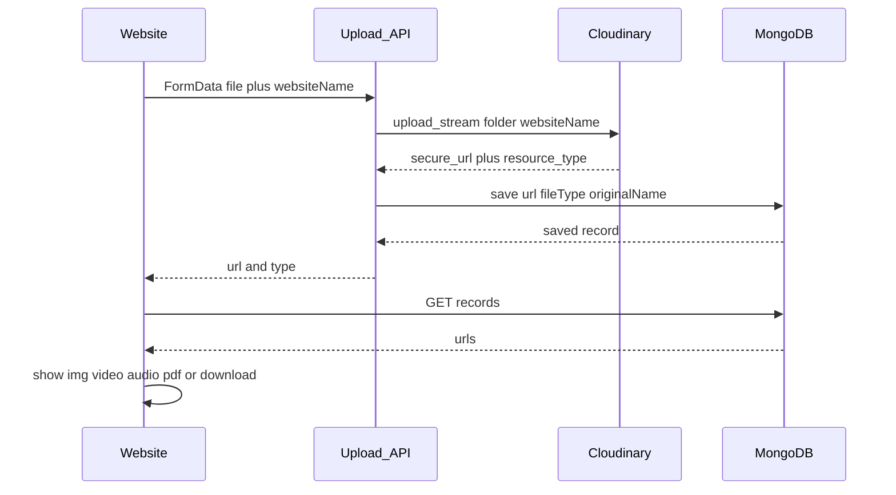

# Cloudinary + MongoDB file upload guide

Rewrite the existing [docs/cloudinary-upload.md](docs/cloudinary-upload.md) into **one document** with two parts. No app code changes — documentation only. Keep the existing README link under Image Upload.

## What the doc will teach

End-to-end pattern for this site and any other site:

```
Pick any file
  → Upload to Cloudinary (folder = website name)
  → Get public HTTPS URL
  → Save URL + fileType + originalName in MongoDB (not the file bytes)
  → Later: read URL from DB
  → Render by type: image / video / audio / PDF / other (download)
```

Nothing binary is stored in MongoDB — only the Cloudinary URL string and metadata.



---

## Part A — How this STN project works today

Keep and tighten the current project-specific content, citing real files:

- Config: [lib/cloudinary.ts](lib/cloudinary.ts) — `uploadImage` (folder `products`, `resource_type: image`) and `uploadMedia` (folder `gallery`, `resource_type: auto`)
- APIs: [app/api/upload/route.ts](app/api/upload/route.ts) (admin images) and [app/api/upload/media/route.ts](app/api/upload/media/route.ts) (gallery)
- Admin then POSTs the returned `url` to products / hero / about / gallery APIs
- MongoDB (Prisma) stores **strings only**: `Product.image` / `images`, `HeroSection.image`, `AboutSection.image`, `GalleryMedia.url` + `type` (`image` | `video`) in [prisma/schema.prisma](prisma/schema.prisma)
- Display: storefront uses the URL as `src`. Gallery in [app/home/our-story/page.tsx](app/home/our-story/page.tsx) branches on `item.type === 'video'` vs image
- Env: `CLOUDINARY_URL` or `CLOUDINARY_CLOUD_NAME` + `API_KEY` + `API_SECRET`
- Next.js: [next.config.ts](next.config.ts) allows `res.cloudinary.com`

Note honestly what this app does **not** do yet: folders are `products` / `gallery` (not website name); only images and videos (not PDF/docs/audio).

---

## Part B — Copy-paste guide for any other website

Standalone snippets (Next.js + Prisma + MongoDB, same stack). Change `WEBSITE_NAME` and reuse.

### 1. Env

```env
CLOUDINARY_CLOUD_NAME=...
CLOUDINARY_API_KEY=...
CLOUDINARY_API_SECRET=...
CLOUDINARY_FOLDER=my-website-name
DATABASE_URL=mongodb://...
```

`CLOUDINARY_FOLDER` is the Cloudinary folder (website name), so files stay grouped per site in one Cloudinary account.

### 2. Upload any file type

One helper using `resource_type: 'auto'` so Cloudinary accepts image, video, audio, PDF, and other files (`raw` for non-media). Return `{ url, resourceType, format, originalName }`.

Folder: `process.env.CLOUDINARY_FOLDER` (website name).

### 3. Upload API

`POST /api/upload` — FormData `file` → Cloudinary → JSON `{ url, fileType, format, originalName }`.

Map MIME / Cloudinary `resource_type` + `format` to a simple `fileType`: `image` | `video` | `audio` | `pdf` | `other`.

### 4. MongoDB schema (reusable)

A generic `FileAsset` model (not tied to products):

- `url` — Cloudinary HTTPS URL
- `fileType` — image | video | audio | pdf | other
- `originalName`, `folder` (website name), `mimeType`

Prisma `create` after upload; `findMany` to list.

### 5. Display by file type

One React component `FilePreview` that switches on `fileType`:

- `image` → `` / `next/image`
- `video` → `<video controls>`
- `audio` → `<audio controls>`
- `pdf` → `<iframe>` or open-in-new-tab
- `other` → download `<a href={url} download>`

Include a short client snippet: pick file → `fetch('/api/upload')` → save record → later `GET` and map through `FilePreview`.

### 6. Checklist

Credentials, folder name, Next `remotePatterns` for `res.cloudinary.com`, confirm MongoDB stores `https://res.cloudinary.com/...` not file bytes.

---

## Files to change

- **Rewrite** [docs/cloudinary-upload.md](docs/cloudinary-upload.md) with Parts A + B (keep title/purpose; expand display and generic reuse sections)
- **No change** to README except it already links this file
- **No application code changes** unless you later want STN itself to use website-name folders / any-file-type uploads
