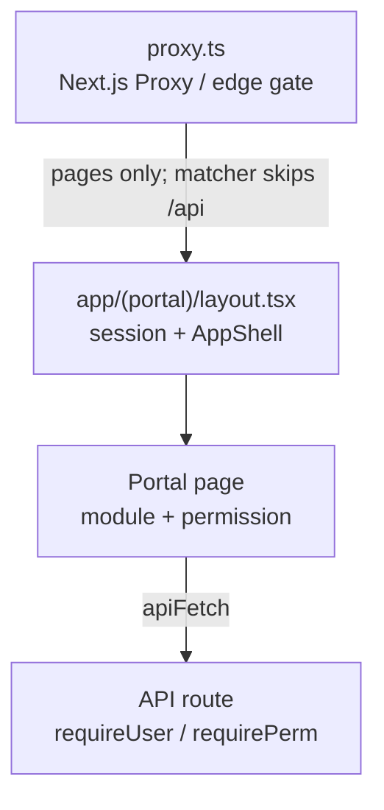
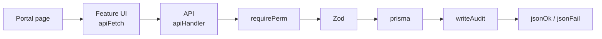
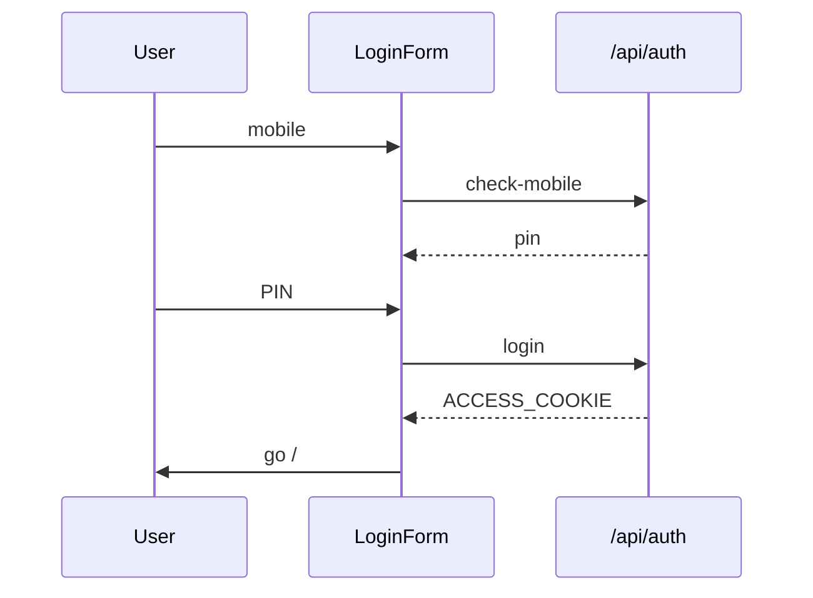
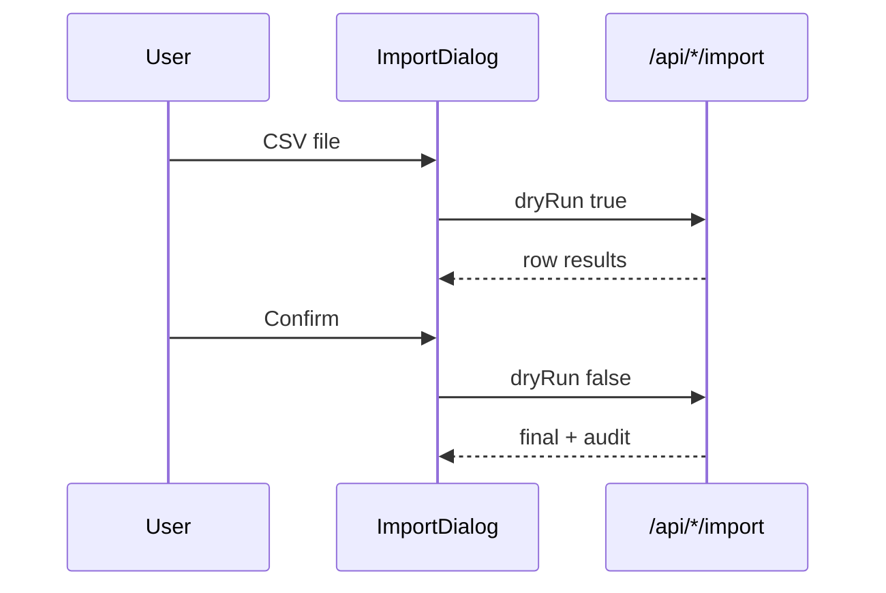

# MLF Application Flows

How each major flow works: **UI → API → validation → Prisma → response**, and which files each flow uses.

**Stack:** Next.js (App Router) · React · Prisma 6 · MongoDB Atlas · JWT cookie session · 2Factor OTP/SMS

**Also see:** [Prisma database connection](./prisma-database.md) · [`prisma/schema.prisma`](../prisma/schema.prisma) · [CSV import order](../prisma/data/README.md)

---

## How to use this doc

| If you need… | Go to |
|--------------|--------|
| Folders, auth layers, request path | [Architecture](#part-a--architecture) |
| Login, permissions, CSV import, notifications, cron | [Cross-cutting](#part-b--cross-cutting-flows) |
| A specific product area (clients, cases, …) | [Domain flows](#part-c--domain-flows) |
| What to keep / clean / consolidate | [Maintainability](#part-d--maintainability) |
| Shared helpers | [Shared libraries](#shared-libraries) |

---

## Part A — Architecture

### Folder structure

| Area | Path | Role |
|------|------|------|
| App Router | `app/` | Pages, layouts, API routes |
| Portal | `app/(portal)/` | Logged-in shell + feature pages |
| Auth UI | `app/(auth)/login/` | Phone / PIN / OTP |
| Public | `app/(public)/legal/` | Legal pages |
| API | `app/api/**` | REST (`/api/...`) — **one tree, no `/api/v1`** |
| Features | `features/<domain>/` | UI (`components/`) + optional `server/` helpers |
| Shared UI | `shared/` | Layout, forms, data dialogs, hooks |
| UI kit | `components/ui/` | shadcn primitives |
| App hooks | `hooks/` | Generic hooks (`use-mobile`, `use-hydrated`) |
| Business libs | `lib/` | auth, rbac, api, db, validations, imports, storage |
| Company config | `config/company/` | modules, nav, permissions, IDs, compliance, SMS |
| Database | `prisma/schema.prisma` | Mongo models |
| CSV samples (canonical) | `public/samples/*.sample.csv` | Import templates (download in UI) |
| CSV mirror | `prisma/data/*.sample.csv` | Same files for seed/docs — keep in sync |
| Uploads | `uploads/` | Document files (runtime, not source) |
| Office PDFs | `private/office-files/` | Allowlisted static PDFs |
| Scripts | `scripts/` | `db-ping`, audit, smoke, one-off migrations |
| Local only (gitignored) | `.data/`, `.tools/`, `.next/` | Local Mongo, tools, build cache |

### Feature module pattern

**Full domains** (page + serialize + API + Zod): clients, cases, employees, appointments, accounts, dak, tasks, hrms, documents.

```text
app/(portal)/<domain>/page.tsx          ← RSC: session + module + permission
features/<domain>/components/*-page.tsx ← client UI
features/<domain>/server/serialize.ts   ← API payload shaping
app/api/<domain>/route.ts               ← list / create
app/api/<domain>/[unitId]/route.ts      ← get / update / delete
lib/validations/<domain>.schema.ts      ← Zod
```

**Thin domains** (UI + API only, little or no `server/serialize`): diary, reports, activity, permissions, availability, notifications, profile, home, auth.

Public IDs are **`unitId`** strings (e.g. `CLI-00001`), not Mongo `_id`. Prefixes: `config/company/ids.ts`. Generation: `nextUnitId()` in `lib/ids/index.ts`.

### Auth layers (three places)



| Layer | File | What it does |
|-------|------|----------------|
| Edge | `proxy.ts` | JWT cookie check for **pages** (not `/api`). Guests → `/login`; signed-in on `/login` → `/`. Public: `/login`, `/legal/*`. |
| Portal layout | `app/(portal)/layout.tsx` | Loads `getSessionUser()`; no user → `/api/auth/session-expired`; DB down → `DbUnavailable`. |
| Page | `app/(portal)/…/page.tsx` | Usually `isModuleEnabled` + permission string. |
| API | `lib/api/guard.ts` | Real enforcement: `requireUser` / `requirePerm` / `requireRole`. |

There is **no** `middleware.ts`. In Next 16, `proxy.ts` is the edge gate (build shows “Proxy (Middleware)”).

### Standard request lifecycle



1. **Page (RSC)** — session (layout) → module/permission → feature UI.
2. **Client** — `apiFetch` / `apiDownload` from `lib/api/client.ts` (cookies included).
3. **API** — `apiHandler` → guard → Zod → Prisma → optional `writeAudit` → response.
4. **Serialize** — when present, `features/<domain>/server/serialize.ts` exposes `unitId`.

**Response shape:** `{ ok: true, data }` or list `{ ok: true, data: [], meta }` · error `{ ok: false, error: { code, message } }`.

### Routes without full module / nav wiring

| Route | How users reach it | Module flag on page? | API gate |
|-------|--------------------|----------------------|----------|
| `/` | Nav Home (`dashboard`) | Yes — `dashboard.view` | `requirePerm(dashboard, view)` |
| `/notifications` | Header bell (not main nav) | No | `requireUser` only |
| `/profile` | User menu | No | Logged-in profile routes |
| Documents | Case / client UI panels | N/A (no `/documents` page) | List needs parent id; download by doc type (`cases.*` / `accounts.*`) |
| `/diary` | Nav (cases **or** appointments **or** tasks) | Multi-module OR | At least one matching `*.view` |
| `/availability` | Nav (appointments-related) | Via related module | Availability APIs |

Notifications / profile stay **any authenticated user**. Home requires `dashboard.view` (aligned with nav).

### Quick map: page → feature → API

| Portal route | Feature | Primary API | In main nav? |
|--------------|---------|-------------|--------------|
| `/` | `features/home` | `/api/dashboard/summary` | Yes (Home) |
| `/login` | `features/auth` | `/api/auth/*` | — |
| `/clients` | `features/clients` | `/api/clients` | Yes |
| `/cases` | `features/cases` | `/api/cases`, `/api/hearings` | Yes |
| `/employees` | `features/employees` | `/api/employees`, `/api/advocates` | Yes |
| `/appointments` | `features/appointments` | `/api/appointments` | Yes |
| `/availability` | `features/availability` | `/api/advocates/availability/*` | Yes |
| `/diary` | `features/diary` | `/api/diary` | Yes |
| `/tasks` | `features/tasks` | `/api/tasks` | Yes |
| `/accounts` | `features/accounts` | `/api/accounts` | Yes |
| `/dak` | `features/dak` | `/api/dak` | Yes |
| `/hrms` | `features/hrms` | `/api/hrms/*` | Yes |
| (case UI) | `features/documents` | `/api/documents` | No standalone page |
| `/notifications` | `features/notifications` | `/api/notifications` | Bell only |
| `/permissions` | `features/permissions` | `/api/permissions/*` | Yes |
| `/reports` | `features/reports` | `/api/exports` | Yes |
| `/activity` | `features/activity` | `/api/activity` | Yes |
| `/profile` | `features/profile` | `/api/profile` | User menu |

Module toggles: `config/company/modules.ts`. Nav items: `config/company/nav.ts`.

---

## Part B — Cross-cutting flows

These touch many domains. Read them once; domain sections assume this pattern.

### Auth / login / OTP / session

**Purpose:** Mobile + 6-digit PIN. OTP (2Factor) for PIN setup and forgot-PIN. Session = httpOnly JWT access cookie.

**Key files**

| Path | Role |
|------|------|
| `proxy.ts` | Edge login-first gate for pages |
| `features/auth/components/login-form.tsx` | Steps: phone → PIN / OTP / setup / reset |
| `lib/auth/session.ts`, `session-user.ts` | Cookies, current user, RSC session |
| `lib/auth/jwt.ts`, `otp-proof.ts`, `pin.ts`, `mobile.ts` | Tokens, OTP proof, PIN hash/lockout |
| `lib/auth/users.service.ts` | Create user on setup |
| `lib/services/two-factor.service.ts` | OTP / transactional SMS |
| `lib/validations/auth.schema.ts` | Zod |
| `app/api/auth/*` | HTTP endpoints |

**Routes**

| Method | Path | Does |
|--------|------|------|
| POST | `/api/auth/check-mobile` | Next step: PIN vs OTP setup |
| POST | `/api/auth/login` | Verify PIN → set cookie |
| POST | `/api/auth/send-otp` | Start OTP (`setup` \| `forgot_pin`) |
| POST | `/api/auth/verify-otp` | → `otpProofToken` |
| POST | `/api/auth/setup-pin` | Set PIN (maybe create user) |
| POST | `/api/auth/forgot-pin/reset` | Reset PIN after proof |
| GET | `/api/auth/me` | Current user |
| POST | `/api/auth/logout` | Clear cookies |
| GET/POST | `/api/auth/session-expired` | Clear cookies → `/login` |

**Returning user:** `check-mobile` → PIN → `login` → cookie → `/` → `AppShell`.

**First-time setup:** `check-mobile` → `send-otp` → `verify-otp` → `setup-pin` → cookies.

Auth endpoints are rate-limited (`lib/rate-limit`).



### RBAC / permissions / modules

**Purpose:** `User.roles[]` → union of `RolePermission` rows → `"module.action"` keys on `PublicUser.permissions`. API enforces; pages mirror for UX. Modules can be turned off in config.

**Key files:** `lib/rbac/` · `lib/api/guard.ts` (`requirePerm`) · `config/company/permissions-defaults.ts` · `config/company/modules.ts` · `config/company/nav.ts` · `app/api/permissions/*` · `features/permissions/`

**Roles:** `admin`, `sub_admin`, `staff`, `advocate`, `accountant`.

Disabled modules leave the nav and fail API module checks. Today every entry in `modules.enabled` is `true` (MVP shipped).

### CSV import

**Purpose:** Bulk create/update from CSV. Always **dry-run first**, then confirm.

**Shared pieces:** `shared/components/data/import-dialog.tsx` · `lib/utils/csv.ts` · `lib/imports/columns.ts` · `lib/imports/lookups.ts` · `assertImportRateLimit` · `compliance.csv.maxRows`

**Samples:** download from **`public/samples/`** (canonical). `prisma/data/*.sample.csv` are **symlinks** to those files — see [import order](../prisma/data/README.md). Sample for accounts is named `payments.sample.csv`.

Shared server wrapper: `lib/imports/run-import.ts` (`createImportHandler`). Domain routes supply `processRows` only.



**Server loop:** `requirePerm` → rate limit → ignore unknown columns → Zod `{ dryRun, rows }` → per-row lookup/validate → create/update or dry-run message → `writeAudit` if not dry-run.

| Endpoint | Columns constant | Import perm |
|----------|------------------|-------------|
| `POST /api/clients/import` | `IMPORT_CLIENT_COLUMNS` | `clients.create` (+ `edit` for upsert) |
| `POST /api/cases/import` | `IMPORT_CASE_COLUMNS` | `cases.upload` (+ `edit` for upsert) |
| `POST /api/hearings/import` | `IMPORT_HEARING_COLUMNS` | `cases.edit` |
| `POST /api/accounts/import` | `IMPORT_PAYMENT_COLUMNS` | `accounts.upload` |
| `POST /api/employees/import` | `IMPORT_EMPLOYEE_COLUMNS` | `employees.create` (+ `edit` for upsert) |
| `POST /api/dak/import` | `IMPORT_DAK_COLUMNS` | `dak.create` |
| `POST /api/tasks/import` | `IMPORT_TASK_COLUMNS` | `tasks.create` |
| `POST /api/appointments/import` | `IMPORT_APPOINTMENT_COLUMNS` | `appointments.create` |

Each domain page wires `ImportDialog` with its `endpoint` + optional `sampleHref`.

### Notifications

**Purpose:** In-app inbox + SSE live push.

**Key files:** `lib/notifications/notify.ts` (`notifyUser`, `scheduleNotify`) · `lib/notifications/sse-hub.ts` · `features/notifications/` · `shared/hooks/use-notifications.ts` (header bell) · `features/notifications/hooks/use-notifications-inbox.ts` (inbox page) · `app/api/notifications/*`

**Flow:** Domain code notifies → `Notification` row + SSE publish → shell listens on `/api/notifications/stream` **only when** `NEXT_PUBLIC_ENABLE_SSE=1` (otherwise poll). Shared stream hook: `shared/hooks/use-notification-stream.ts`. Inbox + bell both respect the flag.

### Cron / hearing SMS

**Purpose:** Scheduled SMS for tomorrow’s hearings.

**Key files:** `vercel.json` → `GET /api/cron/hearing-sms` · `lib/services/hearing-sms.job.ts` · SMS templates in `config/company/sms-templates.ts`

Auth: `CRON_SECRET` (`x-cron-secret` or `Authorization: Bearer`). Manual triggers also exist under `/api/diary/*`.

---

## Part C — Domain flows

Each section: **purpose → files → how it works**.

### Clients

**Purpose:** Client registry (intake, SMS consent).

| Layer | Paths |
|-------|-------|
| Page | `app/(portal)/clients/`, `[unitId]/` |
| UI | `features/clients/components/` |
| API | `/api/clients`, `/api/clients/[unitId]`, `/api/clients/import` |
| Validation / serialize | `lib/validations/clients.schema.ts` · `features/clients/server/serialize.ts` |

1. Open Clients (`clients.view`; create needs `clients.create`).
2. Form → `POST /api/clients` → normalize mobile → `nextUnitId("client")` → create → audit.
3. List: `GET /api/clients?page=&q=`.

### Cases and hearings

**Purpose:** Matter pipeline, court data, advocates, filing checklist, hearings; links to documents and accounts.

| Layer | Paths |
|-------|-------|
| Page / UI | `app/(portal)/cases/` · `features/cases/components/` |
| Rules / filters | `config/company/case-pipeline.ts` · `features/cases/server/filters.ts` |
| API | `/api/cases`, `/api/cases/[unitId]`, `.../status`, `.../checklist`, `.../hearings` · `/api/hearings/[unitId]/adjourn` · imports |
| Validation / serialize | `lib/validations/cases.schema.ts` · `features/cases/server/serialize.ts` |

1. Create case (client + optional advocates).
2. Detail loads case + client + hearings + documents.
3. Status changes go through `canTransitionStatus`.
4. Add hearing updates `nextHearingAt` (may notify); adjourn creates a replacement hearing. **CSV hearing import** also sets `nextHearingAt` to the earliest upcoming hearing per case, shows SMS eligibility per row, and immediately sends client SMS for **tomorrow** dates (catch-up if nightly cron already ran). Future dates still go out day-before via cron.
5. Fee snippet: `GET /api/accounts?caseUnitId=...`.

### Employees and advocates

**Purpose:** Staff users (`User`). Advocates = users with role `advocate`.

| Layer | Paths |
|-------|-------|
| Page / UI | `app/(portal)/employees/` · `features/employees/components/` |
| API | `/api/employees`, `/api/employees/[unitId]`, deactivate / reactivate / force-reset-pin, import · `/api/advocates` · `/api/users/[unitId]/photo` |
| Validation / serialize | `lib/validations/employees.schema.ts` · `features/employees/server/serialize.ts` |

1. Create/update employees (admin role assignment guarded).
2. Case/appointment forms load advocates via `/api/advocates` + `advocate-picker`.

### Appointments, availability, diary

**Appointments** — consultations; can convert to enquiry case.

| Layer | Paths |
|-------|-------|
| Page / UI | `app/(portal)/appointments/` · `features/appointments/` |
| API | `/api/appointments`, `/api/appointments/[unitId]`, `.../convert-case`, import |
| Helpers | `features/appointments/server/enrich.ts`, `serialize.ts` · `lib/validations/appointments.schema.ts` |

**Availability** — weekly hours + time blocks + day slots.

| Layer | Paths |
|-------|-------|
| Page / UI | `app/(portal)/availability/` · `features/availability/` |
| API / libs | `/api/advocates/availability/hours`, `.../blocks` · `/api/appointments/availability` · `lib/appointments/availability.ts`, `booking-rules.ts` · `config/company/booking.ts` |

**Diary** — day board: hearings + appointments + tasks for an IST day. Nav/page/API allow access when **any** of cases / appointments / tasks is enabled with matching `*.view`; sections soft-gate.

| Layer | Paths |
|-------|-------|
| Page / UI | `app/(portal)/diary/` · `features/diary/` |
| API | `GET /api/diary` · tomorrow-notify / send-hearing-sms |

### Tasks

**Purpose:** Office allotment (`OfficeTask`), often tied to cases/assignees.

| Layer | Paths |
|-------|-------|
| Page / UI | `app/(portal)/tasks/` · `features/tasks/components/` |
| API | `/api/tasks`, `/api/tasks/[unitId]`, import |
| Validation / serialize | `lib/validations/tasks.schema.ts` · `features/tasks/server/serialize.ts` |

Create/assign may notify; updates via PATCH; due tasks show on diary.

### Documents and office files

**Case/client documents:** upload UI in `features/documents/` → `POST /api/documents` (multipart) → MIME sniff → `lib/storage` under `uploads/` → `Document` row → download route. Limits in `config/company/compliance.ts`.

**Static office PDFs:** `GET /api/office-files/[slug]` → `private/office-files/*.pdf` (logged-in only).

### Accounts / payments

**Purpose:** Cash ledger (`CashPayment`) for client/case; void; fee rollup.

| Layer | Paths |
|-------|-------|
| Page / UI | `app/(portal)/accounts/` · `features/accounts/components/` |
| API | `/api/accounts`, `/api/accounts/[unitId]`, `.../void`, import |
| Helpers | `features/accounts/server/filters.ts`, `fee-rollup.ts` · `lib/validations/accounts.schema.ts` |

Record → list/filter → void (`POST .../void`) → case detail uses `caseUnitId` filter for fees.

### DAK

**Purpose:** In/out postal register (`DakEntry`).

Same CRUD pattern as clients: `app/(portal)/dak/` · `features/dak/` · `/api/dak` · `lib/validations/dak.schema.ts`.

### HRMS / leave / attendance

**Purpose:** Check-in/out, leave approve/reject, holidays, presence.

| Layer | Paths |
|-------|-------|
| Page / UI | `app/(portal)/hrms/` · `features/hrms/components/` |
| API | `/api/hrms/attendance/*`, `/api/hrms/leave/*`, `/api/hrms/holidays/*`, `/api/hrms/presence` |
| Helpers | `features/hrms/server/presence.ts` · `lib/validations/hrms.schema.ts` |

Module `hrms` must be on. Split perms: `own_attendance`, `own_leave`, `approve_leave`, `manage_attendance`.

Managers (`manage_attendance`) can view/export attendance for **everyone** (`all=1`) or **selected staff** (`userUnitIds=…`) from HRMS History. List/export accept `own_attendance` **or** `manage_attendance`.

### Search, home, reports, activity

| Flow | UI | API |
|------|----|-----|
| Global search (⌘K) | `shared/components/layout/global-search.tsx` | `GET /api/search?q=` |
| Home / dashboard | `features/home/` | `GET /api/dashboard/summary` |
| Reports | `features/reports/` | `GET /api/exports?type=...` (ExcelJS) |
| Activity (audit log) | `features/activity/` | `GET /api/activity` · writes via `lib/audit` |

Export types include cases, clients, employees, tasks, dak, accounts, appointments, fees-outstanding, **attendance**, and more (see `app/api/exports/route.ts`). Most exports require **`reports.view`** first, then the domain `*.view`. Attendance uses `hrms.own_attendance` (self) or `hrms.manage_attendance` + `all=1` (office) so it works from the HRMS history tab without Reports access.

### Profile and reference data

| Flow | Paths |
|------|-------|
| Profile | `features/profile/` · `/api/profile`, `/api/profile/photo` |
| Courts / locations | `/api/courts`, `/api/locations` — form reference data |

---

## Part D — Maintainability

What is already healthy vs what is clutter or worth consolidating later.

### Keep (core structure)

| Keep | Why |
|------|-----|
| `app/api/**` single tree | No `/api/v1` in source |
| `features/` + `shared/` + `lib/` + `config/company/` | Clear domain / shared / business split |
| `proxy.ts` | Active Next 16 edge auth for pages |
| `docs/application-flows.md` + `docs/prisma-database.md` | Product docs |
| `scripts/db-ping.ts`, `full-audit.ts`, `smoke-confidence.ts` | Dev / QA tools |
| `.gitignore` for `.data/`, `.tools/`, `.next/`, uploads | Local-only |

### Unwanted / safe to remove

| Item | Why |
|------|-----|
| Root Cursor plan files (e.g. ecommerce-style `*.plan.md` for wrong app) | Wrong project content; confuses contributors |
| Stale `.next` after big API deletes | Can still show phantom `/api/v1/*` in cache — run `rm -rf .next` when routes confuse you |
| Completed one-off migrations (optional) | `scripts/migrate-case-status.ts` + `MIGRATE_CASE_STATUS.md` once status migration is done everywhere |

Do **not** commit `.env`, `.data/`, `.tools/`, or runtime `uploads/` contents.

### Better later (optional follow-ups)

| Improvement | Why it helps |
|-------------|--------------|
| README as MLF entry | Avoid create-next-app boilerplate pointing at missing `app/page.tsx` |
| Redis / external SSE hub | Live push across serverless isolates without opt-in poll |

### Done in flow cleanup

| Item | Status |
|------|--------|
| `lib/imports/run-import.ts` + thin import routes | Done |
| CSV single source (`public/samples` + symlinks in `prisma/data`) | Done |
| Shared notification SSE hook + flag on bell and inbox | Done |
| Home / exports RBAC (`dashboard.view`, `reports.view`) | Done |
| Document list scoping + download auth by doc type | Done |
| Diary multi-module nav/page/API gate | Done |
| `scripts/README.md` (smoke env vars) | Done |
| OTP weak-PIN before proof consume; SMS claim-then-send | Done |
| `apiFetch` mid-session 401 → session-expired | Done |

### Suggested work order when changing a domain

1. Zod in `lib/validations/<domain>.schema.ts`
2. API under `app/api/<domain>/` with `apiHandler` + `requirePerm` + audit
3. Serialize in `features/<domain>/server/` if list/detail payloads grow
4. UI in `features/<domain>/components/`
5. Page gate in `app/(portal)/<domain>/page.tsx` + nav/module if it is a top-level area
6. Update this doc’s quick map / domain section if the flow changed

---

## Shared libraries

| Concern | Location | Use for |
|---------|----------|---------|
| Responses | `lib/api/response.ts` | `apiHandler`, `jsonOk`, `jsonOkList`, `jsonFail` |
| Guards | `lib/api/guard.ts` | `requireUser`, `requirePerm`, `requireRole` |
| Browser fetch | `lib/api/client.ts` | `apiFetch`, `apiDownload` (401 → session-expired) |
| CSV import | `lib/imports/run-import.ts` | `createImportHandler` |
| Notifications (client) | `shared/hooks/use-notification-stream.ts` | SSE opt-in via `NEXT_PUBLIC_ENABLE_SSE` |
| DB | `lib/db/prisma.ts`, `unreachable.ts` | Prisma client, retry / down detection |
| Validation | `lib/validations/*.schema.ts` | Zod per domain |
| Rate limit | `lib/rate-limit/` | Auth, import, search, upload |
| IDs | `lib/ids/` | `nextUnitId`, opaque cursors |
| Audit | `lib/audit/index.ts` | `writeAudit`, `diffAudit` |
| IST time | `lib/utils/ist.ts` | Diary, HRMS, SMS job day bounds |
| Env | `lib/env.ts` + `instrumentation.ts` | Startup `assertEnv()` |

**Models:** listed in [`prisma/schema.prisma`](../prisma/schema.prisma). How the DB connects and deploy steps: [prisma-database.md](./prisma-database.md).
