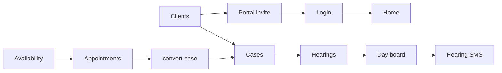

# MLF portal flow playbooks

Human playbooks for each authenticated sidebar module: **how the site works today** (UI → API → validation → Prisma → side effects). Same style as the unified login plan.

**Canonical architecture refs** (do not replace these):

- [site-architecture.md](../site-architecture.md) — full system map, schema, API catalog
- [application-flows.md](../application-flows.md) — file-level maintainability notes

Nav source of truth: [`config/company/nav.ts`](../../config/company/nav.ts).

---

## Auth (not in sidebar)

| Playbook | Entry |
|----------|--------|
| [unified_login_flow_c5377653.plan.md](./unified_login_flow_c5377653.plan.md) | `/login` — one mobile+PIN/OTP login for all roles |

---

## Staff vs client sidebar

| Client sees | Staff-only |
|-------------|------------|
| Home, Cases, Appointments, **Documents** | Clients, Day board, Availability, Court roster, Accounts, Office expenses, HRMS, Postal, Work allotment, Reports, Employees, Activity, Permissions |

Profile and notifications live in the user menu / header, not the main nav.

---

## Flows by nav group

### Workspace

| Label | Route | Playbook |
|-------|-------|----------|
| Home | `/` | [home_flow.plan.md](./home_flow.plan.md) |

### Matters

| Label | Route | Playbook |
|-------|-------|----------|
| Clients | `/clients` | [clients_flow.plan.md](./clients_flow.plan.md) |
| Cases | `/cases` | [cases_flow.plan.md](./cases_flow.plan.md) |
| Day board | `/diary` | [day_board_flow.plan.md](./day_board_flow.plan.md) |
| Documents (client) | `/documents` | [documents_flow.plan.md](./documents_flow.plan.md) |

### Schedule

| Label | Route | Playbook |
|-------|-------|----------|
| Appointments | `/appointments` | [appointments_flow.plan.md](./appointments_flow.plan.md) |
| Availability | `/availability` | [availability_flow.plan.md](./availability_flow.plan.md) |
| Court roster | `/court-roster` | [court_roster_flow.plan.md](./court_roster_flow.plan.md) |

### Office

| Label | Route | Playbook |
|-------|-------|----------|
| Accounts | `/accounts` | [accounts_flow.plan.md](./accounts_flow.plan.md) |
| Office expenses | `/expenses` | [expenses_flow.plan.md](./expenses_flow.plan.md) |
| HRMS | `/hrms` | [hrms_flow.plan.md](./hrms_flow.plan.md) |
| Postal | `/dak` | [postal_flow.plan.md](./postal_flow.plan.md) |
| Work allotment | `/tasks` | [tasks_flow.plan.md](./tasks_flow.plan.md) |
| Reports | `/reports` | [reports_flow.plan.md](./reports_flow.plan.md) |

### Admin

| Label | Route | Playbook |
|-------|-------|----------|
| Employees | `/employees` | [employees_flow.plan.md](./employees_flow.plan.md) |
| Activity | `/activity` | [activity_flow.plan.md](./activity_flow.plan.md) |
| Permissions | `/permissions` | [permissions_flow.plan.md](./permissions_flow.plan.md) |

---

## How flows connect (practice spine)

Deepest create paths: [Clients](./clients_flow.plan.md) → [Cases](./cases_flow.plan.md) ← [Appointments](./appointments_flow.plan.md) convert-case.
