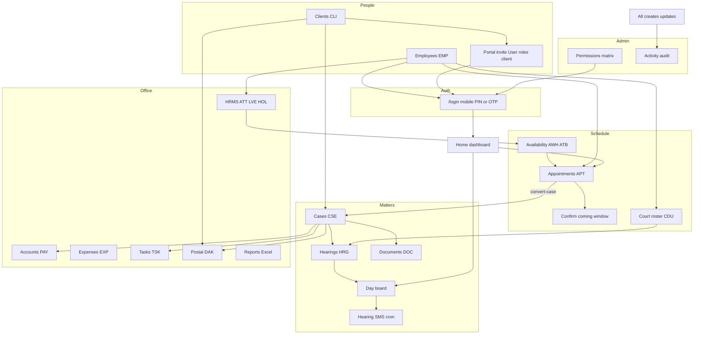
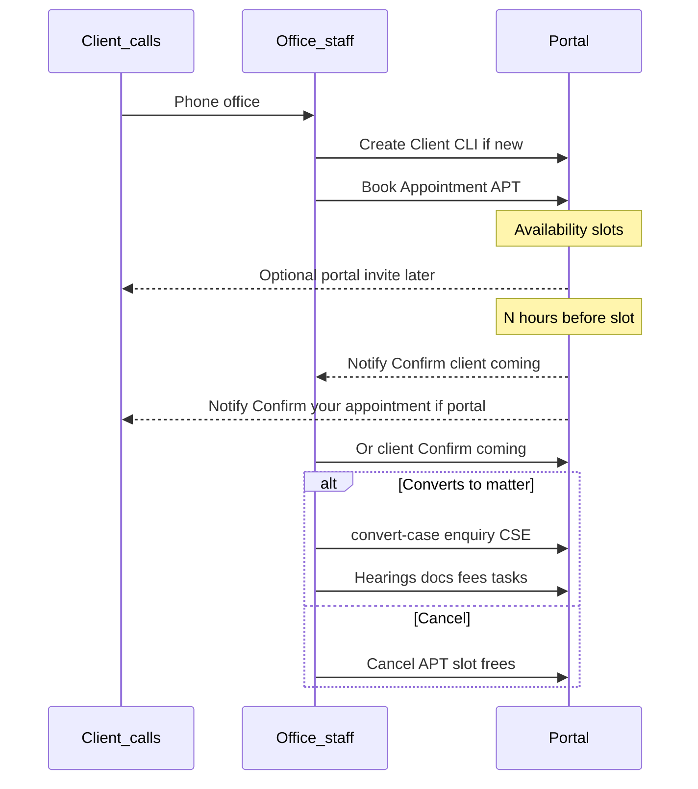
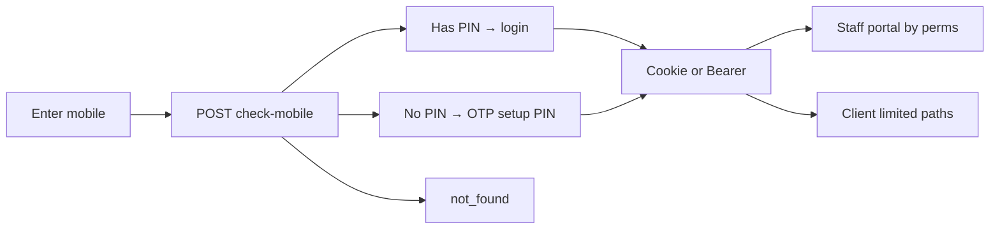
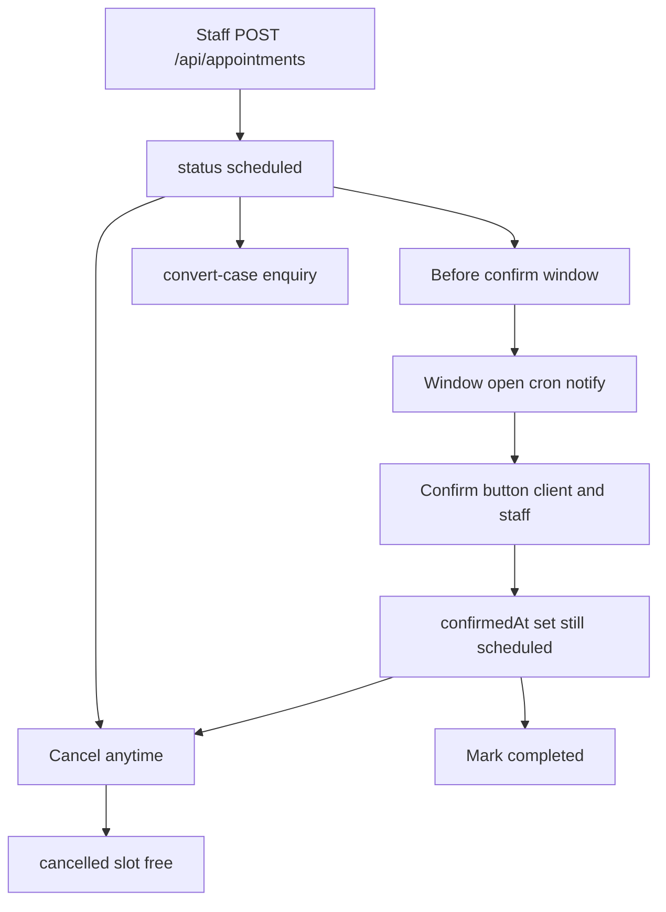
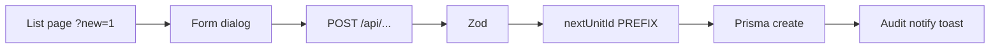
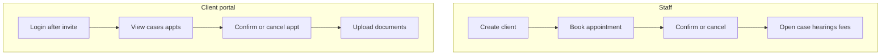

# MLF portal — full flow map

How the whole site works: **charts + tables**. Open a playbook (plain `.md`, not `.plan.md`) for file-level detail — every linked playbook has mermaid flowcharts, sequence diagrams, permission/action tables, and an end-to-end request path. Use the Markdown preview to render charts.

| Need | Doc |
|------|-----|
| This map (charts/tables) | You are here |
| Login | [unified_login_flow](./unified_login_flow.md) |
| Architecture / schema / APIs | [site-architecture.md](../site-architecture.md) |
| Nav source | [`config/company/nav.ts`](../../config/company/nav.ts) |

---

## 1. Who sees what

| Who | Sidebar | Can book appointments? | Can create clients/cases? |
|-----|---------|------------------------|---------------------------|
| **Staff** (admin, advocate, …) | Full nav by permissions | Yes | Yes (by perm) |
| **Client** (portal invite) | Home, Cases, Appointments, Documents | **No** — call office | No |

Profile + notifications = user menu / header (not sidebar).

---

## 2. Master chart — how modules connect

---

## 3. Practice spine (day-to-day office)

| Step | What happens | ID / route |
|------|----------------|------------|
| 1 | Staff creates **Client** (no login yet) | `CLI` · `/clients` |
| 2 | Optional: **Invite to portal** | `User` linked to CLI · same `/login` |
| 3 | Staff sets **Availability** | `AWH` / `ATB` · `/availability` |
| 4 | Client calls → staff **books appointment** | `APT` · `/appointments` |
| 5 | Window opens (`APPOINTMENT_CONFIRM_WINDOW_HOURS`) | Cron notifies both sides |
| 6 | Client or staff presses **Confirm coming** | `confirmedAt` |
| 7 | Or **Cancel** → slot free | `status: cancelled` |
| 8 | Optional **convert-case** → enquiry case | `CSE` |
| 9 | Case → hearings → day board → SMS | `HRG` · `/diary` |
| 10 | Docs, fees, tasks, postal as needed | `DOC` `PAY` `TSK` `DAK` |

---

## 4. Login flow (all roles, one entry)

| User type | How they get a login | First visit |
|-----------|----------------------|-------------|
| Super admin | Env mobile bootstrap | PIN or OTP (see login playbook) |
| Employee | Staff creates on `/employees` | OTP → create PIN |
| Client | Staff invites on client detail | OTP → create PIN |
| Client record only | Create on `/clients` | **Cannot** login until invite |

Playbook: [unified_login_flow](./unified_login_flow.md)

---

## 5. Appointment lifecycle (book → confirm → done)

| State | Badge / UI | Confirm? | Cancel? | Slot busy? |
|-------|------------|----------|---------|------------|
| Before window | Scheduled · Awaiting confirmation | No | Yes | Yes |
| In window, not confirmed | Confirm now + button | Yes | Yes | Yes |
| Confirmed | Confirmed by client/office | No | Yes | Yes |
| Cancelled | cancelled | No | — | **No** |
| Completed | completed | No | — | No |

Env: `APPOINTMENT_CONFIRM_WINDOW_HOURS` (default 1) · cron every 15m · `CRON_SECRET`  
Playbook: [appointments_flow](./appointments_flow.md)

---

## 6. All sidebar modules (one table)

| Group | Module | Route | Who | Core actions | Playbook |
|-------|--------|-------|-----|--------------|----------|
| Workspace | Home | `/` | Both | Dashboard, shortcuts | [home](./home_flow.md) |
| Matters | Clients | `/clients` | Staff | Create/edit/import, portal invite | [clients](./clients_flow.md) |
| Matters | Cases | `/cases` | Both* | Create/pipeline/hearings (*client: own) | [cases](./cases_flow.md) |
| Matters | Day board | `/diary` | Staff | IST day + hearing SMS | [day_board](./day_board_flow.md) |
| Matters | Documents | `/documents` | Client | Upload/list own docs | [documents](./documents_flow.md) |
| Schedule | Appointments | `/appointments` | Both | Staff book; both confirm/cancel | [appointments](./appointments_flow.md) |
| Schedule | Availability | `/availability` | Staff | Hours + blocks → slots | [availability](./availability_flow.md) |
| Schedule | Court roster | `/court-roster` | Staff | Permanent courts + overrides | [court_roster](./court_roster_flow.md) |
| Office | Accounts | `/accounts` | Staff | Cash ledger void | [accounts](./accounts_flow.md) |
| Office | Expenses | `/expenses` | Staff | Office spend + bills | [expenses](./expenses_flow.md) |
| Office | HRMS | `/hrms` | Staff | Attendance leave holidays | [hrms](./hrms_flow.md) |
| Office | Postal | `/dak` | Staff | In/out register | [postal](./postal_flow.md) |
| Office | Work allotment | `/tasks` | Staff | Assign tasks → diary | [tasks](./tasks_flow.md) |
| Office | Reports | `/reports` | Staff | Excel exports | [reports](./reports_flow.md) |
| Admin | Employees | `/employees` | Staff | Create staff users | [employees](./employees_flow.md) |
| Admin | Activity | `/activity` | Staff | Audit log | [activity](./activity_flow.md) |
| Admin | Permissions | `/permissions` | Staff | Role × perm matrix | [permissions](./permissions_flow.md) |

---

## 7. Standard create pattern (most domains)

| Entity | Prefix | Create API |
|--------|--------|------------|
| Employee | `EMP` | `POST /api/employees` |
| Client | `CLI` | `POST /api/clients` |
| Case | `CSE` | `POST /api/cases` |
| Hearing | `HRG` | `POST /api/cases/.../hearings` |
| Appointment | `APT` | `POST /api/appointments` |
| Payment | `PAY` | `POST /api/accounts` |
| Fee waiver | `WVR` | `POST /api/accounts/waivers` (sub_admin pending → admin approve) |
| Expense | `EXP` | `POST /api/expenses` |
| Document | `DOC` | `POST /api/documents` |
| Task | `TSK` | `POST /api/tasks` |
| Dak | `DAK` | `POST /api/dak` |

---

## 8. Client portal vs staff (summary)

| Action | Staff | Client |
|--------|-------|--------|
| Create client / case / employee | Yes | No |
| Book appointment | Yes | No |
| Confirm coming | Yes | Yes (own) |
| Cancel appointment | Yes | Yes (own) |
| Convert to case | Yes | No |
| Upload docs | Case/client/expense panels | `/documents` only |
| Day board / HRMS / accounts | Yes | No |

---

## Playbook index (A–Z by file)

Each playbook: **flowchart + sequence (where useful) + permissions + action catalog + key files**. Eighteen modules total.

| File | Topic |
|------|--------|
| [activity_flow](./activity_flow.md) | Audit log |
| [accounts_flow](./accounts_flow.md) | Cash ledger + fee waivers |
| [appointments_flow](./appointments_flow.md) | Book / confirm / convert |
| [availability_flow](./availability_flow.md) | Hours & blocks |
| [cases_flow](./cases_flow.md) | Matters & hearings |
| [clients_flow](./clients_flow.md) | Intake & portal invite |
| [court_roster_flow](./court_roster_flow.md) | Court cover |
| [day_board_flow](./day_board_flow.md) | Diary + SMS |
| [documents_flow](./documents_flow.md) | Uploads |
| [employees_flow](./employees_flow.md) | Staff users |
| [expenses_flow](./expenses_flow.md) | Office expenses |
| [home_flow](./home_flow.md) | Dashboard |
| [hrms_flow](./hrms_flow.md) | Attendance & leave |
| [permissions_flow](./permissions_flow.md) | RBAC matrix |
| [postal_flow](./postal_flow.md) | Dak register |
| [reports_flow](./reports_flow.md) | Excel exports |
| [tasks_flow](./tasks_flow.md) | Work allotment |
| [unified_login_flow](./unified_login_flow.md) | Login OTP PIN |
