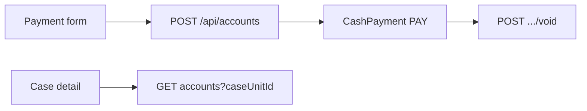

# Accounts flow (`/accounts`)

## Core principle: office cash ledger, not a gateway

**Accounts** stores `CashPayment` (`PAY`) rows: dual **required** Client, optional Case. Staff create/edit/void; case detail shows a fee snippet via `caseUnitId` filter. No card/UPI processor.



---

## Permissions / nav

| Gate | Value |
|------|--------|
| Nav | Office → Accounts · `accounts.view` · **staffOnly** |
| Create | `accounts.create` |
| Edit / void | `accounts.edit` |
| CSV import | `accounts.upload` |

---

## Action catalog

| Action | API |
|--------|-----|
| List / filter | `GET /api/accounts` |
| Create | `POST /api/accounts` |
| Get / edit | `GET` / `PATCH /api/accounts/[unitId]` |
| Void | `POST /api/accounts/[unitId]/void` → `status: void` |
| Import | `POST /api/accounts/import` |
| Case fee snippet | `GET /api/accounts?caseUnitId=CSE-…` |

**ID prefix:** `PAY`. Helpers: [`features/accounts/server/fee-rollup.ts`](../../features/accounts/server/fee-rollup.ts), [`filters.ts`](../../features/accounts/server/filters.ts).

---

## Request path

```text
/accounts  -->  POST /api/accounts { clientUnitId, optional caseUnitId, amount }
           -->  writeAudit
           -->  POST .../void when reversing
Case detail  -->  GET /api/accounts?caseUnitId=CSE-xxxxx
```

---

## Key files

| Layer | Path |
|-------|------|
| Page | [`app/(portal)/accounts/page.tsx`](../../app/(portal)/accounts/page.tsx) |
| UI | [`features/accounts/components/`](../../features/accounts/components/) |
| API | [`app/api/accounts/`](../../app/api/accounts/) |
| Zod | [`lib/validations/accounts.schema.ts`](../../lib/validations/accounts.schema.ts) |

---

## Cross-module links

[Clients](./clients_flow.plan.md) · [Cases](./cases_flow.plan.md) · [Reports](./reports_flow.plan.md) (`fees-outstanding`, `accounts`) · optional receipt [documents](./documents_flow.plan.md)
