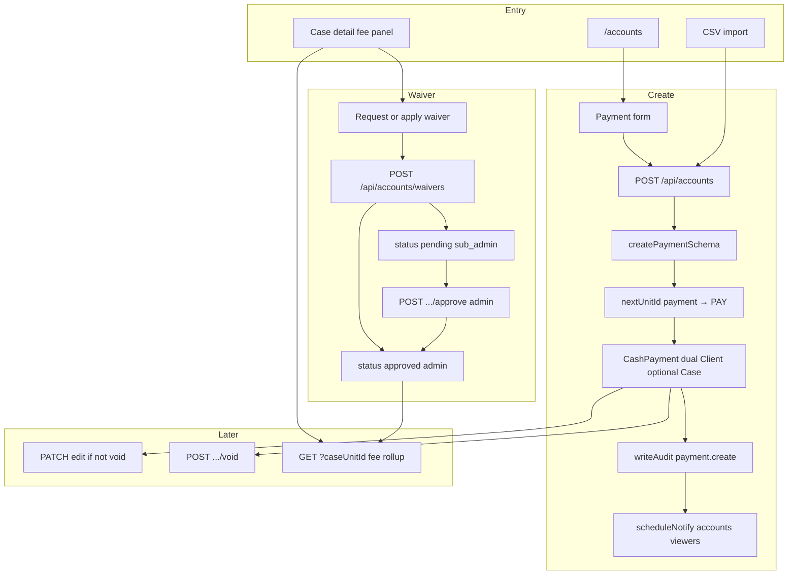
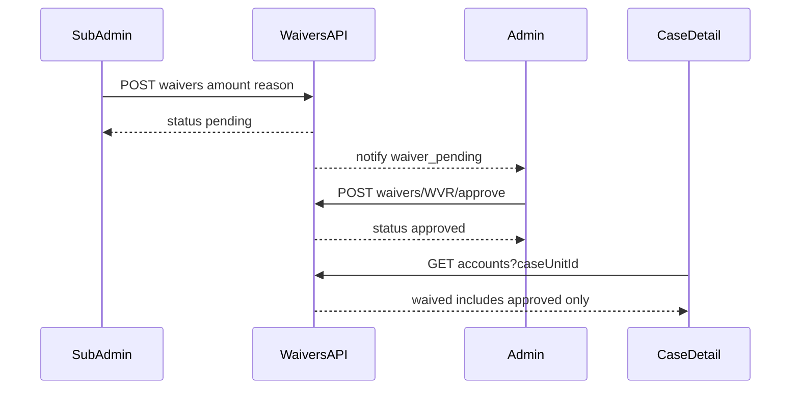

# Accounts flow (`/accounts`)

## Core principle: office cash ledger, not a gateway

**Accounts** stores `CashPayment` (`PAY`) rows: dual **required** Client, optional Case. Staff create/edit/void; case detail shows a fee snippet via `caseUnitId` filter. Status is `pending` | `paid` | `void`. There is **no delete** and no card/UPI processor.

**Fee waivers** are separate `FeeWaiver` (`WVR`) rows — non-cash adjustments that reduce remaining balance without counting as money collected.

| Who | What |
|-----|------|
| **Sub admin** | Requests a waiver → status `pending` (does **not** reduce balance yet). Can cancel own pending requests. |
| **Admin** | Applies waiver immediately (`approved`), or **approves / rejects** pending requests. |

Requires `accounts.waive` **and** role gate (`admin` \| `sub_admin` to request; **admin only** to approve).



---

## Permissions / nav

| Gate | Value |
|------|--------|
| Nav | Office → Accounts · `accounts.view` · **staffOnly** |
| Create | `accounts.create` |
| Edit / void cash | `accounts.edit` |
| CSV import | `accounts.upload` |
| Request / apply waiver | `accounts.waive` **and** role `admin` \| `sub_admin` |
| Approve waiver | `accounts.waive` **and** role **admin only** |

Defaults: **accountant** gets view/create/edit/upload (not waive). **sub_admin** gets `accounts.view` + `accounts.waive` (not cash create/edit by default). **admin** always full catalog.

Clients never see Accounts in the sidebar.

---

## Staff vs client

| Action | Staff | Client |
|--------|-------|--------|
| List / filter payments | Yes | No |
| Create / edit / void cash | Yes (perm) | No |
| Request waiver | Sub admin (+ admin apply) | No |
| Approve / reject waiver | Admin only | No |
| See fee snippet on own case | Via case detail (staff UI) | No accounts page |
| CSV import | Yes | No |

---

## Fee rollup / settlement

`feeRollupForCase` / `feeRollupForClient` ([`fee-rollup.ts`](../../features/accounts/server/fee-rollup.ts)):

| Field | Meaning |
|-------|---------|
| `agreedFee` | Case fee (required on case create) |
| `collected` | Sum of **paid** fee purposes (`advance` \| `partial` \| `full` \| `consultation`) |
| `waived` | Sum of **approved** waivers (legacy `active` counted as approved) |
| `pendingWaived` | Sum of **pending** requests (reserved, does not reduce outstanding) |
| `outstanding` | `max(0, agreedFee − collected − waived)` |
| `settlement` | `none` (Unpaid) \| `partial` \| `paid` |

New waiver amount must be ≤ `outstanding − pendingWaived`. UI badges: **Unpaid** / **Partial** / **Paid** (or **Paid · waived**). Actuals and void payments never count toward collected.

---

## Action catalog

| Action | How | API |
|--------|-----|-----|
| List / filter | `/accounts` · status, client, case, `q` | `GET /api/accounts` |
| Create | Payment form (default purpose **Advance**) | `POST /api/accounts` |
| Get / edit | Row / dialog | `GET` / `PATCH /api/accounts/[unitId]` |
| Void cash | Void action + reason | `POST /api/accounts/[unitId]/void` → `status: void` |
| List / create waiver | Case detail | `GET` / `POST /api/accounts/waivers` |
| Approve waiver | Case detail · admin | `POST /api/accounts/waivers/[unitId]/approve` |
| Void / reject waiver | Reason required | `POST /api/accounts/waivers/[unitId]/void` |
| Import | Import dialog | `POST /api/accounts/import` |
| Case fee snippet | Case detail | `GET /api/accounts?caseUnitId=CSE-…` |

**ID prefixes:** `PAY` (`payment`), `WVR` (`waiver`). Helpers: [`features/accounts/server/fee-rollup.ts`](../../features/accounts/server/fee-rollup.ts), [`filters.ts`](../../features/accounts/server/filters.ts).

---

## Create → rollup → void

1. Page [`app/(portal)/accounts/page.tsx`](../../app/(portal)/accounts/page.tsx) — `accounts.view`.
2. Form requires existing **client**; optional **case** must belong to that client. When case linked, form shows **remaining balance** and blocks fee-purpose amounts above outstanding.
3. `POST /api/accounts` → Zod → verify client/case → `nextUnitId("payment")` → dual FKs → `writeAudit` → may notify.
4. Case detail calls `GET /api/accounts?caseUnitId=` → `feeRollupForCase` (collected + waived + pendingWaived + settlement).
5. Waiver create: `POST /api/accounts/waivers` — admin → `approved`; sub_admin → `pending` + notify admins.
6. Approve: `POST .../waivers/[unitId]/approve` — admin only; re-checks amount ≤ outstanding.
7. Void: admin any; sub_admin own pending only. **Never delete.**



```text
Case detail  -->  POST /api/accounts/waivers
                  (sub_admin → pending; admin → approved)
             -->  POST /api/accounts/waivers/WVR-xxxxx/approve  (admin)
             -->  POST /api/accounts/waivers/WVR-xxxxx/void
```

---

## State / rules

| Cash state | Meaning | Counts in fee rollup? |
|------------|---------|------------------------|
| `pending` | Recorded, not marked paid | No |
| `paid` | Collected | Yes if fee purpose |
| `void` | Reversed | No |

| Waiver status | Meaning |
|---------------|---------|
| `pending` | Awaiting admin; shown as pending; does not reduce outstanding |
| `approved` | Counts in `waived` (legacy `active` treated the same) |
| `void` | Rejected / cancelled |

| Link | Kind |
|------|------|
| Client | **Required** dual `clientId` + `clientUnitId` |
| Case | Optional on cash; **required** on waiver |

---

## Key files

| Layer | Path |
|-------|------|
| Page | [`app/(portal)/accounts/page.tsx`](../../app/(portal)/accounts/page.tsx) |
| UI | [`features/accounts/components/`](../../features/accounts/components/) |
| Fee rollup / filters / waivers | [`features/accounts/server/`](../../features/accounts/server/) |
| API | [`app/api/accounts/`](../../app/api/accounts/) |
| Zod | [`lib/validations/accounts.schema.ts`](../../lib/validations/accounts.schema.ts) |

---

## Cross-module links

| Module | Link |
|--------|------|
| [Clients](./clients_flow.md) | Required parent `CLI` |
| [Cases](./cases_flow.md) | Required case fee + fee panel / Paid badge / pending waivers |
| [Reports](./reports_flow.md) | `accounts`, `fees-outstanding` exports (approved waived) |
| [Documents](./documents_flow.md) | Optional receipt attach (separate DOC) |
| [Activity](./activity_flow.md) | `waiver.request` / `waiver.approve` / `waiver.void` |
| [Permissions](./permissions_flow.md) | `accounts.waive` + admin approve gate |
