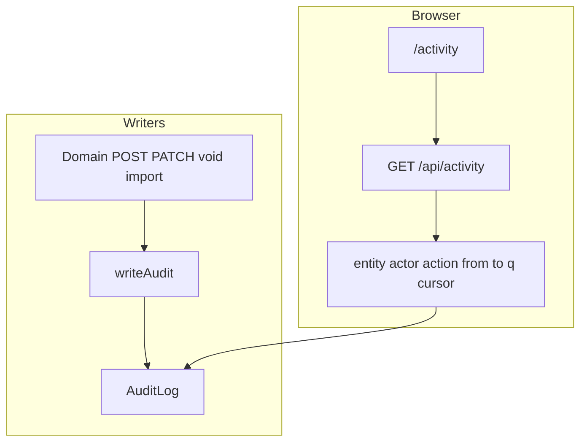
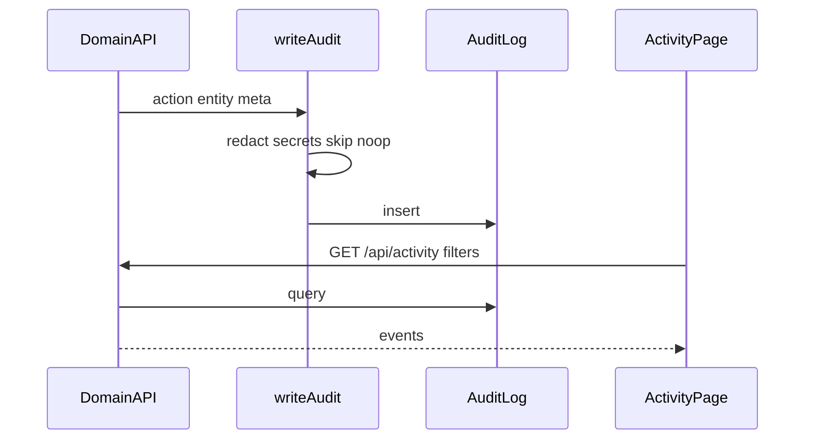

# Activity flow (`/activity`)

## Core principle: browse what the office already wrote to the audit log

**Activity** does not create domain data. Mutations across the app call [`writeAudit`](../../lib/audit/index.ts); this page lists those events for staff with `activity.view`. `writeAudit` redacts secrets, skips no-op updates (empty `changes`), and never throws.



---

## Permissions / nav

| Gate | Value |
|------|--------|
| Nav | Admin → Activity · `activity.view` · **staffOnly** |
| API | `requirePerm(activity, view)` |

No create/edit on this page.

---

## Staff vs client

| Action | Staff | Client |
|--------|-------|--------|
| Browse audit log | Yes (`activity.view`) | No |
| Write audit rows | Via domain APIs only | Never |

---

## Action catalog

| Action | How | API |
|--------|-----|-----|
| Browse / filter | `/activity` | `GET /api/activity` |
| Paginate | Load more | `cursor` opaque token |

**Query filters:**

| Param | Role |
|-------|------|
| `limit` | 1–100 (default 40) |
| `cursor` | Opaque pagination |
| `entity` | Entity type filter |
| `actorUnitId` | Who did it |
| `action` | e.g. `payment.create` |
| `from` / `to` | IST `YYYY-MM-DD` |
| `q` | OR on action / entity / entityUnitId / actorUnitId |

---

## Event shape

Response items:

| Field | Meaning |
|-------|---------|
| `id` | Audit row id |
| `action` | e.g. `client.create`, `payment.void` |
| `entity` | Domain key |
| `entityUnitId` | Public unit id when present |
| `actorUnitId` / `actorName` | Who acted |
| `meta` | Redacted change payload |
| `createdAt` | Timestamp |

Store model: `AuditLog` (`actorUnitId`, `action`, `entity`, `entityUnitId`, `meta`, `createdAt`).

---

## How events get written



```text
Any domain mutation  -->  writeAudit  -->  AuditLog
/activity            -->  GET /api/activity?entity=&from=&to=
                     -->  requirePerm activity.view
```

---

## Key files

| Layer | Path |
|-------|------|
| Page | [`app/(portal)/activity/page.tsx`](../../app/(portal)/activity/page.tsx) |
| UI | [`features/activity/components/activity-page.tsx`](../../features/activity/components/activity-page.tsx) |
| API | [`app/api/activity/route.ts`](../../app/api/activity/route.ts) |
| Writer | [`lib/audit`](../../lib/audit) |

---

## Cross-module links

| Module | Link |
|--------|------|
| [Clients](./clients_flow.md) | `client.*` audits |
| [Cases](./cases_flow.md) | `case.*` / hearing audits |
| [Employees](./employees_flow.md) | `employee.*` |
| [Accounts](./accounts_flow.md) | `payment.*` |
| [Expenses](./expenses_flow.md) | `expense.*` |
| [Permissions](./permissions_flow.md) | `permissions.matrix_update` |
| All other write domains | Same `writeAudit` pattern |
