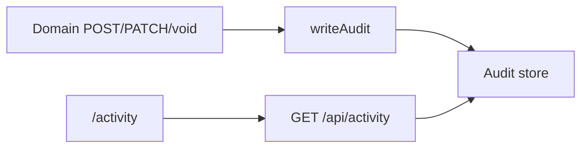

# Activity flow (`/activity`)

## Core principle: browse what the office already wrote to the audit log

**Activity** does not create domain data. Mutations across the app call [`writeAudit`](../../lib/audit/index.ts); this page lists those events for staff with `activity.view`.

---

## Permissions / nav

| Gate | Value |
|------|--------|
| Nav | Admin → Activity · `activity.view` · **staffOnly** |
| API | `requirePerm(activity, view)` |

No create/edit on this page.

---

## Action catalog

| Action | API |
|--------|-----|
| Browse / filter audit events | `GET /api/activity` |

---

## Key files

| Layer | Path |
|-------|------|
| Page | [`app/(portal)/activity/page.tsx`](../../app/(portal)/activity/page.tsx) |
| UI | [`features/activity/components/activity-page.tsx`](../../features/activity/components/activity-page.tsx) |
| API | [`app/api/activity/route.ts`](../../app/api/activity/route.ts) |
| Writer | [`lib/audit`](../../lib/audit) |

---

## Cross-module links

Fed by create/edit/void/import across [Clients](./clients_flow.plan.md), [Cases](./cases_flow.plan.md), [Employees](./employees_flow.plan.md), [Accounts](./accounts_flow.plan.md), and other domains that call `writeAudit`.
