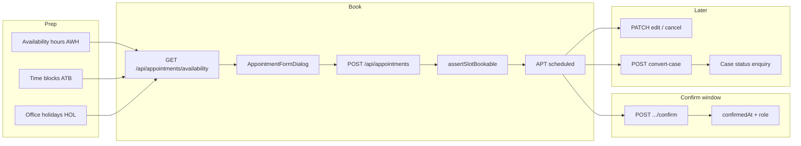
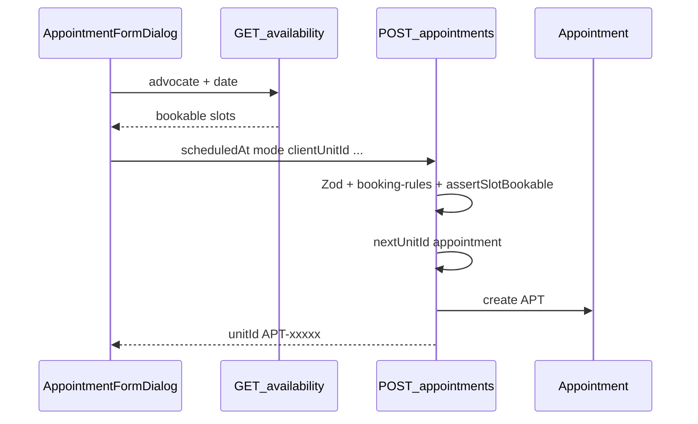

# Appointments flow (`/appointments`)

## Core principle: office books when the client calls

An **appointment** (`APT`) is a scheduled consultation (office / phone / video). **Only office staff create bookings** — the client calls the office; staff pick a bookable slot. Clients may **view** (and **cancel**) their own appointments in the portal; they cannot self-book. Starting **`APPOINTMENT_CONFIRM_WINDOW_HOURS`** before the slot (default 1), both client and office see **Confirm coming**; office can confirm even when the client has no portal. Cancel always frees the slot. Slots come from advocate **availability**, blocks, and office holidays. Staff can **convert** a consultation with a linked client into an enquiry **case**.



---

## Permissions / nav

| Gate | Value |
|------|--------|
| Nav | `appointments.view`, module `appointments` |
| List / slots | `appointments.view` |
| Create / import | `appointments.create` |
| Edit / cancel | appointments edit-or-cancel rules |
| Convert-case | Staff; `appointments.edit` **or** `cases.create`; both modules on |

Related staff nav: [Availability](./availability_flow.md) (`/availability`).

---

## Staff vs client

| Action | Staff | Client |
|--------|-------|--------|
| List | Own advocate diary or any (by role rules) | Own `clientUnitId` only |
| Book | Yes — when client calls; pick client, case, advocate, mode | **No** — call the office |
| Slot picker | Yes | N/A (no create) |
| Confirm coming | Yes — in confirm window (`appointments.view` + access) | Yes — same window, own appointments |
| Edit | Per booking rules | **No** |
| Cancel | Per booking rules — frees slot | Own scheduled appointments (`appointments.cancel`) — frees slot |
| Convert → case | Yes (needs linked client) | **No** |
| CSV import | Yes | No |

Client role defaults: `appointments.view` + `appointments.cancel` only (no `appointments.create`). API also rejects client `POST /api/appointments`.

**Confirm window:** from `scheduledAt − APPOINTMENT_CONFIRM_WINDOW_HOURS` until slot end (`scheduledAt + durationMin`). Helper: [`lib/appointments/confirm-window.ts`](../../lib/appointments/confirm-window.ts). Fields: `confirmedAt`, `confirmedByUnitId`, `confirmedByRole` (`client` \| `staff`). Status stays `scheduled` until completed/cancelled — no auto-cancel if unconfirmed.

Booking advocate resolution: [`lib/appointments/booking-rules.ts`](../../lib/appointments/booking-rules.ts). Slot checks: [`assertSlotBookable`](../../lib/appointments/availability.ts) (only `scheduled` counts as busy).

---

## Action catalog

| Action | How | API |
|--------|-----|-----|
| List / filter | `/appointments` · status, date, advocate, `q` | `GET /api/appointments` |
| Open create | Book button, `?new=1`, Home “Book appointment” | — |
| Load slots | Form + [`AvailabilitySlotPicker`](../../features/availability/components/availability-slot-picker.tsx) | `GET /api/appointments/availability?advocate=&date=` |
| Create | `AppointmentFormDialog` create mode | `POST /api/appointments` |
| Edit / reschedule / cancel | Same dialog / actions | `PATCH /api/appointments/[unitId]` |
| Confirm coming | Button in window (list + client home) | `POST /api/appointments/[unitId]/confirm` |
| Convert to case | Staff action on row/detail · requires **case fee (₹)** | `POST /api/appointments/[unitId]/convert-case` `{ agreedFee }` |
| CSV import | Import dialog | `POST /api/appointments/import` |
| Advocates | Picker | `GET /api/advocates` |

**ID prefix:** `APT`. Convert creates `CSE` (enquiry).

---

## Create / book path (line by line)

1. Page [`app/(portal)/appointments/page.tsx`](../../app/(portal)/appointments/page.tsx) — `appointments.view`; create needs `appointments.create` (**staff only**).
2. [`appointments-page.tsx`](../../features/appointments/components/appointments-page.tsx) opens [`appointment-form-dialog.tsx`](../../features/appointments/components/appointment-form-dialog.tsx).
3. Staff: optional client (picker), optional linked case, title, mode, duration, advocate (if `canBookForAnyAdvocate`).
4. Client portal: **no create UI**; call office. May cancel own scheduled appointments.
5. Staff picks a slot from availability API (hours − blocks − holidays − conflicts).
6. `POST /api/appointments` → rejects client actors → Zod → resolve advocate → `assertSlotBookable` → `nextUnitId("appointment")` → create → audit → notify.



---

## Convert-case

```text
Staff APT with clientUnitId
  -->  POST /api/appointments/APT-xxxxx/convert-case
  -->  new Case status=enquiry + dual Client FK
  -->  Appointment dual-linked to Case
```

Clients cannot convert. After convert, continue on [cases](./cases_flow.md) (checklist, hearings, docs).

---

## Confirm coming

```text
Window opens: scheduledAt − APPOINTMENT_CONFIRM_WINDOW_HOURS (default 1)
  -->  Cron GET /api/cron/appointment-confirm-remind (every 15m, CRON_SECRET)
  -->  In-app notify: portal client (“Confirm your appointment”)
       + advocate (“Confirm client coming”)
  -->  Set confirmRemindedAt (once per APT)
  -->  canConfirm on list/home summaries
  -->  POST /api/appointments/APT-xxxxx/confirm
  -->  confirmedAt + confirmedByRole (client|staff)
  -->  status remains scheduled (busy until cancel/complete)
If booked already inside the window → same remind on create (no wait for cron).
Cancel anytime while scheduled → status cancelled → slot free
```

Env: [`APPOINTMENT_CONFIRM_WINDOW_HOURS`](../../.env.example) · [`CRON_SECRET`](../../.env.example). Job: [`lib/services/appointment-confirm-remind.job.ts`](../../lib/services/appointment-confirm-remind.job.ts).

---

## State / rules

| State | Confirm? | Cancel? | Slot busy? |
|-------|----------|---------|------------|
| Before confirm window | No | Yes | Yes |
| In window, not confirmed | Yes (client + staff) | Yes | Yes |
| Confirmed (`confirmedAt`) | No (already) | Yes | Yes — status still `scheduled` |
| Cancelled | No | — | **No** |
| Completed | No | — | No |

No auto-cancel if unconfirmed. Only `scheduled` counts as busy in slot math.
---

## Availability dependency

Without weekly hours ([availability](./availability_flow.md)), slot picker returns empty / unbookable. Court/break/personal **blocks** and HRMS **holidays** remove slots. Day board shows appointments for the IST day ([day board](./day_board_flow.md)).

---

## Key files

| Layer | Path |
|-------|------|
| Page | [`app/(portal)/appointments/page.tsx`](../../app/(portal)/appointments/page.tsx) |
| List / form UI | [`features/appointments/components/`](../../features/appointments/components/) |
| Slot picker | [`features/availability/components/availability-slot-picker.tsx`](../../features/availability/components/availability-slot-picker.tsx) |
| API list/create | [`app/api/appointments/route.ts`](../../app/api/appointments/route.ts) |
| API get/update | [`app/api/appointments/[unitId]/route.ts`](../../app/api/appointments/[unitId]/route.ts) |
| Confirm | [`app/api/appointments/[unitId]/confirm/route.ts`](../../app/api/appointments/[unitId]/confirm/route.ts) |
| Confirm remind cron | [`app/api/cron/appointment-confirm-remind/route.ts`](../../app/api/cron/appointment-confirm-remind/route.ts) |
| Confirm remind job | [`lib/services/appointment-confirm-remind.job.ts`](../../lib/services/appointment-confirm-remind.job.ts) |
| Convert | [`app/api/appointments/[unitId]/convert-case/route.ts`](../../app/api/appointments/[unitId]/convert-case/route.ts) |
| Slots API | [`app/api/appointments/availability/route.ts`](../../app/api/appointments/availability/route.ts) |
| Import | [`app/api/appointments/import/route.ts`](../../app/api/appointments/import/route.ts) |
| Confirm window | [`lib/appointments/confirm-window.ts`](../../lib/appointments/confirm-window.ts) |
| Access | [`lib/appointments/access.ts`](../../lib/appointments/access.ts) |
| Rules / slots | [`lib/appointments/booking-rules.ts`](../../lib/appointments/booking-rules.ts), [`availability.ts`](../../lib/appointments/availability.ts) |
| Config | [`config/company/booking.ts`](../../config/company/booking.ts) |
| Zod / enrich | [`lib/validations/appointments.schema.ts`](../../lib/validations/appointments.schema.ts), [`features/appointments/server/`](../../features/appointments/server/) |

---

## Cross-module links

| Module | Link |
|--------|------|
| [Availability](./availability_flow.md) | Hours + blocks feed slots |
| [Clients](./clients_flow.md) | Optional / required for convert |
| [Cases](./cases_flow.md) | Optional link; convert creates enquiry |
| [Day board](./day_board_flow.md) | Same-day appointments |
| [HRMS](./hrms_flow.md) | Holidays close slots |
| [Employees](./employees_flow.md) | Advocates via `/api/advocates` |
