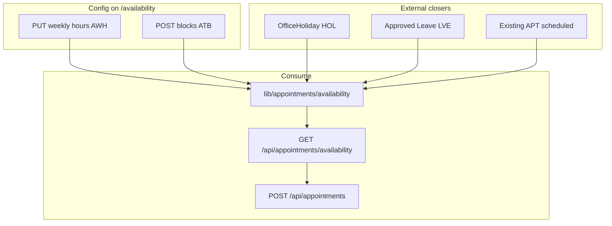
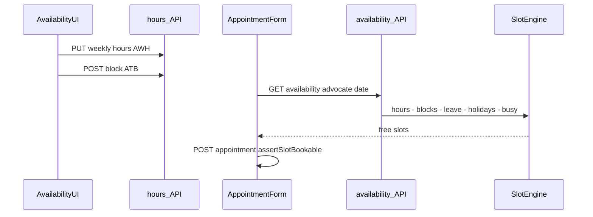

# Availability flow (`/availability`)

## Core principle: hours minus blocks minus holidays minus leave = slots

Staff configure **weekly hours** (`AWH`) and **time blocks** (`ATB`: `break` | `court` | `personal` | `other`). Appointment booking calls `GET /api/appointments/availability`, which applies these plus [HRMS](./hrms_flow.md) office holidays and approved leave. Defaults come from [`config/company/booking.ts`](../../config/company/booking.ts) when no hours row exists (`usingDefaults`).



---

## Permissions / nav

| Gate | Value |
|------|--------|
| Nav | Schedule → Availability · `appointments.view` · **staffOnly** |
| View hours/blocks | `appointments.view` |
| Edit hours/blocks | `appointments.edit` |

Clients never manage availability; they only consume slots when staff book.

---

## Staff vs client

| Action | Staff | Client |
|--------|-------|--------|
| Set weekly hours / blocks | Yes | No |
| See slot picker when booking | Yes (staff book) | N/A (no self-book) |

---

## Action catalog

| Action | API |
|--------|-----|
| Get / set weekly hours | `GET` / `PUT /api/advocates/availability/hours` |
| List / create blocks | `GET` / `POST /api/advocates/availability/blocks` |
| Edit / delete block | `PATCH` / `DELETE /api/advocates/availability/blocks/[unitId]` |
| Consume slots | `GET /api/appointments/availability?advocate=&date=` |
| Book into slot | `POST /api/appointments` ([appointments](./appointments_flow.md)) |

**ID prefixes:** `AWH` (weekly hours), `ATB` (time blocks). Weekday keys 0–6 IST.

---

## Slot calculation path

1. Staff open `/availability` and set hours / blocks.
2. Booking form calls `GET /api/appointments/availability`.
3. [`lib/appointments/availability.ts`](../../lib/appointments/availability.ts) builds windows from weekly hours (or defaults), subtracts blocks, approved leave, office holidays, and busy `scheduled` appointments.
4. Conflict codes include `OUTSIDE_HOURS`, `BLOCKED`, `ON_LEAVE`, `OFFICE_CLOSED`, etc.
5. Create path uses `assertSlotBookable` before insert.



```text
/availability
  --> PUT /api/advocates/availability/hours
  --> POST /api/advocates/availability/blocks
  --> (later) GET /api/appointments/availability?advocate=&date=
  --> POST /api/appointments
```

---

## State / rules

| Input | Effect on slots |
|-------|-----------------|
| Weekly hours `AWH` | Open windows per weekday |
| Block `ATB` | Removes time range |
| Office holiday `HOL` | Closes day / office |
| Approved leave | Advocate unavailable |
| `APT` status `scheduled` | Slot busy; cancel frees it |

| Block kind | Typical use |
|------------|-------------|
| `court` | Court duty (see [court roster](./court_roster_flow.md)) |
| `break` / `personal` / `other` | Non-bookable time |

---

## Key files

| Layer | Path |
|-------|------|
| Page | [`app/(portal)/availability/page.tsx`](../../app/(portal)/availability/page.tsx) |
| UI | [`features/availability/components/`](../../features/availability/components/) |
| Hours API | [`app/api/advocates/availability/hours/`](../../app/api/advocates/availability/hours/) |
| Blocks API | [`app/api/advocates/availability/blocks/`](../../app/api/advocates/availability/blocks/) |
| Slot math | [`lib/appointments/availability.ts`](../../lib/appointments/availability.ts) |
| Zod | [`lib/validations/availability.schema.ts`](../../lib/validations/availability.schema.ts) |
| Defaults | [`config/company/booking.ts`](../../config/company/booking.ts) |

---

## Cross-module links

| Module | Link |
|--------|------|
| [Appointments](./appointments_flow.md) | Consumes slots |
| [HRMS](./hrms_flow.md) | Holidays + leave close slots |
| [Court roster](./court_roster_flow.md) | Court cover / court blocks practice |
