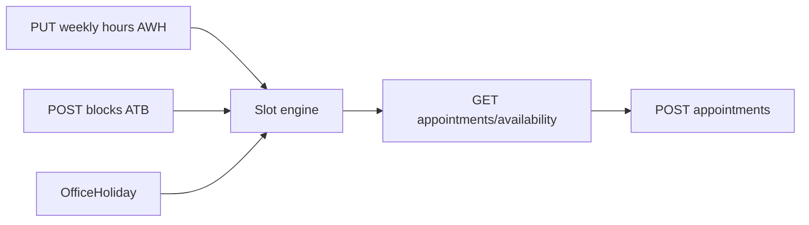

# Availability flow (`/availability`)

## Core principle: hours minus blocks minus holidays = slots

Staff configure **weekly hours** (`AWH`) and **time blocks** (`ATB`: court / break / personal). Appointment booking calls `GET /api/appointments/availability`, which applies these plus [HRMS](./hrms_flow.plan.md) holidays.



---

## Permissions / nav

| Gate | Value |
|------|--------|
| Nav | Schedule → Availability · `appointments.view` · **staffOnly** |
| View hours/blocks | `appointments.view` |
| Edit hours/blocks | `appointments.edit` |

Clients never manage availability; they only consume slots when booking.

---

## Action catalog

| Action | API |
|--------|-----|
| Get / set weekly hours | `GET` / `PUT /api/advocates/availability/hours` |
| List / create blocks | `GET` / `POST /api/advocates/availability/blocks` |
| Edit / delete block | `PATCH` / `DELETE /api/advocates/availability/blocks/[unitId]` |
| Consume slots | `GET /api/appointments/availability` (from [appointments](./appointments_flow.plan.md) form) |

**ID prefixes:** `AWH`, `ATB`. Config defaults: [`config/company/booking.ts`](../../config/company/booking.ts).

---

## Request path

```text
/availability
  --> PUT /api/advocates/availability/hours
  --> POST /api/advocates/availability/blocks
  --> (later) GET /api/appointments/availability?advocate=&date=
  --> POST /api/appointments
```

---

## Key files

| Layer | Path |
|-------|------|
| Page | [`app/(portal)/availability/page.tsx`](../../app/(portal)/availability/page.tsx) |
| UI | [`features/availability/components/`](../../features/availability/components/) |
| Hours API | [`app/api/advocates/availability/hours/`](../../app/api/advocates/availability/hours/) |
| Blocks API | [`app/api/advocates/availability/blocks/`](../../app/api/advocates/availability/blocks/) |
| Slot math | [`lib/appointments/availability.ts`](../../lib/appointments/availability.ts) |

---

## Cross-module links

[Appointments](./appointments_flow.plan.md) · [HRMS](./hrms_flow.plan.md) (holidays) · [Court roster](./court_roster_flow.plan.md) (court blocks practice)
