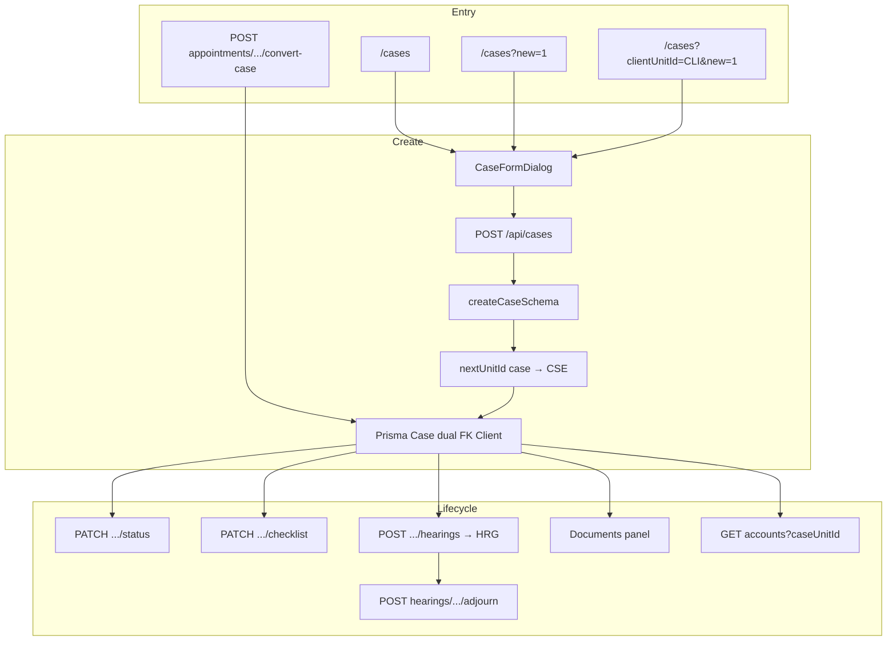
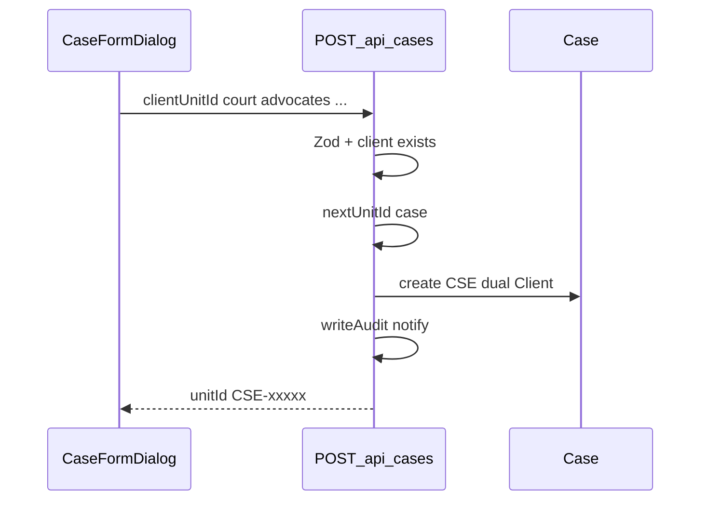

# Cases flow (`/cases`)

## Core principle: matter pipeline with dual client link

A **case** (`CSE`) always belongs to an existing **client** (`CLI`). Staff run full CRUD, status pipeline, filing checklist, and hearings. Clients see **only their own** cases. Consultations can become enquiry cases via appointment **convert-case** ([appointments](./appointments_flow.plan.md)).



---

## Permissions / nav

| Gate | Value |
|------|--------|
| Nav | `cases.view`, module `cases` (staff + client) |
| List / detail | `cases.view` (+ client scope) |
| Create | `cases.create` (staff) |
| Edit / status / checklist / hearings | `cases.edit` |
| Case CSV import | `cases.upload` |
| Hearing CSV import | `cases.edit` |

---

## Staff vs client

| Action | Staff | Client |
|--------|-------|--------|
| List all / filter / board | Yes | Own `clientUnitId` only |
| Create / edit / status / checklist | Yes | No |
| Hearings / adjourn | Yes | View on detail (scoped) |
| Upload docs on case | Yes | Via [documents](./documents_flow.plan.md) / allowed types |
| Convert from appointment | Yes | No |

API forces client filter via `requireClientUnitId` + `isClientOnlyUser` in [`app/api/cases/route.ts`](../../app/api/cases/route.ts).

---

## Action catalog

| Action | How | API |
|--------|-----|-----|
| List / filters / board | `/cases` | `GET /api/cases?...` (`view=board` raises page size) |
| Open create | **New case**, `?new=1`, or from client | — |
| Create | `CaseFormDialog` — client, court cascade, case type, primary advocate; default status **enquiry** | `POST /api/cases` |
| Detail | `/cases/[unitId]` | `GET /api/cases/[unitId]` |
| Edit fields | Form dialog | `PATCH /api/cases/[unitId]` |
| Status transition | Pipeline UI | `PATCH /api/cases/[unitId]/status` → `canTransitionStatus` |
| Filing checklist | Detail | `PATCH /api/cases/[unitId]/checklist` |
| Add hearing | Detail | `POST /api/cases/[unitId]/hearings` → sets `nextHearingAt` |
| Adjourn | Hearing action | `POST /api/hearings/[unitId]/adjourn` → new `HRG` |
| Fee snippet | Detail | `GET /api/accounts?caseUnitId=CSE-…` |
| Import cases / hearings | Import dialogs | `POST /api/cases/import`, `/api/hearings/import` |
| Advocates picker | Form | `GET /api/advocates` |

**ID prefixes:** `CSE` (case), `HRG` (hearing).

---

## Create path (line by line)

1. Page [`app/(portal)/cases/page.tsx`](../../app/(portal)/cases/page.tsx) — `cases.view`; create needs `cases.create`.
2. [`CaseFormDialog`](../../features/cases/components/case-form-dialog.tsx) requires existing client (picker can create client inline — see [clients](./clients_flow.plan.md)).
3. Court / location cascade, case type, primary advocate mobile, optional case number uniqueness.
4. `POST /api/cases` → Zod → verify client exists → `nextUnitId("case")` → create with dual `clientId` + `clientUnitId` → audit → may notify advocates.
5. Toast often points to upload docs on detail.



---

## Status, checklist, hearings

**Pipeline** rules live in [`config/company/case-pipeline.ts`](../../config/company/case-pipeline.ts). Illegal transitions return 400.

**Hearings:**

- Create updates `Case.nextHearingAt`.
- May notify; SMS eligibility uses client `smsConsent`.
- **Adjourn** keeps history on old `HRG` and creates a replacement.
- Hearing import for **tomorrow** dates can SMS immediately (catch-up if nightly cron already ran). Day board / cron details: [day board](./day_board_flow.plan.md).

```text
/cases  -->  POST /api/cases { clientUnitId, court, advocates }
        -->  GET /cases/CSE-xxxxx
        -->  PATCH .../status
        -->  POST .../hearings  -->  HRG + nextHearingAt
        -->  POST /api/hearings/HRG-xxxxx/adjourn
```

---

## Convert-case inbound

Staff on an appointment with a linked client: `POST /api/appointments/[unitId]/convert-case` creates an **enquiry** case and dual-links the appointment. Requires cases + appointments modules and `appointments.edit` or `cases.create`. Full path: [appointments](./appointments_flow.plan.md).

---

## Key files

| Layer | Path |
|-------|------|
| List / detail pages | [`app/(portal)/cases/`](../../app/(portal)/cases/) |
| List / form / detail UI | [`features/cases/components/`](../../features/cases/components/) |
| Pipeline | [`config/company/case-pipeline.ts`](../../config/company/case-pipeline.ts) |
| Filters / serialize | [`features/cases/server/filters.ts`](../../features/cases/server/filters.ts), [`serialize.ts`](../../features/cases/server/serialize.ts) |
| API | [`app/api/cases/route.ts`](../../app/api/cases/route.ts), [`[unitId]/`](../../app/api/cases/[unitId]/) |
| Hearings adjourn | [`app/api/hearings/[unitId]/adjourn/route.ts`](../../app/api/hearings/[unitId]/adjourn/route.ts) |
| Zod | [`lib/validations/cases.schema.ts`](../../lib/validations/cases.schema.ts) |
| Convert | [`app/api/appointments/[unitId]/convert-case/route.ts`](../../app/api/appointments/[unitId]/convert-case/route.ts) |

---

## Cross-module links

| Module | Link |
|--------|------|
| [Clients](./clients_flow.plan.md) | Required parent `CLI` |
| [Documents](./documents_flow.plan.md) | Case parent uploads |
| [Accounts](./accounts_flow.plan.md) | Fee rollup by `caseUnitId` |
| [Day board](./day_board_flow.plan.md) | Hearings for IST day + SMS |
| [Tasks](./tasks_flow.plan.md) / [Postal](./postal_flow.plan.md) | Soft `caseUnitId` |
| [Court roster](./court_roster_flow.plan.md) | Who appears / default courts |
| [Appointments](./appointments_flow.plan.md) | convert-case → enquiry |
