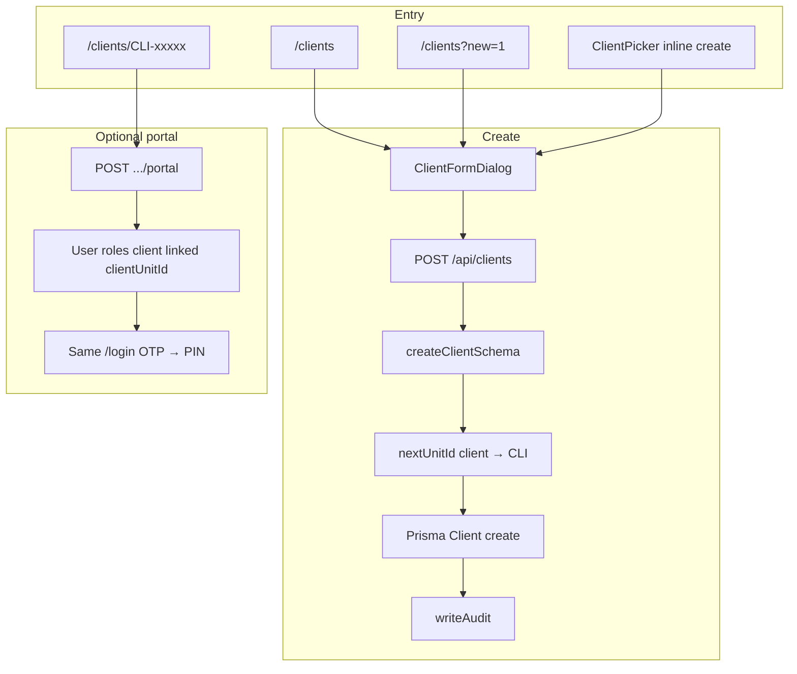
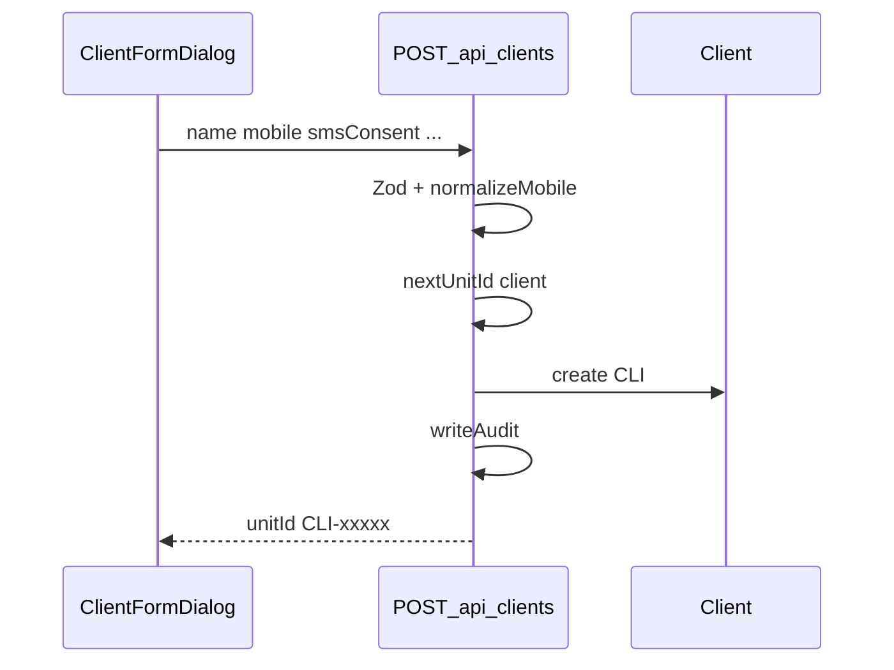

# Clients flow (`/clients`)

## Core principle: registry first, login later

**Clients** are intake records (`CLI`), not login accounts. Staff create/edit them under Matters → Clients. A client can use `/login` only after **Invite to portal** on the detail page creates a linked `User` with `roles: ["client"]`.

See also: [unified login](./unified_login_flow_c5377653.plan.md) (staff vs client create paths), [cases](./cases_flow.plan.md), [appointments](./appointments_flow.plan.md).



---

## Permissions / nav

| Gate | Value |
|------|--------|
| Nav | `clients.view`, module `clients`, **staffOnly** |
| List / detail | `clients.view` |
| Create / import create | `clients.create` |
| Edit / portal enable-disable | `clients.edit` |
| Import upsert | `clients.create` (+ `edit` for update rows) |

Clients never see `/clients` in the sidebar.

---

## Staff vs client

| Action | Staff | Client portal |
|--------|-------|----------------|
| List / search clients | Yes | No |
| Create / edit client record | Yes | No |
| Invite / revoke portal | Yes | No |
| Own profile / cases / appts | — | After invite |

If a client dials `/login` **before** invite → `check-mobile` → `not_found`.

---

## Action catalog

| Action | How | API |
|--------|-----|-----|
| List / search | `/clients` · `q`, pagination | `GET /api/clients?page=&q=` |
| Open create | **New client** or `?new=1` or Home shortcut | — |
| Create | `ClientFormDialog` | `POST /api/clients` |
| Detail | `/clients/[unitId]` | `GET /api/clients/[unitId]` |
| Edit | Same dialog, edit mode | `PATCH /api/clients/[unitId]` |
| CSV import | Import dialog on list | `POST /api/clients/import` (dry-run then confirm) |
| Portal status | Detail panel | `GET /api/clients/[unitId]/portal` |
| Enable portal | **Invite to portal** | `POST /api/clients/[unitId]/portal` |
| Disable portal | Detail | `DELETE /api/clients/[unitId]/portal` |
| Inline create | `ClientPicker` in case/appt forms | Same `POST /api/clients` |

**ID prefix:** `CLI` ([`config/company/ids.ts`](../../config/company/ids.ts)).

---

## Create path (line by line)

1. Page [`app/(portal)/clients/page.tsx`](../../app/(portal)/clients/page.tsx) requires session + `clients.view`; create button needs `clients.create`.
2. UI [`features/clients/components/clients-page.tsx`](../../features/clients/components/clients-page.tsx) opens [`client-form-dialog.tsx`](../../features/clients/components/client-form-dialog.tsx).
3. Fields include name, relation/father-or-spouse, mobile, location cascade, SMS consent, matter brief, etc. ([`lib/validations/clients.schema.ts`](../../lib/validations/clients.schema.ts)).
4. `POST /api/clients` → `requirePerm(clients, create)` → Zod → [`normalizeMobile`](../../lib/auth/mobile.ts) → uniqueness → [`nextUnitId("client")`](../../lib/ids/index.ts) → Prisma create → [`writeAudit`](../../lib/audit/index.ts).
5. Response returns `unitId` (`CLI-#####`); list refreshes. **No `User` row yet.**



---

## Detail + portal invite

1. [`client-detail-page.tsx`](../../features/clients/components/client-detail-page.tsx) loads client, related cases/payments/docs panels.
2. **Invite to portal** → `POST /api/clients/[unitId]/portal` creates `User` with `unitId` / `clientUnitId` = `CLI-…`, `roles: ["client"]`, no `pinHash`.
3. Client first login: `check-mobile` → `otp_required` → verify OTP → setup PIN (same as staff). Details in [login playbook](./unified_login_flow_c5377653.plan.md).

```text
/clients  -->  POST /api/clients  -->  CLI record only
/clients/CLI-xxxxx  -->  POST .../portal  -->  User roles=client
  -->  /login  -->  OTP setup  -->  PIN
```

---

## CSV import

Uses shared [`import-dialog.tsx`](../../shared/components/data/import-dialog.tsx) → `POST /api/clients/import` with dry-run first. Sample: `public/samples/clients.sample.csv`. Import order across the office: **clients before cases** (see [`prisma/data/README.md`](../../prisma/data/README.md)).

---

## Key files

| Layer | Path |
|-------|------|
| List page | [`app/(portal)/clients/page.tsx`](../../app/(portal)/clients/page.tsx) |
| Detail page | [`app/(portal)/clients/[unitId]/page.tsx`](../../app/(portal)/clients/[unitId]/page.tsx) |
| List UI | [`features/clients/components/clients-page.tsx`](../../features/clients/components/clients-page.tsx) |
| Form dialog | [`features/clients/components/client-form-dialog.tsx`](../../features/clients/components/client-form-dialog.tsx) |
| Detail UI | [`features/clients/components/client-detail-page.tsx`](../../features/clients/components/client-detail-page.tsx) |
| Picker | [`features/clients/components/client-picker.tsx`](../../features/clients/components/client-picker.tsx) |
| API list/create | [`app/api/clients/route.ts`](../../app/api/clients/route.ts) |
| API get/update | [`app/api/clients/[unitId]/route.ts`](../../app/api/clients/[unitId]/route.ts) |
| Portal | [`app/api/clients/[unitId]/portal/route.ts`](../../app/api/clients/[unitId]/portal/route.ts) |
| Import | [`app/api/clients/import/route.ts`](../../app/api/clients/import/route.ts) |
| Zod | [`lib/validations/clients.schema.ts`](../../lib/validations/clients.schema.ts) |
| Serialize | [`features/clients/server/serialize.ts`](../../features/clients/server/serialize.ts) |

---

## Cross-module links

| From / to | How |
|-----------|-----|
| → Cases | Case create requires `clientUnitId`; client detail can deep-link `/cases?clientUnitId=CLI-…&new=1` |
| → Appointments | Book with optional client; client portal books as self |
| → Accounts / DAK / Documents | Soft or dual links on detail panels |
| → Login | Only after portal invite |
