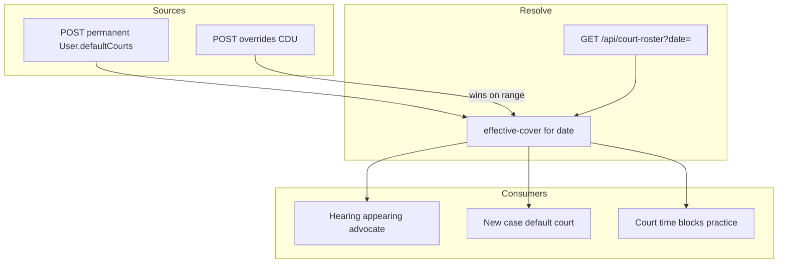
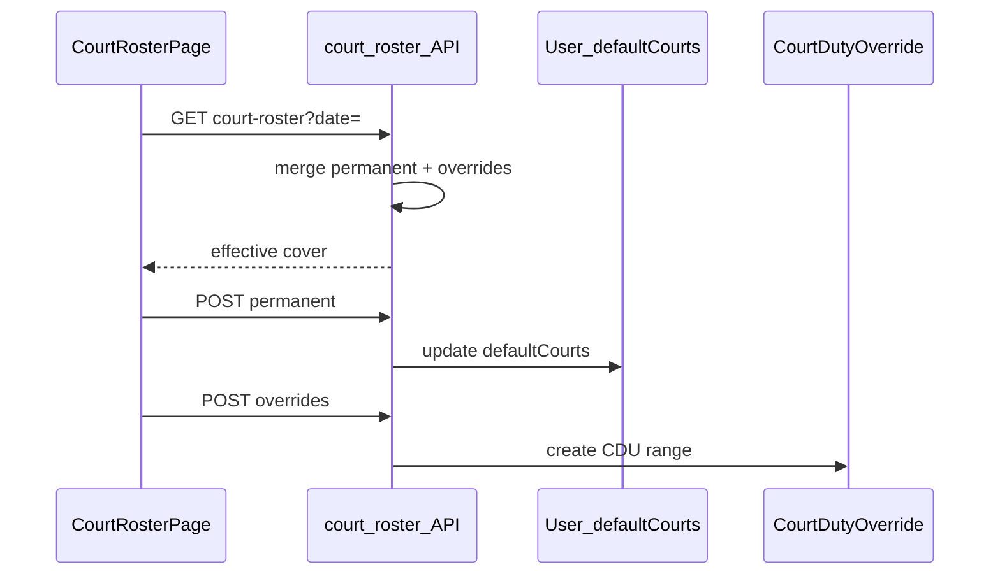

# Court roster flow (`/court-roster`)

## Core principle: permanent list + overrides that win

**Permanent** cover is `User.defaultCourts` (JSON on employee). **Temporary** cover is `CourtDutyOverride` (`CDU`). For an inclusive IST `fromDate`–`toDate`, an override **wins** over the permanent list when computing effective cover ([`features/court-roster/lib/effective-cover.ts`](../../features/court-roster/lib/effective-cover.ts)). Advocates must keep ≥1 default court when removing from permanent.



---

## Permissions / nav

| Gate | Value |
|------|--------|
| Nav | Schedule → Court roster · `employees.view` · **staffOnly** |
| Read roster / available advocates | `employees.view` |
| Edit permanent / overrides | `employees.edit` |

Clients never see Court roster.

---

## Staff vs client

| Action | Staff | Client |
|--------|-------|--------|
| View / edit roster | Yes | No |
| Create date overrides | Yes | No |

---

## Action catalog

| Action | API |
|--------|-----|
| Load roster view | `GET /api/court-roster?date=` (includes overrides for that view) |
| Add/remove permanent court | `POST /api/court-roster/permanent` |
| Create override | `POST /api/court-roster/overrides` |
| Edit / delete override | `PATCH` / `DELETE /api/court-roster/overrides/[unitId]` |
| Available advocates | `GET /api/court-roster/available-advocates` |

**ID prefix:** `CDU` (overrides only). Permanent data lives on employee `User` (`EMP`) — no separate unit id.

**Note:** Permanent is **POST** (add/remove), not GET/PUT. Override list is returned with the main roster GET.

---

## Permanent vs override path

1. Page loads `GET /api/court-roster?date=` for effective cover.
2. Permanent edits: `POST /api/court-roster/permanent` mutates `User.defaultCourts` → `writeAudit` `court_roster.permanent`.
3. Temporary: `POST .../overrides` creates `CDU` for a date range → audit.
4. Effective cover prefers override when date falls in range; else permanent.
5. Cases / hearings / availability court practice consume the resolved cover.



```text
/court-roster
  --> GET /api/court-roster?date=
  --> POST /api/court-roster/permanent   { add/remove court }
  --> POST /api/court-roster/overrides   date range cover
  --> PATCH|DELETE .../overrides/CDU-xxxxx
```

---

## State / rules

| Layer | Wins when |
|-------|-----------|
| Permanent `defaultCourts` | No override covers that date |
| Override `CDU` | Date in inclusive IST `fromDate`–`toDate` |
| Remove permanent court | Advocate must keep ≥1 default court |

---

## Key files

| Layer | Path |
|-------|------|
| Page | [`app/(portal)/court-roster/page.tsx`](../../app/(portal)/court-roster/page.tsx) |
| UI | [`features/court-roster/components/court-roster-page.tsx`](../../features/court-roster/components/court-roster-page.tsx) |
| Effective cover | [`features/court-roster/lib/effective-cover.ts`](../../features/court-roster/lib/effective-cover.ts) |
| API | [`app/api/court-roster/`](../../app/api/court-roster/) |

---

## Cross-module links

| Module | Link |
|--------|------|
| [Employees](./employees_flow.md) | Advocates / `User` |
| [Cases](./cases_flow.md) | Hearings / default court |
| [Day board](./day_board_flow.md) | Who appears that day |
| [Availability](./availability_flow.md) | Court time blocks |
| [Activity](./activity_flow.md) | `court_roster.*` audits |
