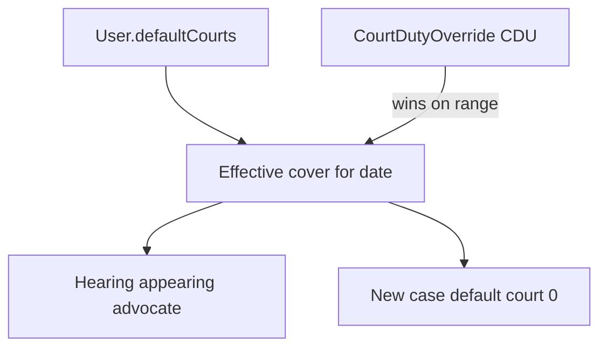

# Court roster flow (`/court-roster`)

## Core principle: permanent list + overrides that win

**Permanent** cover is `User.defaultCourts` (JSON). **Temporary** cover is `CourtDutyOverride` (`CDU`). For a date range, an override **wins** over the permanent list when computing effective cover.



---

## Permissions / nav

| Gate | Value |
|------|--------|
| Nav | Schedule → Court roster · `employees.view` · **staffOnly** |
| Read roster / available advocates | `employees.view` |
| Edit permanent / overrides | `employees.edit` |

---

## Action catalog

| Action | API |
|--------|-----|
| Load roster view | `GET /api/court-roster` |
| Get / set permanent courts | `GET` / `PUT /api/court-roster/permanent` |
| List / create overrides | `GET` / `POST /api/court-roster/overrides` |
| Edit / delete override | `GET` / `PATCH` / `DELETE /api/court-roster/overrides/[unitId]` |
| Available advocates | `GET /api/court-roster/available-advocates` |

**ID prefix:** `CDU` (overrides). Permanent data lives on employee `User` (`EMP`).

---

## Request path

```text
/court-roster
  --> GET /api/court-roster
  --> PUT /api/court-roster/permanent   { advocate courts }
  --> POST /api/court-roster/overrides  date range cover
```

---

## Key files

| Layer | Path |
|-------|------|
| Page | [`app/(portal)/court-roster/page.tsx`](../../app/(portal)/court-roster/page.tsx) |
| UI | [`features/court-roster/components/court-roster-page.tsx`](../../features/court-roster/components/court-roster-page.tsx) |
| API | [`app/api/court-roster/`](../../app/api/court-roster/) |

---

## Cross-module links

[Employees](./employees_flow.plan.md) (advocates) · [Cases](./cases_flow.plan.md) (hearings / default court) · [Availability](./availability_flow.plan.md) (court time blocks)
