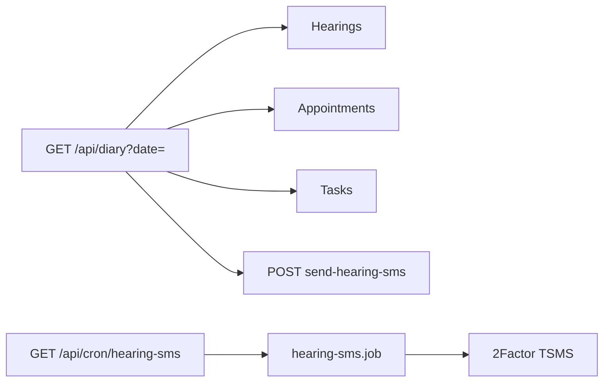

# Day board flow (`/diary`)

## Core principle: one IST day across three domains

**Day board** is not its own domain model. It soft-gates sections when **any** of cases / appointments / tasks is enabled with matching `*.view`, then aggregates that IST day.



---

## Permissions / nav

| Gate | Value |
|------|--------|
| Nav | Matters → Day board · **staffOnly** · `gates`: `cases.view` \| `appointments.view` \| `tasks.view` |
| Page / API | `requireStaffUser`; sections soft-gate by module |
| Manual SMS / tomorrow-notify | `cases.edit` |
| Cron | `CRON_SECRET` (not user JWT) |

Clients do not see Day board.

---

## Action catalog

| Action | How | API |
|--------|-----|-----|
| View day | `/diary?date=YYYY-MM-DD` (default today IST) | `GET /api/diary` |
| Open linked rows | Jump to case / appointment / task | Domain routes |
| Send hearing SMS | Manual office action | `POST /api/diary/send-hearing-sms` |
| Tomorrow preview | Notify helpers | `GET /api/diary/tomorrow-notify` |
| Nightly SMS | Vercel cron ~ `30 11 * * *` UTC | `GET /api/cron/hearing-sms` |

SMS only when client has `smsConsent`. Marks `Hearing.smsSentAt`. Templates: [`config/company/sms-templates.ts`](../../config/company/sms-templates.ts). Job: [`lib/services/hearing-sms.job.ts`](../../lib/services/hearing-sms.job.ts).

---

## Request path

```text
/diary?date=YYYY-MM-DD
  --> GET /api/diary  requireStaffUser
  --> hearings + appointments + tasks in IST bounds
  --> POST /api/diary/send-hearing-sms   cases.edit
Nightly: Vercel GET /api/cron/hearing-sms  CRON_SECRET
```

Hearing import of **tomorrow** dates can also SMS immediately (catch-up) — see [cases](./cases_flow.plan.md).

---

## Key files

| Layer | Path |
|-------|------|
| Page | [`app/(portal)/diary/page.tsx`](../../app/(portal)/diary/page.tsx) |
| UI | [`features/diary/components/diary-page.tsx`](../../features/diary/components/diary-page.tsx) |
| API | [`app/api/diary/route.ts`](../../app/api/diary/route.ts) |
| SMS | [`app/api/diary/send-hearing-sms/`](../../app/api/diary/send-hearing-sms/), [`tomorrow-notify`](../../app/api/diary/tomorrow-notify/) |
| Cron | [`app/api/cron/hearing-sms/route.ts`](../../app/api/cron/hearing-sms/route.ts) |

---

## Cross-module links

[Cases](./cases_flow.plan.md) · [Appointments](./appointments_flow.plan.md) · [Tasks](./tasks_flow.plan.md) · [Clients](./clients_flow.plan.md) (consent + mobile)
