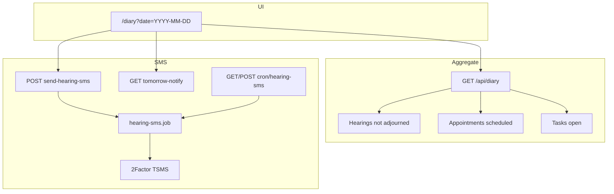
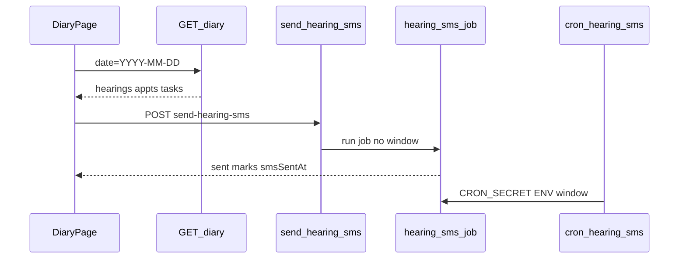

# Day board flow (`/diary`)

## Core principle: one IST day across three domains

**Day board** is not its own domain model. It soft-gates sections when **any** of cases / appointments / tasks is enabled with matching `*.view`, then aggregates that IST day (`istDayBounds`). Hearings exclude adjourned; appointments show `scheduled`; tasks show `open` with `workDate` or `dueDate` in bounds.



---

## Permissions / nav

| Gate | Value |
|------|--------|
| Nav | Matters → Day board · **staffOnly** · `gates`: `cases.view` \| `appointments.view` \| `tasks.view` |
| Page / API | `requireStaffUser`; sections soft-gate by module + view |
| Manual SMS / pending-notify | `cases.edit` |
| Cron | `CRON_SECRET` (not user JWT) |

Clients do not see Day board.

---

## Staff vs client

| Action | Staff | Client |
|--------|-------|--------|
| View IST day board | Yes | No |
| Send hearing SMS | Yes (`cases.edit`) | No |
| Receive hearing SMS + in-app | — | SMS if `smsConsent` + mobile; in-app if portal login |

---

## Action catalog

| Action | How | API |
|--------|-----|-----|
| View day | `/diary?date=YYYY-MM-DD` (default today IST) | `GET /api/diary?date=&advocateMobile=` |
| Open linked rows | Jump to case / appointment / task | Domain routes |
| Send pending SMS | Manual office action (bypasses ENV time) | `POST /api/diary/send-hearing-sms` |
| Pending SMS preview | Notify helpers | `GET /api/diary/tomorrow-notify` |
| Scheduled SMS | Vercel cron `*/15 * * * *` + `HEARING_SMS_TIME_IST` | `GET`/`POST /api/cron/hearing-sms` |

**Pending list:** upcoming hearings (`hearingDate` ≥ today IST) with `smsSentAt: null`. Hearing date can be any future day — send timing is **today at ENV office time**, not the hearing day. Empty list → no SMS. Once `smsSentAt` is set, that hearing is never messaged again.

SMS only when client has `smsConsent`. Successful send also creates client in-app `hearing_reminder` when a portal user exists. Templates: [`config/company/sms-templates.ts`](../../config/company/sms-templates.ts). Job: [`lib/services/hearing-sms.job.ts`](../../lib/services/hearing-sms.job.ts). Window: [`lib/hearings/sms-window.ts`](../../lib/hearings/sms-window.ts). Manual send audits `hearing.sms_manual` and notifies admins.

---

## IST day + SMS path

1. Page [`app/(portal)/diary/page.tsx`](../../app/(portal)/diary/page.tsx) — staff user; soft-gate sections.
2. `GET /api/diary` uses `istDayBounds(dateKey)` (default today).
3. Aggregates hearings (`!isAdjourned`), appointments (`scheduled`), open tasks (non-admin scoped to own assignee).
4. Manual SMS: `cases.edit` → `runHearingSmsJob()` (no ENV gate) → 2Factor + client notify → audit + admin notify.
5. Cron every 15m: `CRON_SECRET` → `runHearingSmsJob({ respectEnvWindow: true })` → no-op outside `HEARING_SMS_TIME_IST` window; otherwise drain pending list → admin `system` notify.
6. Hearing import **enqueues** onto the pending list (no immediate catch-up SMS) — see [cases](./cases_flow.md).



```text
/diary?date=YYYY-MM-DD
  --> GET /api/diary  requireStaffUser
  --> hearings + appointments + tasks in IST bounds
  --> POST /api/diary/send-hearing-sms   cases.edit
Cron: Vercel */15 → GET|POST /api/cron/hearing-sms  CRON_SECRET
      → only sends inside HEARING_SMS_TIME_IST (default 17:00 IST)
```

---

## State / rules

| Section | Included rows |
|---------|---------------|
| Hearings | Not adjourned; date in IST day |
| Appointments | `status: scheduled` |
| Tasks | `status: open` + work/due in day |

| SMS rule | Behavior |
|----------|----------|
| Consent | Client `smsConsent` required |
| Marker | `Hearing.smsSentAt` (once per hearing row) |
| Selection | Upcoming + `smsSentAt` null (any hearing date) |
| Cron | `*/15 * * * *` in `vercel.json`; gated by `HEARING_SMS_TIME_IST` |
| Empty list | No-op |

---

## Key files

| Layer | Path |
|-------|------|
| Page | [`app/(portal)/diary/page.tsx`](../../app/(portal)/diary/page.tsx) |
| UI | [`features/diary/components/diary-page.tsx`](../../features/diary/components/diary-page.tsx) |
| API | [`app/api/diary/route.ts`](../../app/api/diary/route.ts) |
| SMS | [`app/api/diary/send-hearing-sms/`](../../app/api/diary/send-hearing-sms/), [`tomorrow-notify`](../../app/api/diary/tomorrow-notify/) |
| Cron | [`app/api/cron/hearing-sms/route.ts`](../../app/api/cron/hearing-sms/route.ts) |
| Job | [`lib/services/hearing-sms.job.ts`](../../lib/services/hearing-sms.job.ts) |
| Window | [`lib/hearings/sms-window.ts`](../../lib/hearings/sms-window.ts) |

---

## Cross-module links

| Module | Link |
|--------|------|
| [Cases](./cases_flow.md) | Hearings + pending SMS list |
| [Appointments](./appointments_flow.md) | Scheduled for day |
| [Tasks](./tasks_flow.md) | Open work/due |
| [Clients](./clients_flow.md) | Consent + mobile + portal notify |
| [Court roster](./court_roster_flow.md) | Who covers court that day |
| [Home](./home_flow.md) | Today hearings shortcut |
