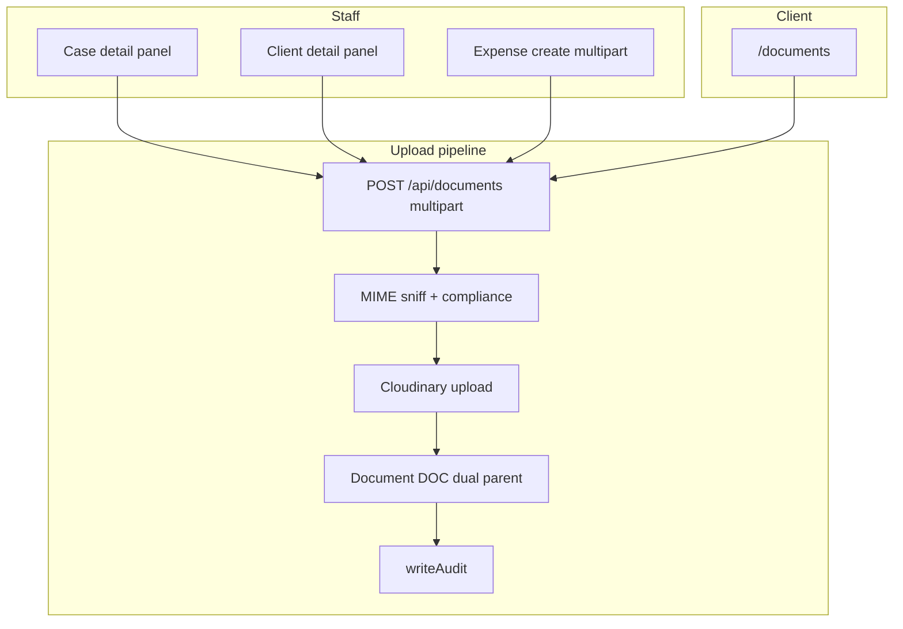
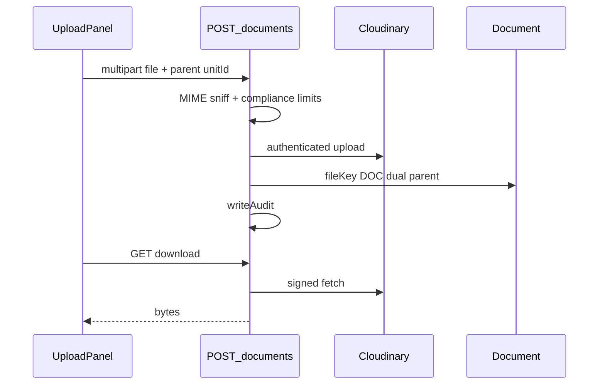

# Documents flow (`/documents` + panels)

## Core principle: files live outside Mongo; metadata is `DOC`

Bytes are never stored in Mongo. Upload creates a `Document` (`DOC`) with `fileKey` (Cloudinary `public_id`; legacy local `uploads/` still readable). Staff upload from **case / client / expense** panels. Clients use sidebar **Documents** only (`clientOnly`). Staff hitting `/documents` **redirects to `/`**.



---

## Permissions / nav

| Gate | Value |
|------|--------|
| Client nav | Matters → Documents · `cases.upload` · **clientOnly** |
| Staff `/documents` | Redirect to `/` — use detail panels instead |
| List/upload/delete/download | `requireUser` then perm/ownership by parent (`cases.*` / `accounts.*` / client scope) |
| Office PDFs | `GET /api/office-files/[slug]` · `requireStaffUser` · `private/office-files/` |

Client upload types: `id_proof`, `evidence`, `affidavit`, `other` (`CLIENT_UPLOAD_DOC_TYPES`). Limits: [`config/company/compliance.ts`](../../config/company/compliance.ts).

---

## Staff vs client

| Action | Staff | Client |
|--------|-------|--------|
| Sidebar `/documents` | No (redirect `/`) | Yes |
| Upload on case/client | Yes | Own CLI parent; limited types |
| Expense bill / receipt | Yes (create expense) | Hidden — no receipts |
| Download / delete | Per parent perm | Own docs |
| Office static PDFs | Yes | No |

---

## Action catalog

| Action | API |
|--------|-----|
| List | `GET /api/documents?caseUnitId=` or `clientUnitId` or `expenseUnitId` (one required) |
| Upload | `POST /api/documents` (multipart) |
| Delete | `DELETE /api/documents/[unitId]` |
| Download | `GET /api/documents/[unitId]/download` |
| Static office PDF | `GET /api/office-files/[slug]` |

**ID prefix:** `DOC`.

**Parent dual links (when set):** case / client / expense (`caseId`+`caseUnitId`, etc.).

**`docType` enum:** `judgment`, `order`, `pleading`, `vakalatnama`, `petition`, `affidavit`, `evidence`, `id_proof`, `receipt`, `other`.

---

## Upload → download path

1. Staff: open case/client panel (or expense create). Client: `/documents`.
2. `FormData` → `POST /api/documents` with parent unit id + file.
3. MIME sniff + compliance limits → Cloudinary authenticated upload → `Document.fileKey` + dual parent → `writeAudit`.
4. Download: `GET .../download` → signed fetch from storage.
5. Expense create path also creates receipt `DOC` dual-linked to `EXP` (see [expenses](./expenses_flow.md)).



```text
Staff case/client/expense panel
  -->  FormData POST /api/documents
  -->  MIME sniff + compliance limits
  -->  Cloudinary  -->  Document.fileKey
  -->  GET .../download  -->  signed bytes

Client /documents  -->  same API, types limited, parent = own CLI
```

---

## State / rules

| Parent | Staff | Client |
|--------|-------|--------|
| Case `CSE` | Panel upload | Via own cases / allowed types |
| Client `CLI` | Panel upload | Own CLI on `/documents` |
| Expense `EXP` | Bill on create | Not shown |

| Storage | Behavior |
|---------|----------|
| Cloudinary | Primary `fileKey` = `public_id` |
| Legacy local | `uploads/` still readable |

---

## Key files

| Layer | Path |
|-------|------|
| Client page | [`app/(portal)/documents/page.tsx`](../../app/(portal)/documents/page.tsx) |
| Client UI | [`features/documents/components/client-documents-page.tsx`](../../features/documents/components/client-documents-page.tsx) |
| Panels | [`features/documents/`](../../features/documents/) |
| API | [`app/api/documents/`](../../app/api/documents/) |
| Storage | [`lib/storage`](../../lib/storage), [`lib/cloudinary.ts`](../../lib/cloudinary.ts) |
| Zod | [`lib/validations/documents.schema.ts`](../../lib/validations/documents.schema.ts) |
| Office files | [`app/api/office-files/[slug]/route.ts`](../../app/api/office-files/[slug]/route.ts) |

---

## Cross-module links

| Module | Link |
|--------|------|
| [Cases](./cases_flow.md) | Case parent uploads |
| [Clients](./clients_flow.md) | Client parent + portal docs |
| [Expenses](./expenses_flow.md) | Receipt bill dual link |
| [Home](./home_flow.md) | Client upload shortcut |
| [Activity](./activity_flow.md) | Upload / delete audits |
