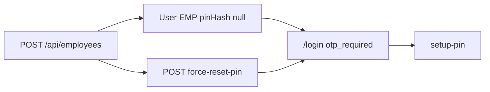

# Employees flow (`/employees`)

## Core principle: create staff User immediately (login-ready after OTP)

**Employees** are `User` rows (`EMP`). Unlike [clients](./clients_flow.plan.md), creating an employee creates a login identity right away — but **without** `pinHash`, so first login uses OTP → setup PIN ([login](./unified_login_flow_c5377653.plan.md)). Advocates = users with role `advocate`.



---

## Permissions / nav

| Gate | Value |
|------|--------|
| Nav | Admin → Employees · `employees.view` · **staffOnly** |
| Create / import | `employees.create` |
| Edit / force-reset PIN | `employees.edit` |
| Deactivate / reactivate | `employees.deactivate` |
| Advocates picker | `GET /api/advocates` · `requireUser` |

Admin role assignment is guarded in the API (cannot freely escalate beyond caller rules).

---

## Action catalog

| Action | API |
|--------|-----|
| List | `GET /api/employees` |
| Create | `POST /api/employees` |
| Get / edit | `GET` / `PATCH /api/employees/[unitId]` |
| Deactivate / reactivate | `POST .../deactivate`, `.../reactivate` |
| Force-reset PIN | `POST .../force-reset-pin` (clears `pinHash`) |
| Import | `POST /api/employees/import` |
| Photo | `GET /api/users/[unitId]/photo` |
| Advocates for forms | `GET /api/advocates` |

**ID prefix:** `EMP`.

---

## Create → first login

```text
Super admin /employees
  -->  POST /api/employees  { mobile, name, roles, designation }
  -->  User EMP  pinHash=null
  -->  employee /login  -->  otp_required  -->  setup PIN
```

---

## Key files

| Layer | Path |
|-------|------|
| Page | [`app/(portal)/employees/page.tsx`](../../app/(portal)/employees/page.tsx) |
| UI | [`features/employees/components/`](../../features/employees/components/) |
| API | [`app/api/employees/`](../../app/api/employees/) |
| Advocates | [`app/api/advocates/`](../../app/api/advocates/) |
| Zod / serialize | [`lib/validations/employees.schema.ts`](../../lib/validations/employees.schema.ts), [`features/employees/server/serialize.ts`](../../features/employees/server/serialize.ts) |

---

## Cross-module links

[Login](./unified_login_flow_c5377653.plan.md) · [Court roster](./court_roster_flow.plan.md) · [Cases](./cases_flow.plan.md) / [Appointments](./appointments_flow.plan.md) pickers · [HRMS](./hrms_flow.plan.md) · [Tasks](./tasks_flow.plan.md) · [Permissions](./permissions_flow.plan.md)
