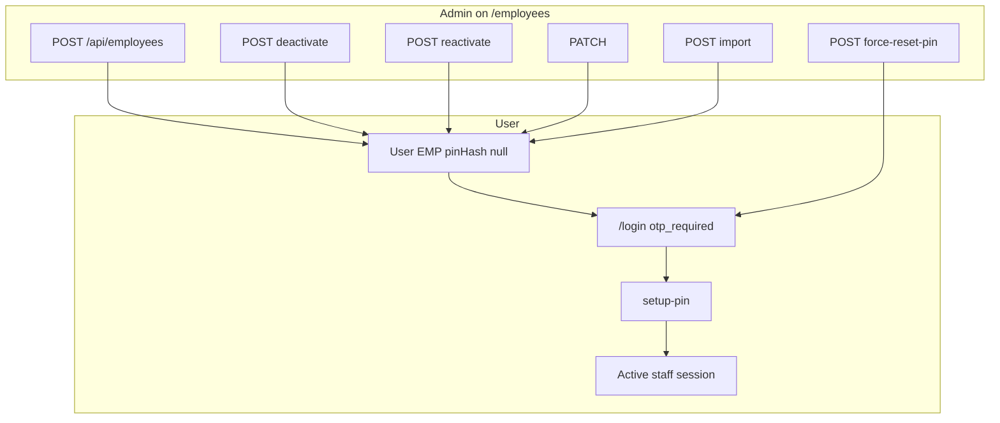
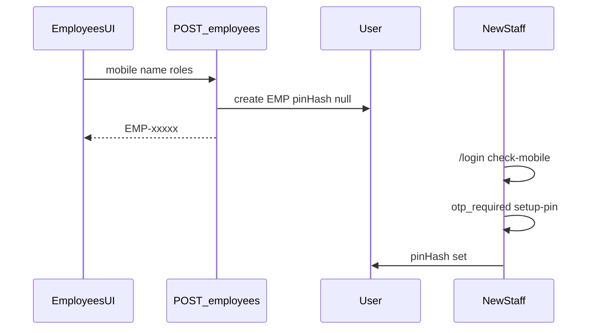

# Employees flow (`/employees`)

## Core principle: create staff User immediately (login-ready after OTP)

**Employees** are `User` rows (`EMP`). Unlike [clients](./clients_flow.md), creating an employee creates a login identity right away — but **without** `pinHash`, so first login uses OTP → setup PIN ([login](./unified_login_flow.md)). Advocates = active users with role `advocate` (`GET /api/advocates`).



---

## Permissions / nav

| Gate | Value |
|------|--------|
| Nav | Admin → Employees · `employees.view` · **staffOnly** |
| Create / import | `employees.create` |
| Edit / force-reset PIN | `employees.edit` |
| Deactivate / reactivate | `employees.deactivate` |
| Advocates picker | `GET /api/advocates` · needs cases.view or appointments view/create |

Admin role assignment is guarded (`requireAdminToAssignAdmin` — cannot freely escalate).

---

## Staff vs client

| Action | Staff admin | Client |
|--------|-------------|--------|
| Create / edit employees | Yes | No |
| Deactivate / force-reset PIN | Yes | No |
| Appear as advocate in pickers | If role `advocate` | N/A |

---

## Action catalog

| Action | API |
|--------|-----|
| List | `GET /api/employees` |
| Create | `POST /api/employees` |
| Get / edit | `GET` / `PATCH /api/employees/[unitId]` |
| Deactivate / reactivate | `POST .../deactivate`, `.../reactivate` |
| Force-reset PIN | `POST .../force-reset-pin` (clears `pinHash`, bumps `sessionVersion`) |
| Import | `POST /api/employees/import` |
| Photo | `GET /api/users/[unitId]/photo` |
| Advocates for forms | `GET /api/advocates` |

**ID prefix:** `EMP`.

---

## Create → first login

1. Admin opens `/employees` → create form (mobile, name, roles, designation).
2. `POST /api/employees` → `User` with `pinHash=null` → audit.
3. Employee visits `/login` → `check-mobile` → `otp_required` → verify OTP → `setup-pin`.
4. Later: **force-reset PIN** clears `pinHash` and unlock counters → same OTP path.
5. **Deactivate:** not self; not last admin; `isActive: false`; notifies admins + target (`employee_deactivated`).



```text
Super admin /employees
  -->  POST /api/employees  { mobile, name, roles, designation }
  -->  User EMP  pinHash=null
  -->  employee /login  -->  otp_required  -->  setup PIN
  -->  POST .../force-reset-pin  -->  pinHash cleared again
  -->  POST .../deactivate  -->  isActive false
```

---

## State / rules

| Action | Rules |
|--------|-------|
| Create | No `pinHash`; first login OTP |
| Deactivate | Not self; not last admin |
| Force-reset PIN | Clears hash; bumps `sessionVersion` |
| Assign `admin` | Caller must be allowed to assign admin |
| Advocates API | Active users with role `advocate` |

---

## Key files

| Layer | Path |
|-------|------|
| Page | [`app/(portal)/employees/page.tsx`](../../app/(portal)/employees/page.tsx) |
| UI | [`features/employees/components/`](../../features/employees/components/) |
| API | [`app/api/employees/`](../../app/api/employees/) |
| Advocates | [`app/api/advocates/`](../../app/api/advocates/) |
| Zod / serialize | [`lib/validations/employees.schema.ts`](../../lib/validations/employees.schema.ts), [`features/employees/server/serialize.ts`](../../features/employees/server/serialize.ts) |

---

## Cross-module links

| Module | Link |
|--------|------|
| [Login](./unified_login_flow.md) | OTP / PIN path |
| [Permissions](./permissions_flow.md) | Roles → grants |
| [Court roster](./court_roster_flow.md) | Advocate default courts |
| [Cases](./cases_flow.md) / [Appointments](./appointments_flow.md) | Advocate pickers |
| [HRMS](./hrms_flow.md) | Attendance / leave per user |
| [Tasks](./tasks_flow.md) | Assignees |
| [Activity](./activity_flow.md) | `employee.*` audits |
