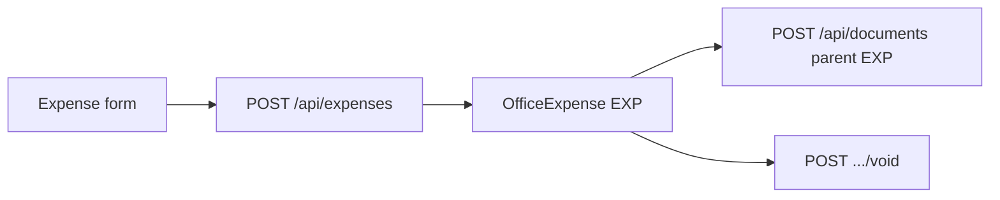

# Office expenses flow (`/expenses`)

## Core principle: office spend register with optional bill doc

**Office expenses** track `OfficeExpense` (`EXP`). Staff list/create/edit/void. A bill can be attached as a [Document](./documents_flow.plan.md) dual-linked to the expense.

---

## Permissions / nav

| Gate | Value |
|------|--------|
| Nav | Office → Office expenses · `expenses.view` · **staffOnly** |
| Create | `expenses.create` |
| Edit / void | `expenses.edit` |

---

## Action catalog

| Action | API |
|--------|-----|
| List / filter | `GET /api/expenses` |
| Create | `POST /api/expenses` |
| Get / edit | `GET` / `PATCH /api/expenses/[unitId]` |
| Void | `POST /api/expenses/[unitId]/void` |
| Attach bill | `POST /api/documents` with expense parent |

**ID prefix:** `EXP`. Serialize/filters: [`features/expenses/server/`](../../features/expenses/server/).

---

## Key files

| Layer | Path |
|-------|------|
| Page | [`app/(portal)/expenses/page.tsx`](../../app/(portal)/expenses/page.tsx) |
| UI | [`features/expenses/components/`](../../features/expenses/components/) |
| API | [`app/api/expenses/`](../../app/api/expenses/) |
| Zod | [`lib/validations/expenses.schema.ts`](../../lib/validations/expenses.schema.ts) |

---

## Cross-module links

[Documents](./documents_flow.plan.md) · [Reports](./reports_flow.plan.md) (`expenses` export)
