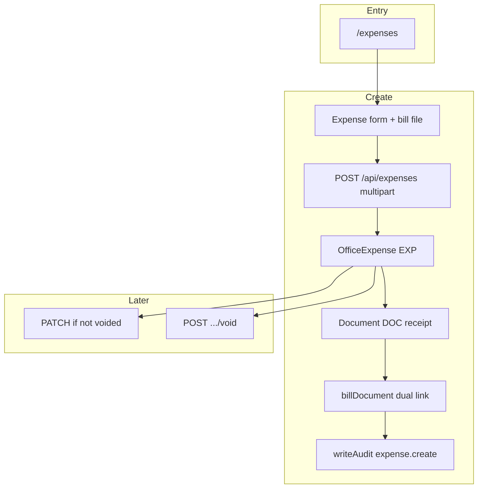
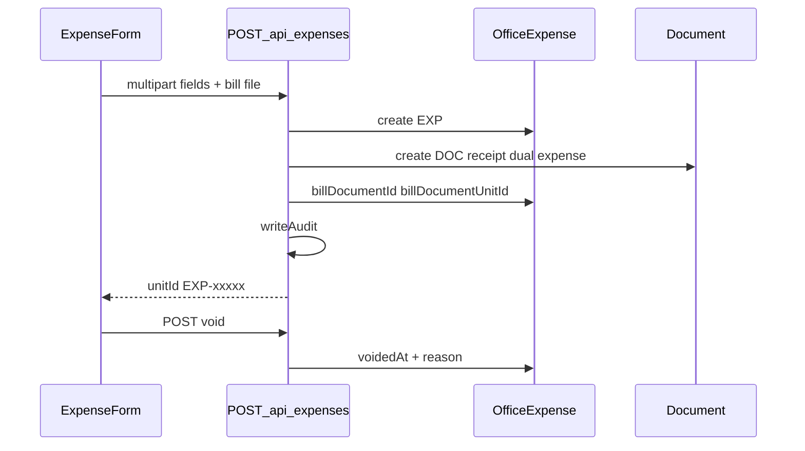

# Office expenses flow (`/expenses`)

## Core principle: office spend register with bill doc on create

**Office expenses** track `OfficeExpense` (`EXP`). Staff list/create/edit/void. Create is **multipart**: the API creates a `Document` (`docType: receipt`) dual-linked to the expense, then sets `billDocumentId` / `billDocumentUnitId`. Void sets `voidedAt` (no status enum). Summary totals always exclude voided rows.



---

## Permissions / nav

| Gate | Value |
|------|--------|
| Nav | Office → Office expenses · `expenses.view` · **staffOnly** |
| Create | `expenses.create` |
| Edit / void | `expenses.edit` |

Clients never see Expenses.

---

## Staff vs client

| Action | Staff | Client |
|--------|-------|--------|
| List / create / void | Yes | No |
| Attach / view bill | Yes | No (receipts hidden on client docs page) |
| Excel export | Via [Reports](./reports_flow.md) | No |

---

## Action catalog

| Action | How | API |
|--------|-----|-----|
| List / filter | `/expenses` · `status=active\|void\|all` (default active) | `GET /api/expenses` |
| Create | Form + bill file | `POST /api/expenses` (multipart) |
| Get / edit | Row / dialog | `GET` / `PATCH /api/expenses/[unitId]` |
| Void | Void action + reason | `POST /api/expenses/[unitId]/void` |
| View bill | Linked `DOC` download | `GET /api/documents/[unitId]/download` |

**ID prefix:** `EXP`. Bill doc uses `DOC`. Serialize/filters: [`features/expenses/server/`](../../features/expenses/server/).

---

## Create → bill → void

1. Page [`app/(portal)/expenses/page.tsx`](../../app/(portal)/expenses/page.tsx) — `expenses.view`.
2. Create submits multipart (expense fields + bill file).
3. API creates `OfficeExpense` → `nextUnitId` → creates `Document` receipt with dual `expenseId` / `expenseUnitId` → sets bill dual fields → `writeAudit`.
4. PATCH blocked if `voidedAt` is set.
5. Void: `POST .../void` sets `voidedAt` / `voidedById` / `voidReason`. Already void → 409. No notify on void (unlike payments). List `status=active` means `voidedAt: null`.



```text
/expenses
  --> POST /api/expenses (multipart)  -->  EXP + DOC receipt
  --> PATCH /api/expenses/EXP-xxxxx   (blocked if voided)
  --> POST .../void
```

---

## State / rules

| Filter `status` | Meaning |
|-----------------|---------|
| `active` (default) | `voidedAt` is null |
| `void` | Voided rows |
| `all` | Both |

| Rule | Behavior |
|------|----------|
| Delete | Not used — void instead |
| Summary totals | Always exclude voided |
| Bill on create | Multipart required; `docType: receipt` |

---

## Key files

| Layer | Path |
|-------|------|
| Page | [`app/(portal)/expenses/page.tsx`](../../app/(portal)/expenses/page.tsx) |
| UI | [`features/expenses/components/`](../../features/expenses/components/) |
| Server | [`features/expenses/server/`](../../features/expenses/server/) |
| API | [`app/api/expenses/`](../../app/api/expenses/) |
| Zod | [`lib/validations/expenses.schema.ts`](../../lib/validations/expenses.schema.ts) |

---

## Cross-module links

| Module | Link |
|--------|------|
| [Documents](./documents_flow.md) | Bill `DOC` dual-linked to expense |
| [Reports](./reports_flow.md) | `expenses` export |
| [Activity](./activity_flow.md) | `expense.create` / update / void |
