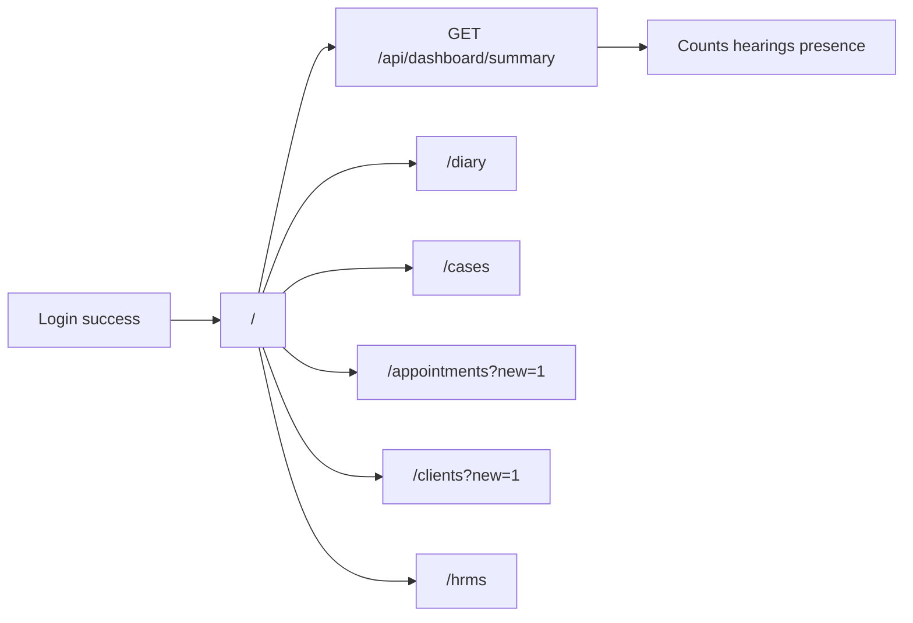

# Home flow (`/`)

## Core principle: one landing page, role-shaped summary

After login, users land on **`/`**. The page gates `dashboard.view`, then loads aggregates via `GET /api/dashboard/summary`. Widgets and shortcuts point into other modules; create shortcuts use `?new=1` deep links.



---

## Permissions / nav

| Gate | Value |
|------|--------|
| Nav | Workspace → Home · `dashboard.view` · module `dashboard` |
| API | `requirePerm(dashboard, view)` |

Staff and clients both may see Home when they hold `dashboard.view`. Client UI uses a lighter overview (`client-home-overview` pattern in `features/home/`).

---

## Action catalog

| Action | How |
|--------|-----|
| View summary | Widgets from dashboard API |
| Jump to day board | Link → `/diary` |
| Jump to cases / appointments / HRMS | Nav links from widgets |
| Create shortcuts | e.g. `/clients?new=1`, `/cases?new=1`, `/appointments?new=1` via welcome hero |

There is **no create** on Home itself — only deep links into other flows.

---

## Request path

1. [`app/(portal)/page.tsx`](../../app/(portal)/page.tsx) — session + `dashboard.view`.
2. [`features/home/`](../../features/home/) client UI calls `apiFetch("/api/dashboard/summary")`.
3. [`app/api/dashboard/summary/route.ts`](../../app/api/dashboard/summary/route.ts) aggregates Prisma (cases, hearings, attendance/presence as allowed).
4. Server helper: [`features/home/server/dashboard-summary.ts`](../../features/home/server/dashboard-summary.ts).

```text
GET /  -->  layout AppShell
       -->  features/home
       -->  GET /api/dashboard/summary
       -->  requirePerm dashboard.view
       -->  jsonOk widgets + links
```

---

## Key files

| Layer | Path |
|-------|------|
| Page | [`app/(portal)/page.tsx`](../../app/(portal)/page.tsx) |
| UI | [`features/home/components/`](../../features/home/components/) |
| Summary server | [`features/home/server/dashboard-summary.ts`](../../features/home/server/dashboard-summary.ts) |
| API | [`app/api/dashboard/summary/route.ts`](../../app/api/dashboard/summary/route.ts) |

---

## Cross-module links

[Day board](./day_board_flow.plan.md) · [Cases](./cases_flow.plan.md) · [Appointments](./appointments_flow.plan.md) · [Clients](./clients_flow.plan.md) · [HRMS](./hrms_flow.plan.md) · [Login](./unified_login_flow_c5377653.plan.md)
