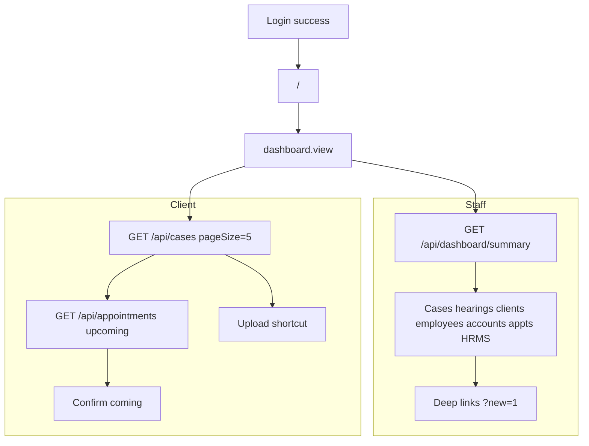
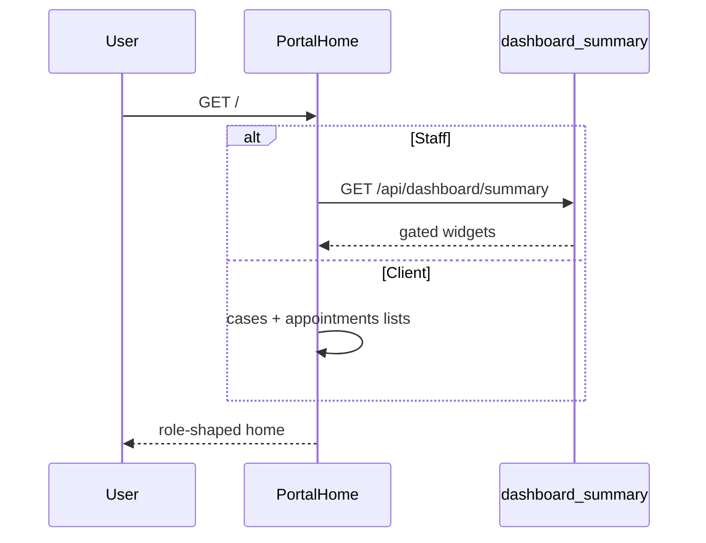

# Home flow (`/`)

## Core principle: one landing page, role-shaped summary

After login, users land on **`/`**. The page gates `dashboard.view`, then loads aggregates. **Staff** use `GET /api/dashboard/summary` (also SSR). **Clients** use `ClientHomeOverview` — they do **not** call the dashboard summary; they load a few own cases + upcoming appointments instead. Create shortcuts use `?new=1` deep links.



---

## Permissions / nav

| Gate | Value |
|------|--------|
| Nav | Workspace → Home · `dashboard.view` · module `dashboard` |
| Staff summary API | `requirePerm(dashboard, view)` |
| Client home data | Own scoped case/appointment APIs |

Staff and clients both may see Home when they hold `dashboard.view`.

---

## Staff vs client

| Area | Staff | Client |
|------|-------|--------|
| Data source | `buildDashboardSummary` | `ClientHomeOverview` (cases + appts lists) |
| Widgets | Counts, today hearings, pending fees, appts, HRMS, attention | Light overview only |
| Presence / admin board | If `hrms.manage_attendance` | No |
| Create shortcuts | `/clients?new=1`, `/cases?new=1`, `/appointments?new=1` | No create; confirm / upload |
| Confirm appointment | Via appt widgets / links | Yes, in confirm window |

---

## Action catalog

| Action | How |
|--------|-----|
| View staff summary | Widgets from dashboard API / SSR |
| View client overview | Own cases + upcoming appts |
| Jump to day board | Link → `/diary` |
| Jump to cases / appointments / HRMS | Widget links |
| Create shortcuts | e.g. `/clients?new=1`, `/cases?new=1`, `/appointments?new=1` via welcome hero |
| Confirm coming | Client home / appointment actions |

There is **no create** on Home itself — only deep links into other flows.

---

## Staff summary fields (permission-gated)

| Block | Typical contents |
|-------|------------------|
| `cases` | Counts + `todayHearings` |
| `clients` | `total` |
| `employees` | `total`, `active`, `advocates` |
| `accounts` | `pendingAmount`, `pendingCount`, `paidThisMonth` |
| `appointments` | Today/week counts + lists + `byAdvocate` |
| `hrms` / `adminBoard` | Presence when manage_attendance |
| `attention` | Items needing follow-up |
| `todayKey` / `isOfficeAdmin` | Day key + admin flag |

---

## Request path

1. [`app/(portal)/page.tsx`](../../app/(portal)/page.tsx) — session + `dashboard.view`.
2. Staff: SSR / [`features/home/`](../../features/home/) → `GET /api/dashboard/summary` → [`features/home/server/dashboard-summary.ts`](../../features/home/server/dashboard-summary.ts).
3. Client: [`client-home-overview`](../../features/home/components/) loads scoped cases + appointments.



```text
GET /  -->  layout AppShell
       -->  staff: GET /api/dashboard/summary
       -->  client: GET /api/cases + /api/appointments (scoped)
       -->  deep links into other modules
```

---

## Key files

| Layer | Path |
|-------|------|
| Page | [`app/(portal)/page.tsx`](../../app/(portal)/page.tsx) |
| UI | [`features/home/components/`](../../features/home/components/) (`welcome-overview`, `client-home-overview`) |
| Summary server | [`features/home/server/dashboard-summary.ts`](../../features/home/server/dashboard-summary.ts) |
| API | [`app/api/dashboard/summary/route.ts`](../../app/api/dashboard/summary/route.ts) |

---

## Cross-module links

| Module | Link |
|--------|------|
| [Day board](./day_board_flow.md) | Today hearings / diary jump |
| [Cases](./cases_flow.md) | Counts + client list |
| [Appointments](./appointments_flow.md) | Today/week + confirm |
| [Clients](./clients_flow.md) | Create shortcut |
| [HRMS](./hrms_flow.md) | Presence / admin board |
| [Accounts](./accounts_flow.md) | Pending fees |
| [Login](./unified_login_flow.md) | Lands here after session |
| [Documents](./documents_flow.md) | Client upload shortcut |
