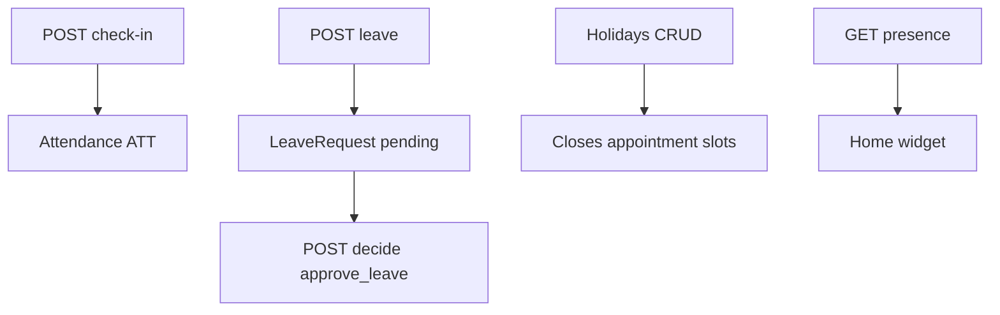

# HRMS flow (`/hrms`)

## Core principle: attendance, leave, holidays under split perms

**HRMS** covers check-in/out (`ATT`), leave (`LVE`), office holidays (`HOL`), and presence for managers. Module `hrms` must be on. Permissions are split (`own_attendance`, `own_leave`, `approve_leave`, `manage_attendance`) — not a single CRUD.



---

## Permissions / nav

| Gate | Value |
|------|--------|
| Nav | Office → HRMS · `hrms.view` · **staffOnly** |
| Check-in/out | `hrms.own_attendance` |
| List attendance | `own_attendance` **or** `manage_attendance` (`all=1` / `userUnitIds`) |
| Request leave | `hrms.own_leave` |
| Approve/reject | `hrms.approve_leave` |
| Presence | `hrms.manage_attendance` |
| Holidays manage | manage-holiday style perms on holiday routes |

---

## Action catalog

| Action | API |
|--------|-----|
| List attendance / history | `GET /api/hrms/attendance` |
| Create attendance row | `POST /api/hrms/attendance` |
| Check-in / check-out | `POST .../check-in`, `.../check-out` |
| List / request leave | `GET` / `POST /api/hrms/leave` |
| Decide leave | `POST /api/hrms/leave/[unitId]/decide` |
| Cancel leave | `POST /api/hrms/leave/[unitId]/cancel` |
| Holidays CRUD | `/api/hrms/holidays` |
| Presence | `GET /api/hrms/presence` |
| Export attendance | Also via [Reports](./reports_flow.plan.md) / HRMS history (`type=attendance`) |

**ID prefixes:** `ATT`, `LVE`, `HOL`. Unique attendance: `[userId, date]` IST `YYYY-MM-DD`.

---

## Request path

```text
/hrms
  --> POST /api/hrms/attendance/check-in   -->  ATT dual User
  --> POST /api/hrms/leave                 -->  LVE pending
  --> POST /api/hrms/leave/LVE-xxxxx/decide  -->  notifyUser
  --> GET  /api/hrms/presence              -->  home widget
Holidays close appointment slots.
```

---

## Key files

| Layer | Path |
|-------|------|
| Page | [`app/(portal)/hrms/page.tsx`](../../app/(portal)/hrms/page.tsx) |
| UI | [`features/hrms/components/`](../../features/hrms/components/) |
| Presence | [`features/hrms/server/presence.ts`](../../features/hrms/server/presence.ts) |
| API | [`app/api/hrms/`](../../app/api/hrms/) |
| Zod | [`lib/validations/hrms.schema.ts`](../../lib/validations/hrms.schema.ts) |

---

## Cross-module links

[Employees](./employees_flow.plan.md) · [Home](./home_flow.plan.md) · [Availability](./availability_flow.plan.md) / [Appointments](./appointments_flow.plan.md) · [Reports](./reports_flow.plan.md)
