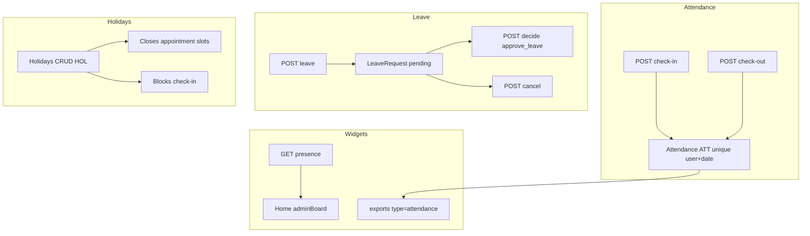
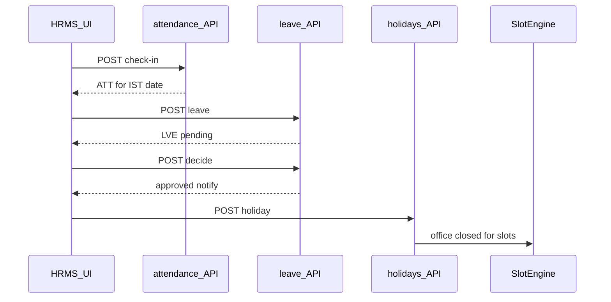

# HRMS flow (`/hrms`)

## Core principle: attendance, leave, holidays under split perms

**HRMS** covers check-in/out (`ATT`), leave (`LVE`), office holidays (`HOL`), and presence for managers. Module `hrms` must be on. Permissions are split (`own_attendance`, `own_leave`, `approve_leave`, `manage_attendance`) — not a single CRUD. Holidays close appointment slots and block check-in; approved leave also closes booking slots.



---

## Permissions / nav

| Gate | Value |
|------|--------|
| Nav | Office → HRMS · `hrms.view` · **staffOnly** |
| Check-in/out | `hrms.own_attendance` |
| List attendance | `own_attendance` **or** `manage_attendance` (`all=1` / `userUnitIds`) |
| Request leave | `hrms.own_leave` |
| Approve/reject | `hrms.approve_leave` (cannot decide own leave) |
| Presence | `hrms.manage_attendance` |
| Holidays create/manage | `hrms.manage_attendance` on holiday routes |

Clients never see HRMS.

---

## Staff vs client

| Action | Staff | Client |
|--------|-------|--------|
| Check-in / leave / holidays | Yes (by split perms) | No |
| Presence board | Managers | No |
| Attendance Excel | Self or office scope | No |

---

## Action catalog

| Action | API |
|--------|-----|
| List attendance / history | `GET /api/hrms/attendance` |
| Check-in / check-out | `POST .../check-in`, `.../check-out` (check-out blocked while evening tasks pending) |
| List / request leave | `GET` / `POST /api/hrms/leave` |
| Decide leave | `POST /api/hrms/leave/[unitId]/decide` |
| Cancel leave | `POST /api/hrms/leave/[unitId]/cancel` |
| Holidays CRUD | `/api/hrms/holidays` |
| Presence | `GET /api/hrms/presence?date=` |
| Export attendance | `GET /api/exports?type=attendance` ([Reports](./reports_flow.md) / HRMS history) |

**ID prefixes:** `ATT`, `LVE`, `HOL`. Unique attendance: `[userId, date]` IST `YYYY-MM-DD`.

---

## Subflow paths

### Attendance

1. Check-in needs `hrms.own_attendance`; blocked on office holiday or approved leave; optional geo fields.
2. Creates/updates `ATT` for today IST; check-out closes the day.
3. Managers list with `all=1` or `userUnitIds`.

### Leave

1. Staff `POST /api/hrms/leave` → `LVE` `pending`.
2. Approver `POST .../decide` → `approved` | `rejected`; notifies requester; cannot decide own leave.
3. Requester may `POST .../cancel`. Status also: `cancelled`.

### Holidays

1. Manager creates `HOL` → notifies all active users `office_holiday`.
2. Closes booking slots ([availability](./availability_flow.md)) and blocks check-in that day.



```text
/hrms
  --> POST /api/hrms/attendance/check-in   -->  ATT dual User
  --> POST /api/hrms/leave                 -->  LVE pending
  --> POST /api/hrms/leave/LVE-xxxxx/decide  -->  notifyUser
  --> GET  /api/hrms/presence              -->  home widget
  --> POST /api/hrms/holidays              -->  closes slots + check-in
```

---

## State / rules

| Leave status | Meaning |
|--------------|---------|
| `pending` | Awaiting decide |
| `approved` | Counts as leave; closes slots |
| `rejected` | Denied |
| `cancelled` | Withdrawn |

| Closer | Effect |
|--------|--------|
| Office holiday | No check-in; slots closed; notify all |
| Approved leave | Advocate unavailable for booking |
| Attendance uniqueness | One `ATT` per user per IST date |

---

## Key files

| Layer | Path |
|-------|------|
| Page | [`app/(portal)/hrms/page.tsx`](../../app/(portal)/hrms/page.tsx) |
| UI | [`features/hrms/components/`](../../features/hrms/components/) |
| Presence | [`features/hrms/server/presence.ts`](../../features/hrms/server/presence.ts) |
| API | [`app/api/hrms/`](../../app/api/hrms/) |
| Zod | [`lib/validations/hrms.schema.ts`](../../lib/validations/hrms.schema.ts) |

---

## Cross-module links

| Module | Link |
|--------|------|
| [Employees](./employees_flow.md) | Staff users |
| [Home](./home_flow.md) | Presence / admin board |
| [Availability](./availability_flow.md) / [Appointments](./appointments_flow.md) | Holidays + leave close slots |
| [Reports](./reports_flow.md) | `attendance` export |
| [Activity](./activity_flow.md) | HRMS mutation audits |
| [Tasks](./tasks_flow.md) | Check-out blocked until evening responses |
