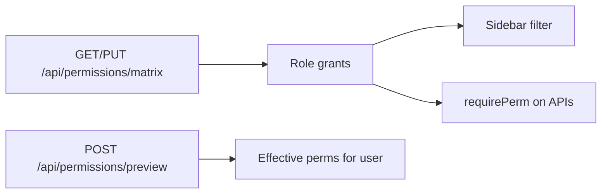

# Permissions flow (`/permissions`)

## Core principle: one matrix drives nav and APIs

**Permissions** edits the role × permission matrix. After save, `user.permissions` (JWT / session) decides which sidebar items appear ([`config/company/nav.ts`](../../config/company/nav.ts)) and what `requirePerm` allows on APIs.

---

## Permissions / nav

| Gate | Value |
|------|--------|
| Nav | Admin → Permissions · `permissions.view` · **staffOnly** |
| Edit matrix | `permissions.edit` |
| Preview | `requireUser` |

---

## Action catalog

| Action | API |
|--------|-----|
| Load matrix | `GET /api/permissions/matrix` |
| Save matrix | `PUT /api/permissions/matrix` |
| Preview effective perms | `POST /api/permissions/preview` |

Related config: modules in [`config/company/modules.ts`](../../config/company/modules.ts), permission catalog under `config/company/`.

---

## Key files

| Layer | Path |
|-------|------|
| Page | [`app/(portal)/permissions/page.tsx`](../../app/(portal)/permissions/page.tsx) |
| UI | [`features/permissions/components/permissions-matrix-page.tsx`](../../features/permissions/components/permissions-matrix-page.tsx) |
| API | [`app/api/permissions/matrix/`](../../app/api/permissions/matrix/), [`preview`](../../app/api/permissions/preview/) |
| Nav consumer | [`config/company/nav.ts`](../../config/company/nav.ts), [`shared/components/layout/site-sidebar.tsx`](../../shared/components/layout/site-sidebar.tsx) |
| API guard | [`lib/api/guard.ts`](../../lib/api/guard.ts) |

---

## Cross-module links

Affects **every** sidebar playbook in this folder. Staff onboarding: [Employees](./employees_flow.plan.md) assign roles → matrix grants actions → [Login](./unified_login_flow_c5377653.plan.md) session carries permissions.
