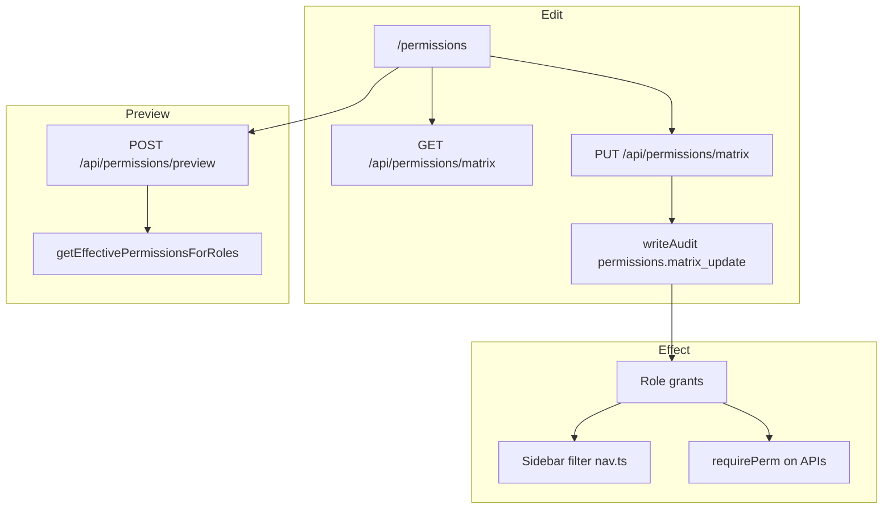
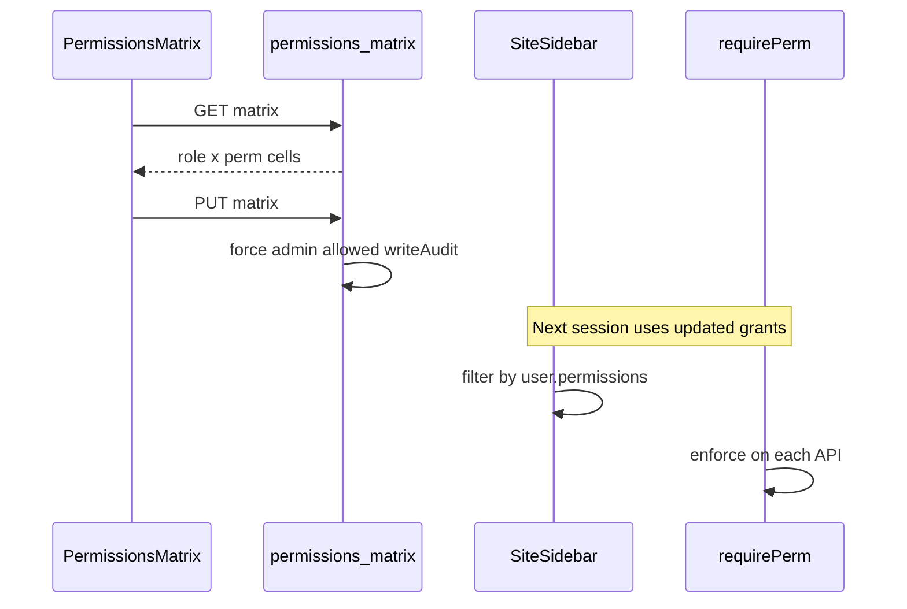

# Permissions flow (`/permissions`)

## Core principle: one matrix drives nav and APIs

**Permissions** edits the role × permission matrix (`PERMISSION_CATALOG`). After save, effective grants on the user session decide which sidebar items appear ([`config/company/nav.ts`](../../config/company/nav.ts)) and what `requirePerm` allows on APIs. PUT forces every `admin` cell `allowed: true`. Preview computes effective perms for a role set without saving.



---

## Permissions / nav

| Gate | Value |
|------|--------|
| Nav | Admin → Permissions · `permissions.view` · **staffOnly** |
| Edit matrix | `permissions.edit` |
| Preview | `requireUser` + employees module + (`employees.view` **or** `create` **or** `edit`) |

Clients never see Permissions.

---

## Staff vs client

| Action | Staff | Client |
|--------|-------|--------|
| View / edit matrix | Yes (by perm) | No |
| Preview role set | Yes (employees gate) | No |
| Feel effect of matrix | Via own JWT grants | Fixed client role defaults |

---

## Action catalog

| Action | How | API |
|--------|-----|-----|
| Load matrix | Page mount | `GET /api/permissions/matrix` |
| Save matrix | Save button | `PUT /api/permissions/matrix` |
| Preview effective perms | Preview UI | `POST /api/permissions/preview` body `{ roles }` |

Related config: modules in [`config/company/modules.ts`](../../config/company/modules.ts), defaults in [`config/company/permissions-defaults.ts`](../../config/company/permissions-defaults.ts).

---

## Matrix save → nav / API effect

1. Page [`app/(portal)/permissions/page.tsx`](../../app/(portal)/permissions/page.tsx) — `permissions.view`.
2. `GET` loads role × catalog cells.
3. `PUT` with `permissions.edit` → admin cells forced on → persist → `writeAudit` `permissions.matrix_update`.
4. Users pick up new grants on next session refresh / re-login (JWT carries permissions).
5. Sidebar filters by `user.permissions`; every API still enforces `requirePerm` in [`lib/api/guard.ts`](../../lib/api/guard.ts).
6. Preview: `{ roles }` → `getEffectivePermissionsForRoles` (no write).



```text
/permissions
  --> GET /api/permissions/matrix
  --> PUT /api/permissions/matrix   (admin cells always allowed)
  --> POST /api/permissions/preview { roles }
Sidebar / APIs consume effective permissions after login.
```

---

## State / rules

| Rule | Behavior |
|------|----------|
| Admin role cells | Always `allowed: true` on save |
| Preview | Read-only computation; needs employees module + view/create/edit |
| Modules off | Nav/module gates still hide whole areas even if perm exists |
| Fee waivers | Catalog key `accounts.waive` defaults to admin + sub_admin. Sub admin **requests** (pending); **admin only** can approve. API hard-gates roles so accountant/staff cannot waive even if matrix is mis-edited. |

---

## Key files

| Layer | Path |
|-------|------|
| Page | [`app/(portal)/permissions/page.tsx`](../../app/(portal)/permissions/page.tsx) |
| UI | [`features/permissions/components/permissions-matrix-page.tsx`](../../features/permissions/components/permissions-matrix-page.tsx) |
| API | [`app/api/permissions/matrix/`](../../app/api/permissions/matrix/), [`preview`](../../app/api/permissions/preview/) |
| Nav consumer | [`config/company/nav.ts`](../../config/company/nav.ts), [`shared/components/layout/site-sidebar.tsx`](../../shared/components/layout/site-sidebar.tsx) |
| API guard | [`lib/api/guard.ts`](../../lib/api/guard.ts) |

---

## Cross-module links

| Module | Link |
|--------|------|
| [Employees](./employees_flow.md) | Assign roles → matrix grants actions |
| [Login](./unified_login_flow.md) | Session carries permissions |
| Every sidebar playbook | Nav visibility |
| [Activity](./activity_flow.md) | Matrix update audit |
