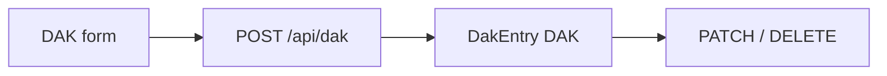

# Postal (DAK) flow (`/dak`)

## Core principle: in/out register with soft parent hints

Nav label **Postal**; routes use `/dak`. Each `DakEntry` (`DAK`) has `direction` in/out. Optional `caseUnitId` / `clientUnitId` are **soft** (may dangle if parent removed) — display/filter only.

---

## Permissions / nav

| Gate | Value |
|------|--------|
| Nav | Office → Postal · `dak.view` · **staffOnly** |
| Create / import | `dak.create` |
| Edit / delete | `dak.edit` |

---

## Action catalog

| Action | API |
|--------|-----|
| List / filter | `GET /api/dak` |
| Create | `POST /api/dak` |
| Edit / delete | `PATCH` / `DELETE /api/dak/[unitId]` |
| Import | `POST /api/dak/import` |

**ID prefix:** `DAK`.

---

## Key files

| Layer | Path |
|-------|------|
| Page | [`app/(portal)/dak/page.tsx`](../../app/(portal)/dak/page.tsx) |
| UI | [`features/dak/components/`](../../features/dak/components/) |
| API | [`app/api/dak/`](../../app/api/dak/) |
| Zod | [`lib/validations/dak.schema.ts`](../../lib/validations/dak.schema.ts) |

---

## Cross-module links

[Cases](./cases_flow.plan.md) · [Clients](./clients_flow.plan.md) (soft filters) · [Reports](./reports_flow.plan.md) (`dak` export)
