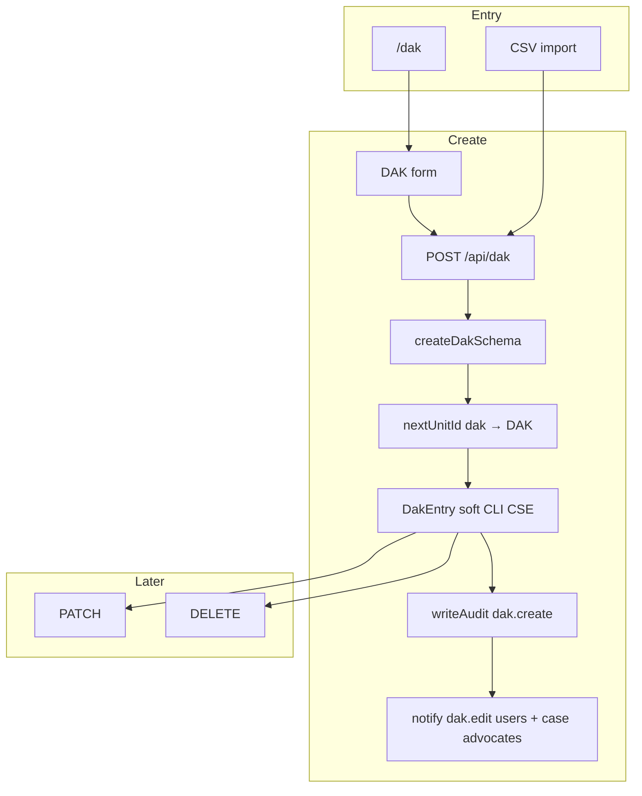
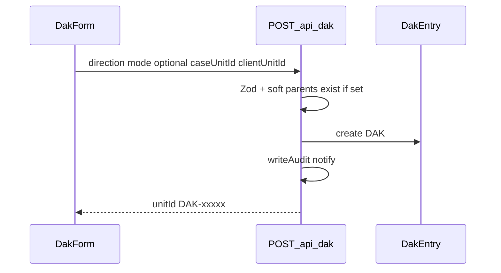

# Postal (DAK) flow (`/dak`)

## Core principle: in/out register with soft parent hints

Nav label **Postal**; routes use `/dak`. Each `DakEntry` (`DAK`) has `direction` `in` | `out`. Optional `caseUnitId` / `clientUnitId` are **soft** (strings only — may dangle if parent removed); validated on write and resolved for display. Modes in UI: `post` | `courier` | `hand` | `email` | `whatsapp`.



---

## Permissions / nav

| Gate | Value |
|------|--------|
| Nav | Office → Postal · `dak.view` · **staffOnly** |
| Create / import | `dak.create` |
| Edit / delete | `dak.edit` |

Clients never see Postal.

---

## Staff vs client

| Action | Staff | Client |
|--------|-------|--------|
| List / create / edit / delete | Yes | No |
| Soft-link CLI / CSE | Yes | No |
| Excel export | Via [Reports](./reports_flow.md) | No |

---

## Action catalog

| Action | How | API |
|--------|-----|-----|
| List / filter | `/dak` · direction, dates, `q`, parent filters | `GET /api/dak` |
| Create | Form | `POST /api/dak` |
| Edit | Form | `PATCH /api/dak/[unitId]` |
| Delete | Destructive action | `DELETE /api/dak/[unitId]` |
| Import | Import dialog | `POST /api/dak/import` |

**ID prefix:** `DAK`.

---

## Create path

1. Page [`app/(portal)/dak/page.tsx`](../../app/(portal)/dak/page.tsx) — `dak.view`.
2. Form: direction, mode, parties, optional soft `caseUnitId` / `clientUnitId`.
3. `POST /api/dak` → Zod → parents must exist if set → `nextUnitId` → `writeAudit` → notify users with `dak.edit` and case advocates when linked.
4. Update / delete similarly audit.



```text
/dak
  --> POST /api/dak { direction, mode, optional caseUnitId, clientUnitId }
  --> PATCH / DELETE /api/dak/DAK-xxxxx
  --> POST /api/dak/import
```

---

## State / rules

| Field | Values |
|-------|--------|
| `direction` | `in` \| `out` |
| Mode (UI) | `post` \| `courier` \| `hand` \| `email` \| `whatsapp` |

| Link | Kind |
|------|------|
| Case | Optional **soft** `caseUnitId` |
| Client | Optional **soft** `clientUnitId` |

Unlike accounts, DAK **allows DELETE** (with audit). Soft parents are display/filter only after create.

---

## Key files

| Layer | Path |
|-------|------|
| Page | [`app/(portal)/dak/page.tsx`](../../app/(portal)/dak/page.tsx) |
| UI | [`features/dak/components/`](../../features/dak/components/) |
| API | [`app/api/dak/`](../../app/api/dak/) |
| Zod | [`lib/validations/dak.schema.ts`](../../lib/validations/dak.schema.ts) |

---

## Cross-module links

| Module | Link |
|--------|------|
| [Cases](./cases_flow.md) | Soft `caseUnitId` filter / notify advocates |
| [Clients](./clients_flow.md) | Soft `clientUnitId` |
| [Reports](./reports_flow.md) | `dak` export |
| [Activity](./activity_flow.md) | `dak.create` / update / delete |
