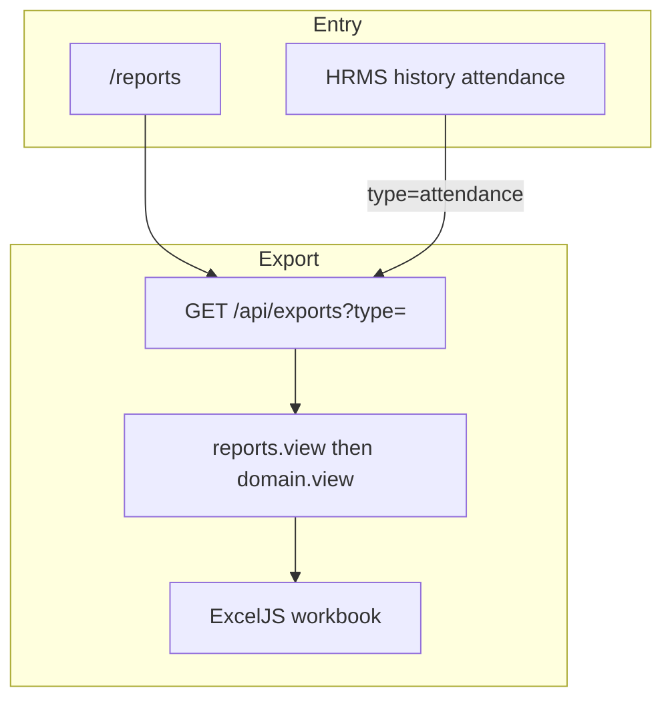
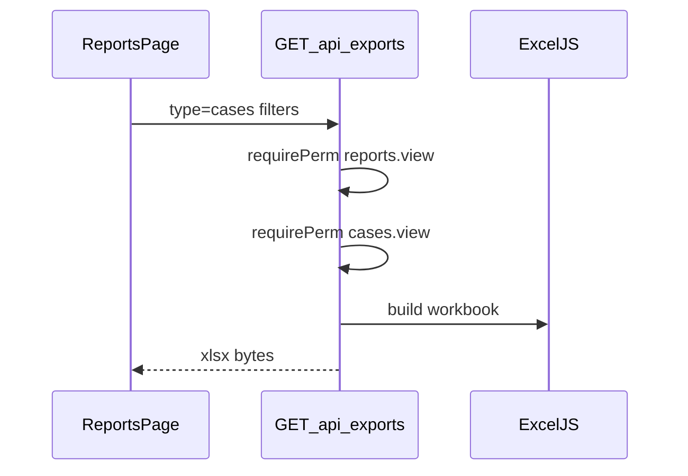

# Reports flow (`/reports`)

## Core principle: read-only Excel exports across domains

**Reports** is not a write domain. UI picks an export type; server builds an ExcelJS workbook at `GET /api/exports?type=…`. Most types need `reports.view` **then** the domain `*.view`. Attendance can also run from HRMS history with HRMS perms alone (no `reports.view`). Rate limit: **10 exports / 15 minutes**.



---

## Permissions / nav

| Gate | Value |
|------|--------|
| Nav | Office → Reports · `reports.view` · **staffOnly** |
| Typical export | `reports.view` + domain `*.view` |
| Attendance | `hrms.own_attendance` (self) or `hrms.manage_attendance` + scope (`all=1` / `mine` / `userUnitIds`) — **no** `reports.view` required |

Clients never see Reports.

---

## Staff vs client

| Action | Staff | Client |
|--------|-------|--------|
| Download Excel by type | Yes (by perms) | No |
| Attendance from HRMS | Yes | No |

---

## Export types

| `type` | After `reports.view`? | Domain gate |
|--------|----------------------|-------------|
| `cases` | Yes | `cases.view` |
| `clients` | Yes | `clients.view` |
| `employees` | Yes | `employees.view` |
| `tasks` | Yes | `tasks.view` |
| `dak` | Yes | `dak.view` |
| `accounts` | Yes | `accounts.view` |
| `expenses` | Yes | `expenses.view` |
| `appointments` | Yes | `appointments.view` |
| `fees-outstanding` | Yes | `accounts.view` |
| `attendance` | **No** | `hrms.own_attendance` and/or `hrms.manage_attendance` |

---

## Action catalog

| Action | How | API |
|--------|-----|-----|
| Open reports | `/reports` | — |
| Download workbook | Pick type + filters | `GET /api/exports?type=…` |
| Attendance from HRMS | History tab export | Same `type=attendance` |

There is **no create/edit** on Reports — only downloads.

---

## Export request path

1. Page [`app/(portal)/reports/page.tsx`](../../app/(portal)/reports/page.tsx) — `reports.view`.
2. UI calls `apiFetch("/api/exports?type=…")` with query filters.
3. [`app/api/exports/route.ts`](../../app/api/exports/route.ts) checks `reports.view` (except attendance), then domain perm, then builds ExcelJS sheet.
4. Browser receives `.xlsx` download. Rate-limited 10 / 15 min.



```text
/reports  -->  GET /api/exports?type=accounts
          -->  reports.view + accounts.view
          -->  ExcelJS download

/hrms history  -->  GET /api/exports?type=attendance
               -->  hrms.own_attendance | manage_attendance
```

---

## Key files

| Layer | Path |
|-------|------|
| Page | [`app/(portal)/reports/page.tsx`](../../app/(portal)/reports/page.tsx) |
| UI | [`features/reports/components/reports-page.tsx`](../../features/reports/components/reports-page.tsx) |
| API | [`app/api/exports/route.ts`](../../app/api/exports/route.ts) |

---

## Cross-module links

| Module | Link |
|--------|------|
| [Clients](./clients_flow.md) | `clients` |
| [Cases](./cases_flow.md) | `cases` |
| [Accounts](./accounts_flow.md) | `accounts`, `fees-outstanding` |
| [Expenses](./expenses_flow.md) | `expenses` |
| [Appointments](./appointments_flow.md) | `appointments` |
| [Tasks](./tasks_flow.md) | `tasks` |
| [Postal](./postal_flow.md) | `dak` |
| [Employees](./employees_flow.md) | `employees` |
| [HRMS](./hrms_flow.md) | `attendance` |
