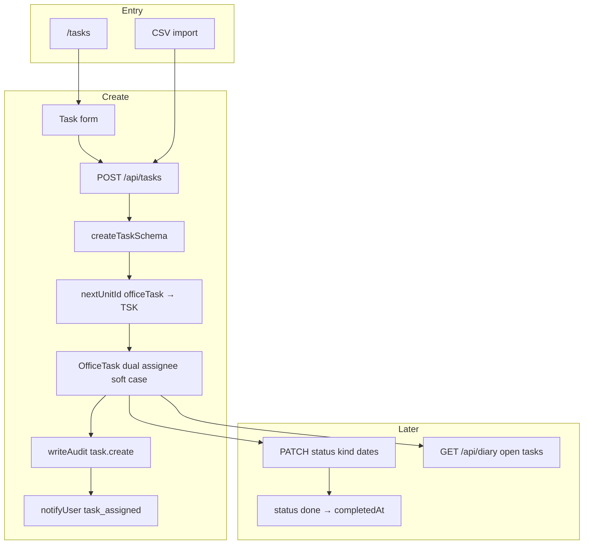
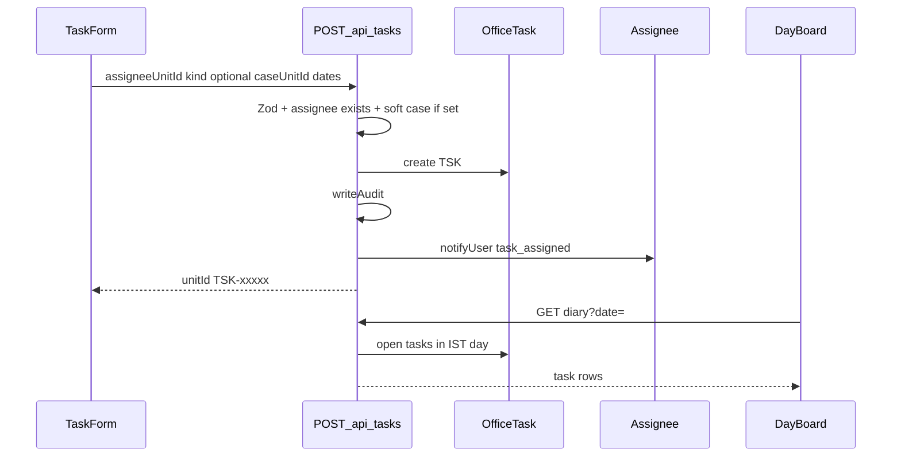

# Work allotment (tasks) flow (`/tasks`)

## Core principle: assign office work, surface on day board

**Work allotment** manages `OfficeTask` (`TSK`): dual assignee `User`, optional **soft** `caseUnitId` (string only — may dangle). Create/reassign may `notifyUser` (`task_assigned`); completing may notify the creator (`task_done`). Open items with `workDate` or `dueDate` in the IST day appear on [Day board](./day_board_flow.md).



---

## Permissions / nav

| Gate | Value |
|------|--------|
| Nav | Office → Work allotment · `tasks.view` · **staffOnly** |
| Create / import | `tasks.create` |
| Edit / status | `tasks.edit` |

Clients never see Work allotment.

---

## Staff vs client

| Action | Staff | Client |
|--------|-------|--------|
| List / assign / complete | Yes | No |
| Soft-link to case | Yes (`caseUnitId`) | No |
| See task on day board | Yes (own open unless admin) | No |

---

## Action catalog

| Action | How | API |
|--------|-----|-----|
| List / filter | `/tasks` · `q`, `status`, `kind`, `workDate`, `assigneeUnitId`, `due=overdue\|today` | `GET /api/tasks` |
| Create / assign | Form | `POST /api/tasks` |
| Update / reassign / status | Form / actions | `PATCH /api/tasks/[unitId]` |
| Import | Import dialog | `POST /api/tasks/import` |
| Day board | Linked from diary | `GET /api/diary` (open + date in IST day) |

**ID prefix:** `TSK`. Assignees come from [employees](./employees_flow.md).

**Kinds:** `allotment` | `finishing` | `ca_section` | `bundle_check` | `numbering` | `general`.

---

## Assign → notify → day board

1. Page [`app/(portal)/tasks/page.tsx`](../../app/(portal)/tasks/page.tsx) — `tasks.view`.
2. Form picks assignee (employee `EMP`), optional soft `caseUnitId` (validated on write if set), kind, due/work dates.
3. `POST /api/tasks` → Zod → dual `assigneeId`+`assigneeUnitId` → `writeAudit` → `notifyUser` `task_assigned`.
4. Reassign or mark `done` via `PATCH` → audit; done sets `completedAt` and may notify creator `task_done`; leaving done clears `completedAt`.
5. Day board loads `status: open` where `workDate` or `dueDate` falls in IST day bounds; non-admin scoped to own `assigneeUnitId`.



```text
/tasks
  --> POST /api/tasks { assigneeUnitId, kind, optional caseUnitId }
  --> notifyUser assignee
  --> PATCH ... status done|cancelled|open
  --> GET /api/diary shows open tasks for IST day
```

---

## State / rules

| Status | Meaning | `completedAt` |
|--------|---------|---------------|
| `open` | Active work | Cleared |
| `done` | Finished | Set |
| `cancelled` | Dropped | — |

| Link | Kind |
|------|------|
| Assignee | **Required** dual User |
| Case | Optional **soft** `caseUnitId` only (no `caseId`) |

---

## Key files

| Layer | Path |
|-------|------|
| Page | [`app/(portal)/tasks/page.tsx`](../../app/(portal)/tasks/page.tsx) |
| UI | [`features/tasks/components/`](../../features/tasks/components/) |
| API | [`app/api/tasks/`](../../app/api/tasks/) |
| Zod / serialize | [`lib/validations/tasks.schema.ts`](../../lib/validations/tasks.schema.ts), [`features/tasks/server/serialize.ts`](../../features/tasks/server/serialize.ts) |

---

## Cross-module links

| Module | Link |
|--------|------|
| [Employees](./employees_flow.md) | Assignees |
| [Cases](./cases_flow.md) | Soft `caseUnitId` |
| [Day board](./day_board_flow.md) | Open tasks by date |
| [Reports](./reports_flow.md) | `tasks` export |
| [Activity](./activity_flow.md) | `task.create` / `task.update` |
