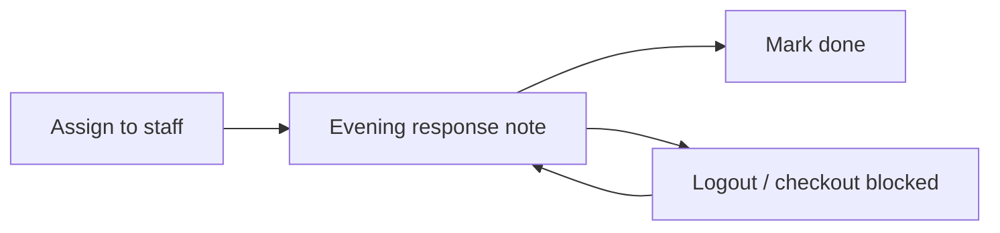

# Work allotment (tasks) flow (`/tasks`)

## Simple story

1. **Assign** — give a task to one person, or to **all staff**
2. **Respond in the evening** — staff add a short note
3. **Done** — that note marks the task done
4. **Gate** — logout and HRMS check-out ask for answers if today’s open tasks are still unanswered

---

## Permissions / nav

| Gate | Value |
|------|--------|
| Nav | Office → Work allotment · `tasks.view` · **staffOnly** |
| Create / import | `tasks.create` |
| Edit / status | `tasks.edit` |

Clients never see Work allotment.

---

## Actions

| Action | API |
|--------|-----|
| List / filter | `GET /api/tasks` |
| Assign (one or all staff) | `POST /api/tasks` (`assigneeUnitId` **or** `assignToAllStaff: true`) |
| Update / reassign / done | `PATCH /api/tasks/[unitId]` — **done requires `finishNote`** |
| Pending tonight | `GET /api/tasks/pending-response` (current user’s open tasks for today) |
| Import | `POST /api/tasks/import` |
| Day board | `GET /api/diary` (open tasks in IST day) |

**ID prefix:** `TSK`.

---

## Rules

| Rule | Detail |
|------|--------|
| Assign all staff | One open task per active office employee (not client logins) |
| Evening response | Same as mark done — non-empty `finishNote` required |
| Logout | UI asks for pending responses before signing out |
| Check-out | UI dialog + server rejects check-out while pending open tasks remain for today |
| Statuses | `open` → `done` (sets `completedAt`) · `cancelled` |

---

## Key files

| Layer | Path |
|-------|------|
| Page | [`app/(portal)/tasks/page.tsx`](../../app/(portal)/tasks/page.tsx) |
| UI | [`features/tasks/components/`](../../features/tasks/components/) |
| Pending helper | [`features/tasks/server/pending-response.ts`](../../features/tasks/server/pending-response.ts) |
| API | [`app/api/tasks/`](../../app/api/tasks/) |
| Zod | [`lib/validations/tasks.schema.ts`](../../lib/validations/tasks.schema.ts) |

---

## Cross-module links

| Module | Link |
|--------|------|
| [Employees](./employees_flow.md) | Assignees |
| [HRMS](./hrms_flow.md) | Check-out blocked until responses |
| [Day board](./day_board_flow.md) | Open tasks by date |
| [Activity](./activity_flow.md) | `task.create` / `task.update` |
