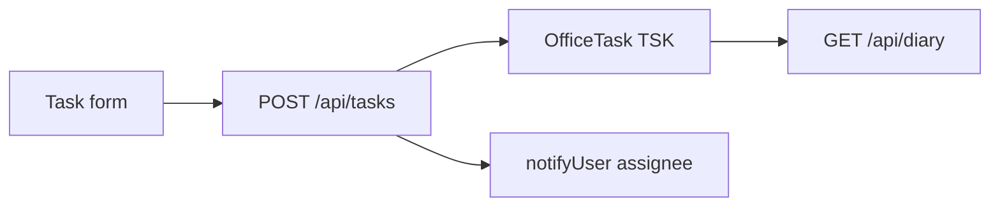

# Work allotment (tasks) flow (`/tasks`)

## Core principle: assign office work, surface on day board

**Work allotment** manages `OfficeTask` (`TSK`): dual assignee `User`, optional soft `caseUnitId`. Create/assign may `notifyUser`. Items with due / `workDate` appear on [Day board](./day_board_flow.plan.md).

---

## Permissions / nav

| Gate | Value |
|------|--------|
| Nav | Office → Work allotment · `tasks.view` · **staffOnly** |
| Create / import | `tasks.create` |
| Edit / status | `tasks.edit` |

---

## Action catalog

| Action | API |
|--------|-----|
| List / filter | `GET /api/tasks` |
| Create / assign | `POST /api/tasks` |
| Update | `PATCH /api/tasks/[unitId]` |
| Import | `POST /api/tasks/import` |

**ID prefix:** `TSK`. Assignees come from [employees](./employees_flow.plan.md).

---

## Key files

| Layer | Path |
|-------|------|
| Page | [`app/(portal)/tasks/page.tsx`](../../app/(portal)/tasks/page.tsx) |
| UI | [`features/tasks/components/`](../../features/tasks/components/) |
| API | [`app/api/tasks/`](../../app/api/tasks/) |
| Zod / serialize | [`lib/validations/tasks.schema.ts`](../../lib/validations/tasks.schema.ts), [`features/tasks/server/serialize.ts`](../../features/tasks/server/serialize.ts) |

---

## Cross-module links

[Employees](./employees_flow.plan.md) · [Cases](./cases_flow.plan.md) · [Day board](./day_board_flow.plan.md) · [Reports](./reports_flow.plan.md)
