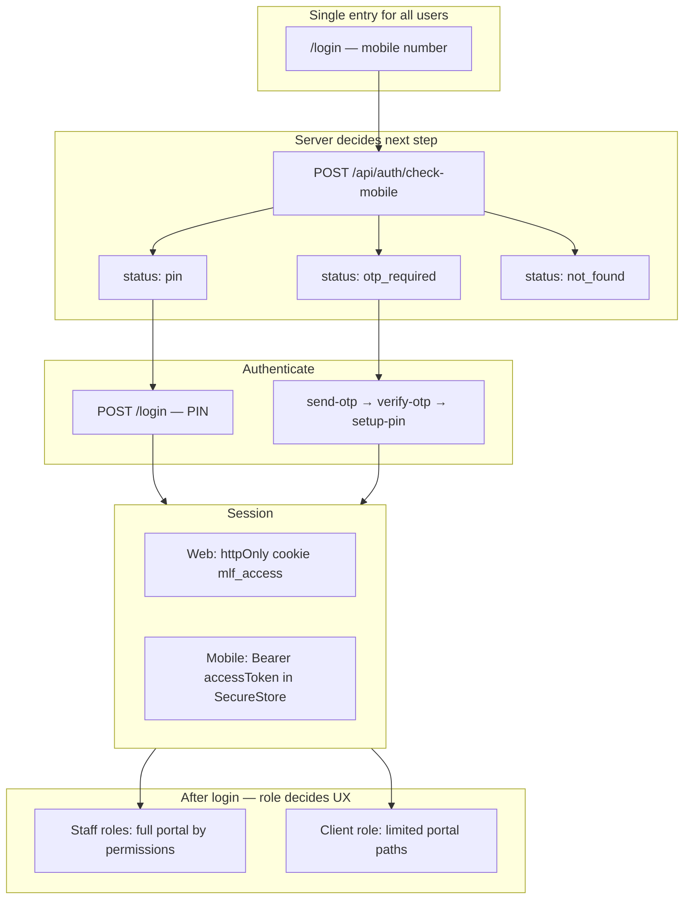
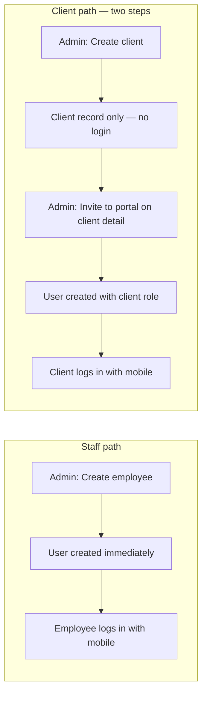
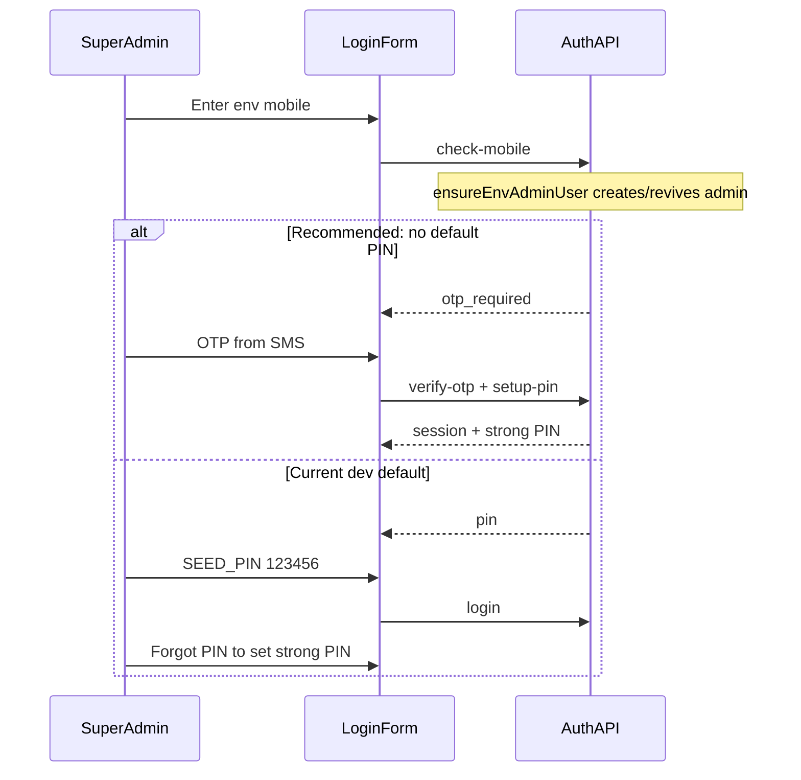
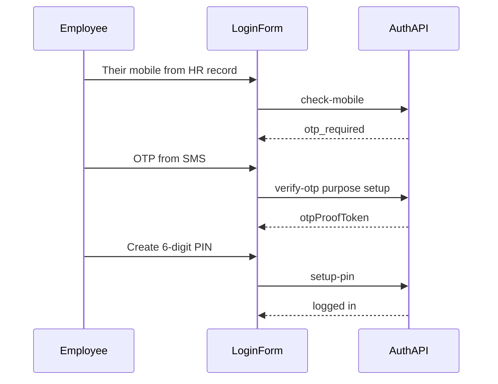
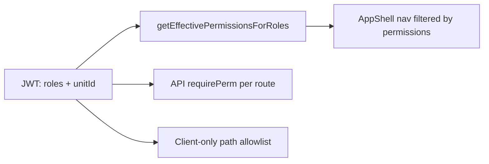

# Recommended unified login flow (web + mobile)

## Core principle: one login, many roles

Your app already follows the right pattern: **no separate login per role**. Everyone uses the same screen ([`features/auth/components/login-form.tsx`](features/auth/components/login-form.tsx)) and the same APIs under [`app/api/auth/*`](app/api/auth/). After login, **roles + permissions** in the JWT decide what they see.

---

## How env super-admin check works today

When any user enters a mobile on `/login`:

1. UI sends 10-digit number → server normalizes to `91XXXXXXXXXX` ([`lib/auth/mobile.ts`](lib/auth/mobile.ts)).
2. `POST /api/auth/check-mobile` always calls `ensureEnvAdminUser(mobile)` ([`lib/auth/bootstrap-admin.ts`](lib/auth/bootstrap-admin.ts)).
3. **Only if** the number matches env vars (`SUPER_ADMIN_MOBILE`, `ADMIN_MOBILE`, `ADMIN_MOBILE_1`) → create/revive a `User` with `admin` role. Other numbers are **never** auto-created.
4. Server re-reads the user and returns:

| DB state | Response | Next UI step |
|----------|----------|--------------|
| Active + has `pinHash` | `pin` | Enter PIN |
| Active + no `pinHash` | `otp_required` | OTP → create PIN |
| Inactive or unknown | `not_found` | Error: contact admin |

**Important correction:** “Forgot PIN” is **not** for first-time setup. It only works when `pinHash` already exists ([`app/api/auth/send-otp/route.ts`](app/api/auth/send-otp/route.ts) lines 92–102). First-time users (new employee, invited client, force-reset PIN) use the **OTP setup** path (`purpose: setup`).

**Super-admin today:** bootstrap usually sets default PIN `123456` (`SEED_PIN`) immediately, so check-mobile returns `pin` — not `otp_required`. Super admin logs in with that PIN first, then can change it via Forgot PIN.

---

## Staff vs client: login access is NOT the same

**This is the key difference you asked about:**

| Action | What gets created | Can login immediately? |
|--------|-------------------|------------------------|
| **Create employee** (`POST /api/employees`) | `User` row (staff roles) | **Yes** — mobile works on `/login` right away (OTP setup first, then PIN) |
| **Create client** (`POST /api/clients`) | `Client` row only | **No** — client record is not a login account |
| **Invite to portal** (`POST /api/clients/[unitId]/portal`) | `User` row (`roles: ["client"]`, linked via `clientUnitId`) | **Yes** — after invite, same OTP → PIN flow as staff |

**Why separate invite for clients?**
- Not every client needs portal access (some are intake-only, SMS-only, etc.).
- Staff controls **when** a client can see cases, appointments, and documents online.
- UI: client detail page → **Invite to portal** button ([`features/clients/components/client-detail-page.tsx`](features/clients/components/client-detail-page.tsx)).

If a client tries to log in **before** invite → `check-mobile` returns `not_found` (“This number is not registered”).

**Optional future improvement:** Auto-invite on client create (checkbox “Enable portal access”) — not implemented today; would call the same `POST .../portal` logic after create.

---

## Recommended lifecycle by user type

### 1. Super admin (env bootstrap)

**Setup (once per deployment):**
- Set `SUPER_ADMIN_MOBILE` in [`.env.example`](.env.example) / production env.
- Optionally run `npm run db:seed` or `npx tsx scripts/ensure-super-admin.ts`.

**Recommended production flow:**

**Best practice:** In production, **do not rely on `SEED_PIN`**. Either:
- Skip setting `pinHash` in bootstrap (force OTP setup on first login), **or**
- Login once with `SEED_PIN`, immediately use Forgot PIN to set a strong PIN.

Env admin remains special: `check-mobile` always revives them if deactivated ([`docs/site-architecture.md`](docs/site-architecture.md) §3.8).

---

### 2. Sub-admin / staff / advocate / accountant (created in Employees)

**Admin creates user** — [`POST /api/employees`](app/api/employees/route.ts):
- Creates `User` with chosen `roles[]` (e.g. `sub_admin`, `staff`, `advocate`).
- **No `pinHash`** — employee cannot PIN-login yet.

**Employee first login (web or mobile):**

**Return visits:** `check-mobile` → `pin` → `POST /login`.

**Admin actions:** Force-reset PIN clears `pinHash` → employee repeats OTP setup ([`app/api/employees/[unitId]/force-reset-pin/route.ts`](app/api/employees/[unitId]/force-reset-pin/route.ts)).

---

### 3. Client (portal invite)

**Admin invites** from client detail — [`POST /api/clients/[unitId]/portal`](app/api/clients/[unitId]/portal/route.ts):
- Creates `User` with `roles: ["client"]`, `clientUnitId` linked to `Client`.
- Uses mobile from the client record; **no `pinHash`**.

**Client login:** Same OTP setup flow as staff (mobile → OTP → PIN).

**After login:** [`proxy.ts`](proxy.ts) + [`lib/auth/client-portal.ts`](lib/auth/client-portal.ts) restrict clients to `/`, `/cases`, `/appointments`, `/profile`, etc. Staff see full nav based on RBAC permissions.

---

## Web vs mobile — same flow, different session storage

| Step | Web (Next.js) | Mobile (React Native) |
|------|---------------|------------------------|
| Auth APIs | Same `/api/auth/*` | Same `/api/auth/*` |
| Session | `Set-Cookie: mlf_access` (httpOnly) | Store `accessToken` from JSON in SecureStore |
| Authenticated requests | Cookie auto-sent (`authFetch` with credentials) | `Authorization: Bearer <accessToken>` |
| Session check | Portal layout + `GET /api/auth/me` | `GET /api/auth/me` with Bearer |
| Logout | `POST /api/auth/logout` clears cookie | Clear SecureStore + optional logout API |

Reference: [`docs/mobile-app-build-prompt.md`](docs/mobile-app-build-prompt.md) and [`lib/auth/session.ts`](lib/auth/session.ts) (`getAccessPayloadFromRequest` accepts cookie **or** Bearer).

**Mobile app should implement the same step machine as web:**
1. phone → `check-mobile`
2. branch on `status`
3. pin → `login` OR otp → `verify-otp` → `setup-pin` / `forgot-pin/reset`
4. persist `accessToken` + `user.permissions`

---

## Post-login: role drives UI, not login

- **Super admin / admin:** full permission catalog ([`lib/rbac/index.ts`](lib/rbac/index.ts)).
- **Sub-admin / staff / advocate / accountant:** union of role permissions from `RolePermission` matrix.
- **Client:** role `client` only + path restrictions; no employee modules.

No role picker at login — admin assigns roles when creating the employee; client role is set at portal invite.

---

## Recommended “best” flow summary

| User | Who creates account | First login | Return login | PIN recovery |
|------|---------------------|-------------|--------------|--------------|
| Super admin | Env + `ensureEnvAdminUser` | OTP setup (prod) or SEED_PIN then change (dev) | Mobile + PIN | Forgot PIN |
| Sub-admin / staff | Admin in Employees | Mobile → OTP → set PIN | Mobile + PIN | Forgot PIN |
| Client | Admin portal invite | Mobile → OTP → set PIN | Mobile + PIN | Forgot PIN |
| Unknown mobile | — | `not_found` — no signup | — | — |

**Rules to keep:**
1. **No public signup** — every user must exist in DB (env bootstrap, employee create, or portal invite).
2. **One login UI** for web and mobile — branch on `check-mobile` status only.
3. **OTP setup** = first PIN or after force-reset; **Forgot PIN** = change existing PIN.
4. **Strong PIN enforced** on setup/reset (`isWeakPin`); allow weak PIN only on direct login if bootstrap set it (change this in prod).
5. **Rate limits** on all auth endpoints (already in place).
6. **Session invalidation** on PIN reset (`sessionVersion++`).

---

## Optional improvements (if you implement later)

These are recommendations, not required for the current design to work:

1. **Production bootstrap:** Change [`ensureEnvAdminUser`](lib/auth/bootstrap-admin.ts) to create user **without** `pinHash` so super admin always goes through OTP setup (strong PIN from day one).
2. **Onboarding copy:** When `otp_required`, show “First time? Enter the OTP sent to your mobile” vs Forgot PIN label only on PIN step.
3. **Admin visibility:** Show `hasPin: false` on Employees list (already in [`toEmployeeSummary`](features/employees/server/serialize.ts)) — prompt admin that employee hasn’t completed first login.
4. **Invite SMS (optional):** After employee create / portal invite, send a transactional SMS: “You’ve been added to MLF. Open the app and sign in with your mobile.”
5. **Docs:** Add a short “Login playbook” section to [`docs/application-flows.md`](docs/application-flows.md) linking super-admin → staff → client paths ( [`docs/site-architecture.md`](docs/site-architecture.md) §3–5 already has most of this).

---

## What you do NOT need

- Separate login pages per role
- Username/email login (mobile is the identifier)
- Role selection at login
- Different API trees for web vs mobile (same `/api/auth/*`, different session transport)

Your current architecture is sound for a law-office portal. The main production gap is the default `SEED_PIN` for env admin — switching to OTP-first bootstrap is the single highest-value hardening step.
