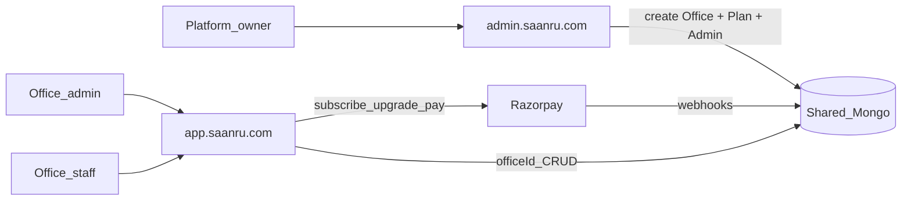
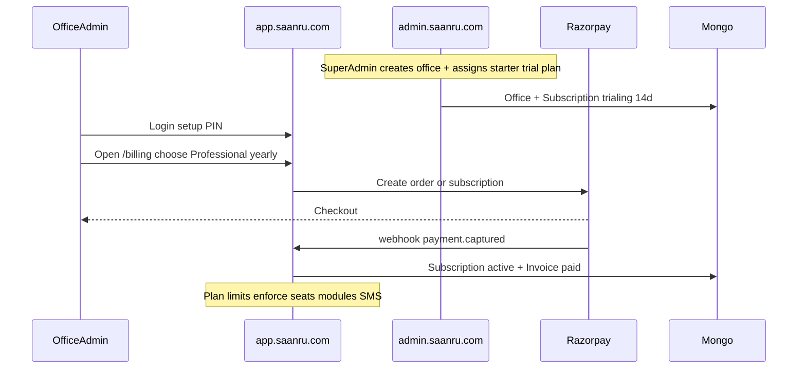
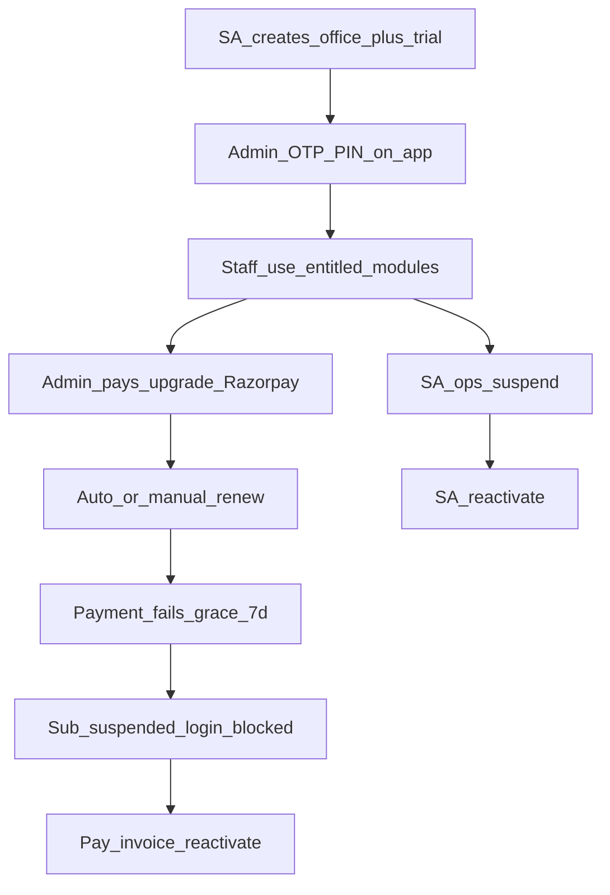

# SAANRU — Multi-Office Lawyer SaaS Plan

**Product name:** SAANRU  
**Reference only:** MLF codebase (do not retrofit MLF)  
**Delivery:** Two apps / two domains + shared MongoDB with `officeId`  
**Billing:** Offices subscribe to priced plans (Razorpay, INR)

| Surface | Domain (example) | Who |
|---------|------------------|-----|
| Super Admin | `admin.saanru.com` | Platform owners — offices, plans, subscriptions, support |
| Office Portal | `app.saanru.com` | Each law office — full MLF-like product |
| Marketing (later) | `saanru.com` | Pricing page, signup CTA (optional v1.1) |



---

## Decisions locked

| Decision | Choice |
|----------|--------|
| Product | **SAANRU** |
| Hosting | Two apps: Super Admin + Office Portal |
| Codebase | New monorepo; MLF = reference for flows/UI/API/RBAC |
| Tenancy | Shared Mongo + `officeId` / `officeUnitId` (`OFF-#####`) |
| Payments | **Razorpay** (INR); monthly + yearly |
| Trial | 14-day trial on first activate (configurable per plan) |
| Stack | Next.js App Router · React · Prisma/Mongo · JWT cookie · mobile+PIN/OTP · Zod · Tailwind/shadcn |

---

## Repo layout

```text
saanru/
  apps/
    super-admin/       # admin.saanru.com
    office-portal/     # app.saanru.com
  packages/
    db/                # Prisma schema + client
    shared/            # IDs, Zod, API envelope, plan limits helpers
    ui/                # shared primitives (optional)
  docs/
```

- Separate deploys, cookies (`saanru_sa_access` / `saanru_op_access`), JWT secrets, brands.
- Shared Prisma schema; no cross-domain session cookies.

---

# Part A — Subscription plans and pricing

## Plan catalog (seed + Super Admin editable)

Prices are **INR** and intended as v1 defaults (Super Admin can change anytime).

| Plan | Code | Monthly | Yearly (≈2 months free) | Seats (active staff) | SMS / month | Storage | Modules |
|------|------|---------|-------------------------|----------------------|-------------|---------|---------|
| **Starter** | `starter` | ₹1,999 | ₹19,990 | 5 | 200 | 2 GB | Core: dashboard, clients, cases, diary, appointments, availability, tasks, employees, permissions, activity, profile, notifications, reports (basic) |
| **Professional** | `professional` | ₹4,999 | ₹49,990 | 25 | 1,000 | 20 GB | Starter + accounts, expenses, dak, documents upload, CSV imports, full reports |
| **Enterprise** | `enterprise` | ₹9,999 | ₹99,990 | 100 | 5,000 | 100 GB | All modules including HRMS + hearing SMS cron + priority support flag + custom branding (logo/color) |

**Add-ons (optional v1.1):** extra seats pack, extra SMS pack — model ready, UI later.

### Plan → module entitlements

| Module | Starter | Professional | Enterprise |
|--------|---------|--------------|------------|
| dashboard, clients, cases, diary | yes | yes | yes |
| appointments, availability | yes | yes | yes |
| tasks, employees, permissions, activity | yes | yes | yes |
| reports (exports) | basic | full | full |
| accounts, expenses | no | yes | yes |
| dak, documents | no | yes | yes |
| CSV imports | no | yes | yes |
| hrms | no | no | yes |
| hearing SMS (cron + diary send) | no | no | yes |
| custom branding | logo only | logo + color | full |

Effective modules for an office = **intersection** of (plan entitlements) ∩ (Super Admin office toggles) ∩ (office admin cannot enable what plan denies).

### Subscription states

`trialing` → `active` → `past_due` (grace 7 days) → `suspended` (portal read-only or login block — **login block** for unpaid) → `cancelled` / `expired`

Also: `Office.status` remains `draft` | `active` | `suspended` | `closed` (ops). Portal usable only when office `active` **and** subscription in `trialing` | `active` | `past_due` (grace).

### Billing data models

| Model | Purpose |
|-------|---------|
| `Plan` | `unitId` (`PLN-#####`), code, name, prices (monthly/yearly paise), seat/sms/storage limits, `moduleEntitlements[]`, `trialDays`, `isActive`, sortOrder |
| `Subscription` | `unitId` (`SUB-#####`), `officeId`, `planId`, status, billingCycle (`monthly`/`yearly`), `currentPeriodStart/End`, `trialEndsAt`, `cancelAtPeriodEnd`, Razorpay ids (`razorpayCustomerId`, `razorpaySubscriptionId` / order ids) |
| `Invoice` | `unitId` (`INV-#####`), office, subscription, amount, tax, status, Razorpay payment id, PDF key, paidAt |
| `UsageCounter` | per office per month: `smsSent`, `storageBytes`, `activeSeats` (computed) |
| `WebhookEvent` | idempotent Razorpay event ids |

### Who buys / how



**Paths:**

1. **Super Admin assigns plan** on create (default Starter trial) or override (comp / enterprise deal).
2. **Office admin self-serve** at Portal `/billing` — upgrade/downgrade/renew (downgrade at period end).
3. **Super Admin** can extend trial, change plan manually, mark complimentary, record offline payment.

---

# Part B — Data model

## Platform (Super Admin)

- `PlatformUser` (`PADMIN-#####`) — mobile + PIN/OTP; roles `platform_owner` | `platform_support`
- `Office` (`OFF-#####`) — profile, slug, status, branding, module overrides, timezone IST default
- `OfficeMembership` — User ↔ Office + roles (multi-office mobile)
- `Plan`, `Subscription`, `Invoice`, `UsageCounter`, `WebhookEvent`
- `PlatformAuditLog`, `PlatformIdCounter`

## Office portal (MLF models + tenancy)

Every domain row: **`officeId` + `officeUnitId`**.

Auth/staff: `User`, `OtpSession`, `ConsumedOtpProof`, `RolePermission` (per office), `AuditLog`, `IdCounter` **unique `(officeId, entity)`**

Domain: `Client`, `Case`, `Hearing`, `CashPayment`, `OfficeExpense`, `Document`, `Appointment`, `DakEntry`, `OfficeTask`, `Attendance`, `LeaveRequest`, `AdvocateWeeklyHours`, `AdvocateTimeBlock`, `OfficeHoliday`, `Notification`

**IDs (MLF golden rules):** UI/API = `unitId` only; dual FKs inside APIs; never leak ObjectIds.  
**Uniqueness:** `(officeId, mobile)` on User; platform mobiles separate.  
**Indexes:** always `(officeId, …)` on list queries.

---

# Part C — Super Admin (`admin.saanru.com`)

## Purpose

Create/manage offices, plans/pricing, subscriptions, first admins, suspend/support. **No** case/client editing.

## Auth

Mirror MLF: mobile → PIN / OTP setup / forgot. Cookie `saanru_sa_access`. Edge gate + layout session.

## Screens

| Route | Job |
|-------|-----|
| `/login` | Platform auth |
| `/` | KPIs: offices, MRR, trials ending, past_due, recent signups |
| `/offices` | Registry + filters (status, plan, q) |
| `/offices/new` | Wizard: profile → branding → plan → modules → first admin → review |
| `/offices/[unitId]` | Tabs: Overview · Subscription · Admins · Modules · Usage · Activity · Danger |
| `/plans` | Plan list + create/edit price, limits, entitlements |
| `/plans/[unitId]` | Plan detail |
| `/subscriptions` | All subs; filter status/plan; extend / force-change |
| `/invoices` | Platform invoice browser |
| `/platform-users` | Support users (v1.1 ok) |
| `/activity` | Platform audit |
| `/profile` | Self |

## Create-office wizard steps

1. Office profile (name, slug, phone, email, address, state, timezone)  
2. Branding (display name, optional logo later)  
3. **Plan** — pick Starter/Professional/Enterprise + cycle + start trial yes/no  
4. Modules — pre-checked from plan; Super Admin may only **disable** further (not enable beyond plan)  
5. First admin (name, mobile, role admin)  
6. Review → create: Office + Subscription + User + Membership + seed RolePermission + IdCounters + audit + invite SMS to `app.saanru.com`

**Danger:** Suspend office, Reactivate, Force-reset admin PIN, Close (soft), Mark complimentary subscription.

## Super Admin APIs (core)

Auth `/api/auth/*` · Offices CRUD + activate/suspend/reactivate/close · Admins ·  
`/api/plans` CRUD · `/api/subscriptions` list/patch/extend · `/api/invoices` ·  
`/api/dashboard/summary` · `/api/activity` · `/api/profile`  
Razorpay admin actions: record offline payment, sync status.

---

# Part D — Office Portal (`app.saanru.com`) — full MLF flows

Architecture per feature (same as MLF):

```text
app/(portal)/<domain>/page.tsx     → session + module + permission + plan gate
features/<domain>/components/      → client UI
features/<domain>/server/          → serialize
app/api/<domain>/route.ts          → requirePerm + officeId scope + Zod + Prisma + audit
lib/validations/<domain>.schema.ts
```

**Gates on every request:** JWT → active User → Office active → Subscription allowed → module enabled by plan∩office → `requirePerm`.

**Cross-office access:** always **404**.

---

## D1 — Auth / OTP / session / office picker

**Purpose:** Staff login; multi-office picker; PIN setup.

**UI:** `/login` — phone → PIN | OTP setup | forgot PIN | office picker if mobile in multiple offices.

**APIs:** `check-mobile`, `login`, `send-otp`, `verify-otp`, `setup-pin`, `forgot-pin/reset`, `me`, `logout`, `session-expired`, `select-office`

**JWT:** `sub`=EMP unitId, `oid`=OFF unitId. Cookie `saanru_op_access`.

**Flow:** check-mobile → (offices list) → PIN/OTP → cookie → `/`. Suspended/unpaid office → clear error.

---

## D2 — RBAC / modules / plan gates

**Roles:** `admin`, `sub_admin`, `staff`, `advocate`, `accountant` (MLF blurbs).  
**Permissions:** seed from MLF `PERMISSION_CATALOG`; edit at `/permissions` (admin).  
**Nav:** MLF groups — Workspace / Matters / Schedule / Office / Admin; hide if module off or plan denies.  
**UI:** ForbiddenState when perm missing; UpgradePrompt when plan blocks module.

---

## D3 — Home dashboard

**Route:** `/` · **API:** `GET /api/dashboard/summary`  
**UI:** welcome, stats, action queue, timeline, office presence, personal attendance (if HRMS entitled).  
**Perm:** `dashboard.view`

---

## D4 — Clients

**Routes:** `/clients`, `/clients/[unitId]`  
**APIs:** GET/POST `/api/clients`, GET/PATCH `/api/clients/[unitId]`, POST import  
**Flow:** create (normalize mobile, SMS consent) → `CLI-#####` → list/search → detail → link to cases/payments.  
**Import:** dry-run → confirm.  
**Perms:** `clients.view|create|edit`

---

## D5 — Cases + hearings + checklist

**Routes:** `/cases`, `/cases/[unitId]`  
**APIs:** cases CRUD, `.../status`, `.../checklist`, `.../hearings`, hearings adjourn, cases/hearings import  
**Flow:**

1. Create case with `clientUnitId`, court fields, advocates  
2. Pipeline status via `canTransitionStatus`  
3. Filing checklist / batta flags  
4. Add hearing → updates `nextHearingAt` → may notify  
5. Adjourn → new HRG + outcome  
6. Documents panel + fee snippet from accounts  

**IDs:** `CSE`, `HRG`, dual client FKs.  
**Perms:** `cases.view|create|edit|upload`

---

## D6 — Appointments + availability + convert-case

**Routes:** `/appointments`, `/availability`  
**APIs:** appointments CRUD, convert-case, import; advocates hours/blocks; slot availability  
**Flow:** set weekly hours/blocks → book consultation (slot rules) → complete/cancel → optional convert → enquiry `CSE`.  
**Row scope:** non–office-bookers see own `advocateMobile` only (MLF).  
**Perms:** `appointments.view|create|edit|cancel`

---

## D7 — Diary (day board)

**Route:** `/diary`  
**API:** `GET /api/diary?date=&advocateMobile=` · send-hearing-sms · tomorrow-notify  
**Aggregate:** Hearings + Appointments + Tasks for IST day.  
**Access:** any of cases|appointments|tasks `*.view`.  
**Enterprise:** SMS send respects monthly SMS quota.

---

## D8 — Accounts (cash ledger)

**Route:** `/accounts`  
**APIs:** GET/POST accounts, GET/PATCH `[unitId]`, void, import  
**Flow:** payment on client (+ optional case) → list/filter/summary → void → case fee rollup.  
**Not** online client checkout — office cash book.  
**Plan:** Professional+.  
**Perms:** `accounts.view|create|edit|upload`

---

## D9 — Expenses

**Route:** `/expenses`  
**APIs:** CRUD-ish + void; optional bill `DOC`  
**Plan:** Professional+.  
**Perms:** `expenses.view|create|edit|upload`

---

## D10 — Documents

**No standalone page** — panels on case/client/expense.  
**APIs:** POST multipart `/api/documents`, DELETE, download.  
**Storage:** `offices/{OFF}/…`; enforce plan storage quota.  
**Access by kind:** expense bill → expenses perms; else cases/accounts rules (MLF).

---

## D11 — Tasks (work allotment)

**Route:** `/tasks`  
**APIs:** GET/POST `/api/tasks`, PATCH `[unitId]`, import  
**Flow:** create/assign → notify → finish → show on diary.  
**Row scope:** non-admin/sub_admin → own assignee only.  
**Perms:** `tasks.view|create|edit`

---

## D12 — Dak (postal)

**Route:** `/dak`  
**APIs:** CRUD + import; soft links `caseUnitId`/`clientUnitId`  
**Plan:** Professional+.  
**Perms:** `dak.view|create|edit`

---

## D13 — HRMS

**Route:** `/hrms`  
**APIs:** attendance check-in/out, list; leave request/decide/cancel; holidays; presence  
**Perms:** `hrms.view`, `own_attendance`, `own_leave`, `manage_attendance`, `approve_leave`  
**Plan:** Enterprise only.

---

## D14 — Employees

**Route:** `/employees`  
**APIs:** CRUD, deactivate/reactivate, force-reset-pin, import; `/api/advocates`  
**Seat limit:** creating/reactivating user blocked if active seats ≥ plan limit → UpgradePrompt.  
**Perms:** `employees.view|create|edit|deactivate`

---

## D15 — Permissions matrix

**Route:** `/permissions`  
**APIs:** GET/PUT matrix, preview  
**Seed:** MLF defaults per office on provision.

---

## D16 — Notifications

**Routes:** header bell + `/notifications`  
**APIs:** list, unread-count, read, read-all, SSE stream (flag)  
**Always** available to authenticated users.

---

## D17 — Search, reports, activity, profile

| Flow | Route | API |
|------|-------|-----|
| ⌘K search | header | `GET /api/search?q=` (office-scoped) |
| Reports | `/reports` | `GET /api/exports?type=` |
| Activity | `/activity` | `GET /api/activity` |
| Profile | `/profile` | GET/PATCH profile, photo |

---

## D18 — Billing (Office Portal — new vs MLF)

**Route:** `/billing` (office admin / sub_admin)  
**UI:** current plan, period end, usage meters (seats/SMS/storage), plan comparison, Upgrade/Renew, invoice list, download invoice.  
**APIs:**

| Method | Path | Purpose |
|--------|------|---------|
| GET | `/api/billing/subscription` | Current sub + plan + usage |
| GET | `/api/billing/plans` | Public catalog for upgrade |
| POST | `/api/billing/checkout` | Create Razorpay order/subscription |
| POST | `/api/billing/change-plan` | Schedule upgrade/downgrade |
| POST | `/api/billing/cancel` | cancel at period end |
| GET | `/api/billing/invoices` | Office invoices |
| POST | `/api/billing/webhooks/razorpay` | Signature-verified webhooks (no user JWT) |

**Past due banner** in AppShell when `past_due`; hard block when `suspended`/`expired`.

---

## D19 — Cron / hearing SMS

`GET /api/cron/hearing-sms` with `CRON_SECRET` — iterate offices with Enterprise SMS entitlement + active sub; skip if monthly SMS quota exhausted; write UsageCounter.

---

## D20 — CSV import (all Professional+)

Same MLF pattern: ImportDialog → dry-run → confirm.  
Endpoints: clients, cases, hearings, accounts, employees, dak, tasks, appointments.  
Parent unitIds must resolve **inside same office**.

---

## Portal nav (final)

| Group | Items |
|-------|-------|
| Workspace | Home |
| Matters | Clients, Cases, Day board |
| Schedule | Appointments, Availability |
| Office | Accounts*, Expenses*, HRMS†, Postal*, Work allotment, Reports, **Billing** |
| Admin | Employees, Activity, Permissions |

\* Professional+ · † Enterprise

---

# Part E — End-to-end lifecycles

## Office lifecycle



## Matter lifecycle (inside office)

Client → Appointment (optional) → Case enquiry → engage/pipeline → Hearings → Diary → Documents → Payments → Tasks/Dak → Dispose/archive.

---

# Part F — Security and ops

- Separate JWT secrets/cookies per app; never accept cross-app tokens.  
- All portal queries force `officeId`.  
- Plan + subscription checked in guard (module + seats + SMS + storage).  
- Webhook signature verification + idempotent `WebhookEvent`.  
- Rate-limit auth; PIN lockout.  
- File keys under `offices/{OFF}/`.  
- Env: two deploys, shared `DATABASE_URL`, Razorpay keys on portal (+ webhook), SMS, cron.  
- Seed: platform owner, 3 plans with prices above, demo office on Professional trial.

---

# Part G — UI/UX standards

MLF patterns: AppShell, PageHeader, DataToolbar, filters, PaginationBar, EmptyState, ForbiddenState, dialogs, drawers, ImportDialog, toasts, theme, UnitIdBadge.  

SAANRU brand on Super Admin + marketing; Office Portal shows **office** display name/logo.  
Billing: clear plan cards, usage bars, UpgradePrompt on locked modules.

---

# Part H — Out of scope v1

- Client self-service portal  
- Custom domains per office  
- Email login / OAuth  
- Online fee collection from clients (cash ledger only)  
- WhatsApp Business API (SMS only via 2Factor-like provider)

---

# Part I — Implementation phases

| Phase | Deliverable |
|-------|-------------|
| **0 Foundation** | Monorepo, schema (incl. Plan/Subscription/Invoice), shared libs |
| **1 Super Admin** | Auth, offices wizard, plans CRUD/pricing, subs overview, suspend, audit |
| **2 Billing** | Razorpay checkout, webhooks, trial/grace, Portal `/billing`, usage meters |
| **3 Portal core** | Auth+picker, employees, permissions, clients, cases/hearings, diary, docs, home, search, activity, profile, notifications |
| **4 Schedule & money** | Appointments, availability, convert-case, accounts, expenses, reports, imports |
| **5 Ops** | Tasks, dak, HRMS, SMS cron+quota, branding |
| **6 Hardening** | Isolation + subscription E2E, smoke, seed, docs |

---

# Part J — Test checklist

- Two offices; same mobile → picker; zero data leak (404).  
- Starter cannot open accounts/HRMS; Professional opens accounts not HRMS; Enterprise all.  
- Seat limit blocks 6th user on Starter.  
- Trial → checkout → active; fail renew → past_due → suspended → pay → active.  
- Super Admin complimentary override works.  
- Full matter path: client → case → hearing → diary → payment → expense → dak → task → leave (Enterprise).  
- Webhook replay does not double-apply.  
- SA cookie rejected on portal APIs and vice versa.

---

# Reference (MLF — read only)

- Flows: [docs/website-guide.md](docs/website-guide.md), [docs/application-flows.md](docs/application-flows.md)  
- Schema/API: [prisma/schema.prisma](prisma/schema.prisma), [docs/schema-api-reference.md](docs/schema-api-reference.md)  
- Nav/modules/RBAC: [config/company/nav.ts](config/company/nav.ts), [modules.ts](config/company/modules.ts), [permissions-defaults.ts](config/company/permissions-defaults.ts)

Build **SAANRU** as a new product; keep MLF as Manitham’s single-office app.
