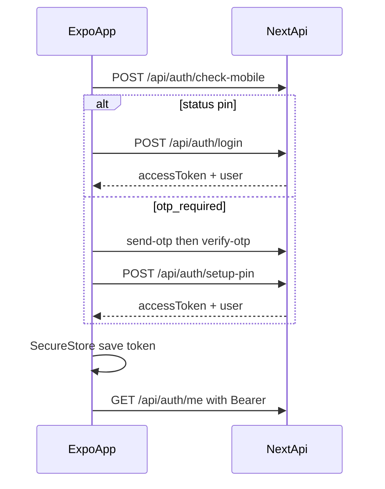

# MLF React Native App (iOS + Android)

## Context

MLF is a **law-firm staff portal**. The website at [`/Users/psmpasu/projects/mlf`](/Users/psmpasu/projects/mlf) already exposes REST APIs and returns `accessToken` from login / setup-pin / forgot-pin reset. Authenticated routes accept `Authorization: Bearer <token>` (or the web cookie).

The existing [`docs/mobile-app-build-prompt.md`](docs/mobile-app-build-prompt.md) describes **Flutter**. This plan replaces that stack with **React Native (Expo)** while keeping the same API contract from [`docs/application-flows.md`](docs/application-flows.md).

**Default stack choice:** Expo (SDK 53+) + TypeScript + Expo Router. One codebase ships Android and iOS; Expo Secure Store / App Config cover tokens and `API_BASE_URL` without ejecting for v1.

```text
Expo RN UI
  → ApiClient (fetch / axios)
       Authorization: Bearer <JWT>
  → Next.js /api/*
       Prisma
  → MongoDB Atlas
```

**Hard rules**

- Never connect the app to MongoDB; never ship `JWT_SECRET`, `DATABASE_URL`, or `CRON_SECRET`.
- Store JWT in **SecureStore**; on **401** clear token → login.
- Gate UI with `user.permissions` (`"module.action"`); API still enforces 403.
- Prefer **polling** notifications; do not rely on SSE.
- Use public **`unitId`** strings (`CLI-00001`, …), never Mongo `_id`.

**Project path:** `/Users/psmpasu/projects/mlf_mobile` (new Expo app; sibling of the website).

---

## Prerequisites (website)

Before phones talk to production:

1. Deploy website with auth responses that include `accessToken` ([`app/api/auth/login`](app/api/auth/login/route.ts), setup-pin, forgot-pin/reset).
2. Env on server: `DATABASE_URL`, `JWT_SECRET`, `TWO_FACTOR_*`, `ADMIN_MOBILE`, `CRON_SECRET`, `ALLOWED_ORIGINS` (web only; native Bearer skips CORS).
3. Note public base URL, e.g. `https://your-mlf-app.vercel.app`.
4. App config: `EXPO_PUBLIC_API_BASE_URL` = that origin (no trailing slash).

**Local API targets**

| Client | Base URL |
|--------|----------|
| Android emulator | `http://10.0.2.2:3000` |
| iOS simulator | `http://localhost:3000` |
| Physical device | `http://<Mac-LAN-IP>:3000` (debug cleartext only) |

---

## Phase 0 — Project shell

1. Create Expo app with TypeScript + Expo Router (`npx create-expo-app`).
2. Core packages: `expo-secure-store`, `expo-router`, Zustand or TanStack Query + light auth store, `zod` (match API envelopes), `date-fns`/`dayjs` + IST-aware date helpers, `expo-image-picker`, `expo-location` (HRMS later).
3. Folder layout:

```text
mlf_mobile/
  app/                 # Expo Router screens
  src/
    core/              # api client, auth storage, errors, theme, env
    features/
      auth/
      home/
      diary/
      clients/
      cases/
      appointments/
      tasks/
      accounts/
      hrms/
      notifications/
      profile/
```

4. **ApiClient** responsibilities:
   - Base URL from `EXPO_PUBLIC_API_BASE_URL`
   - Attach `Authorization: Bearer` + `Content-Type: application/json`
   - Parse `{ ok, data, meta? }` / `{ ok: false, error: { code, message } }`
   - Global 401 → logout

5. Update [`docs/mobile-app-build-prompt.md`](docs/mobile-app-build-prompt.md) to describe React Native/Expo (replace Flutter-specific sections) so it stays the mobile source of truth.

---

## Phase 1 — Auth + app shell

Mirror website auth ([application-flows auth section](docs/application-flows.md)):



Screens: splash → check `/me` → login (mobile → PIN / OTP / setup / forgot PIN) → main tabs.

**Nav (permission-gated):** Home · Day board · Cases · Clients · More (tasks, accounts, HRMS, profile, notifications).

PIN = 6 digits; OTP = 4 digits.

---

## Phase 2 — Field staff core

| Feature | Primary APIs |
|---------|----------------|
| Home | `GET /api/dashboard/summary` |
| Day board | `GET /api/diary?date=YYYY-MM-DD` |
| Clients | `GET/POST /api/clients`, `GET/PATCH /api/clients/[unitId]` |
| Cases | `GET/POST /api/cases`, detail, status/checklist/hearings as needed |
| Appointments | `GET/POST /api/appointments`, availability |
| Notifications | list, unread-count, mark read (poll) |
| Search | `GET /api/search?q=` |

**Defer (desktop-first):** CSV import, permissions matrix editor, bulk exports, employees admin, dak (optional).

---

## Phase 3 — Office + HRMS

- Tasks: `GET/POST /api/tasks`, `PATCH /api/tasks/[unitId]`
- Accounts: cash payments + void if permitted
- HRMS: check-in/out (optional GPS), leave, holidays
- Profile: `GET/PATCH /api/profile`, photo multipart with Bearer

---

## Phase 4 — Polish + store builds

- Pull-to-refresh, empty/error states, offline-friendly messaging
- App icons, splash, Android App Bundle + iOS Archive via EAS Build
- Test on emulator, simulator, and one physical device each OS

---

## Build & run (both platforms)

```bash
# Website API
cd /Users/psmpasu/projects/mlf && npm run dev

# Mobile
cd /Users/psmpasu/projects/mlf_mobile
npx expo start
# Press a = Android emulator, i = iOS simulator
# Or: eas build -p android|ios for store binaries
```

**Release path:** Expo Application Services (EAS) for signed Android AAB and iOS IPA; Apple Developer + Google Play accounts required for store submission.

---

## Website vs mobile responsibilities

| Concern | Website | Mobile (Expo) |
|---------|---------|----------------|
| Database | Prisma + Atlas | Never connects |
| Auth | Issues JWT; cookie web; `accessToken` JSON | SecureStore + Bearer |
| Business rules | Zod + RBAC | UI + show API errors |
| OTP / SMS | 2Factor server-side | Call send/verify only |
| Uploads | `/api/documents`, profile photo | Multipart + Bearer |

No mobile-only API tree for v1. Push (FCM/APNs) is optional later and needs a new register-device endpoint on the website.

---

## Quick test plan

1. Website running with `accessToken` auth.
2. `npx expo start` → Android + iOS.
3. Login with real staff mobile + PIN.
4. Confirm `/api/auth/me`, diary, and cases load with Bearer.
5. Logout clears token; APIs fail until login.
6. User without a permission cannot open that screen (API still returns 403).
