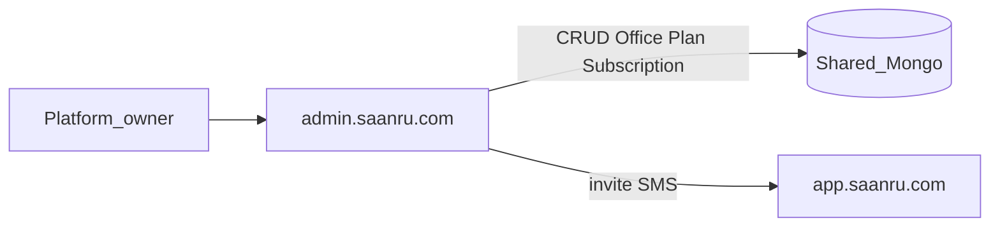

# SAANRU Super Admin — Build Plan

**Website:** `admin.saanru.com`  
**Audience:** Platform owners (create offices, plans, subscriptions, support)  
**Reference:** MLF codebase (read-only — do not retrofit MLF)  
**Sibling docs:** [Office Portal](./02-website-office-portal.md) · [Marketing](./03-website-marketing.md)

---

## Purpose

Super Admin is the **platform control plane** for SAANRU multi-tenant lawyer-office SaaS. It creates and manages law offices, subscription plans, billing, and first office admins.

**Non-goals:** No case/client/diary editing. No MLF domain modules. Office data lives on the Office Portal only.

---

## Stack

| Layer | Choice |
|-------|--------|
| Framework | Next.js App Router · React |
| DB | Prisma 6 · MongoDB Atlas (shared with Office Portal) |
| Auth | Mobile + PIN/OTP (mirror MLF) · JWT httpOnly cookie |
| Validation | Zod |
| UI | Tailwind · shadcn-style components |
| Payments | Razorpay (INR) — admin overrides + sync; checkout on portal |

**Cookie:** `saanru_sa_access` (separate JWT secret from portal)  
**Deploy:** `apps/super-admin` in monorepo · separate Vercel project

**Integration:** See [full product plan](../saanru_docs_split_336dbf47.plan.md) — shared MongoDB, 3-site flow, monorepo layout.

---

## Architecture



```text
apps/super-admin/
  app/
    (auth)/login/
    (portal)/           # authenticated SA shell
      page.tsx          # dashboard KPIs
      offices/
      plans/
      subscriptions/
      invoices/
      platform-users/
      activity/
      profile/
    api/
      auth/
      offices/
      plans/
      subscriptions/
      invoices/
      dashboard/
      activity/
      profile/
  features/
  lib/auth/             # SA session, JWT
  proxy.ts              # page gate → /login
```

---

## Auth

Mirror MLF auth flow:

| Step | API | Notes |
|------|-----|-------|
| Check mobile | `POST /api/auth/check-mobile` | Platform user lookup |
| Login | `POST /api/auth/login` | PIN verify |
| OTP setup | `send-otp` → `verify-otp` → `setup-pin` | First login |
| Forgot PIN | OTP → `forgot-pin/reset` | |
| Session | `GET /api/auth/me` | `PublicPlatformUser` |
| Logout | `POST /api/auth/logout` | Clear cookie |

**Model:** `PlatformUser` (`PADMIN-#####`)  
**Roles:** `platform_owner` | `platform_support`  
**Edge:** `proxy.ts` gates pages; `/api/*` uses `requirePlatformUser`

---

## Screens & routes

| Route | Job |
|-------|-----|
| `/login` | Platform auth |
| `/` | KPIs: total offices, MRR, trials ending, past_due count, recent signups |
| `/offices` | Registry + filters (status, plan, search) |
| `/offices/new` | Create-office wizard |
| `/offices/[unitId]` | Detail tabs (see below) |
| `/plans` | Plan list |
| `/plans/new`, `/plans/[unitId]` | Create/edit plan |
| `/subscriptions` | All subscriptions; filter by status/plan |
| `/invoices` | Platform invoice browser |
| `/platform-users` | Support users (v1.1 ok to defer UI) |
| `/activity` | Platform audit log |
| `/profile` | Self profile |

### Office detail tabs (`/offices/[unitId]`)

| Tab | Contents |
|-----|----------|
| Overview | Name, slug, status, contact, timezone, created |
| Subscription | Current plan, status, period, trial end, change/extend |
| Admins | Office admin users + invite |
| Modules | Entitlements from plan; SA can **disable only** (not enable beyond plan) |
| Usage | Seats, SMS sent, storage bytes this month |
| Activity | Platform audit for this office |
| Danger | Suspend, reactivate, force-reset admin PIN, close (soft), mark complimentary |

---

## Create-office wizard

**Route:** `/offices/new`

| Step | Fields |
|------|--------|
| 1. Profile | name, slug (unique), phone, email, address, state, timezone (IST default) |
| 2. Branding | display name, optional logo URL/key (Enterprise full branding on portal) |
| 3. Plan | Starter / Professional / Enterprise + billing cycle + start 14-day trial yes/no |
| 4. Modules | Pre-checked from plan; SA may only **disable** further |
| 5. First admin | name, mobile, role `admin` |
| 6. Review | Summary → create |

**On submit (atomic transaction):**

1. `Office` (`OFF-#####`) status `active` or `draft`
2. `Subscription` (`SUB-#####`) status `trialing` or `active`
3. `User` + `OfficeMembership` for first admin
4. Seed `RolePermission` from MLF defaults per office
5. Seed `IdCounter` rows unique `(officeId, entity)`
6. `PlatformAuditLog` entry
7. SMS invite to `app.saanru.com` for admin mobile

---

## Platform data models

| Model | ID prefix | Key fields |
|-------|-----------|------------|
| `PlatformUser` | `PADMIN` | mobile, pinHash, roles, isActive |
| `Office` | `OFF` | name, slug, status (`draft\|active\|suspended\|closed`), branding, moduleOverrides[], timezone |
| `OfficeMembership` | — | userId, officeId, roles[] (multi-office mobile) |
| `Plan` | `PLN` | code, name, monthly/yearly paise, seatLimit, smsLimit, storageBytes, moduleEntitlements[], trialDays, isActive |
| `Subscription` | `SUB` | officeId, planId, status, billingCycle, currentPeriodStart/End, trialEndsAt, razorpayCustomerId, razorpaySubscriptionId |
| `Invoice` | `INV` | officeId, subscriptionId, amount, tax, status, razorpayPaymentId, pdfKey, paidAt |
| `UsageCounter` | — | officeId, month, smsSent, storageBytes, activeSeats |
| `WebhookEvent` | — | razorpayEventId (idempotent) |
| `PlatformAuditLog` | — | actor, action, entityType, entityUnitId, meta |
| `PlatformIdCounter` | — | entity → seq |

Office domain models (`Client`, `Case`, …) are **not** edited here — only provisioned empty via wizard seed.

---

## Plan catalog (seed defaults)

| Plan | Code | Monthly | Yearly | Seats | SMS/mo | Storage |
|------|------|---------|--------|-------|--------|---------|
| Starter | `starter` | ₹1,999 | ₹19,990 | 5 | 200 | 2 GB |
| Professional | `professional` | ₹4,999 | ₹49,990 | 25 | 1,000 | 20 GB |
| Enterprise | `enterprise` | ₹9,999 | ₹99,990 | 100 | 5,000 | 100 GB |

### Module entitlements

| Module | Starter | Professional | Enterprise |
|--------|---------|--------------|------------|
| dashboard, clients, cases, diary, appointments, availability, tasks, employees, permissions, activity, notifications | yes | yes | yes |
| court roster, client portal | yes | yes | yes |
| reports | basic | full | full |
| accounts, expenses, dak, documents, CSV imports | no | yes | yes |
| hrms, hearing SMS cron | no | no | yes |
| custom branding | logo | logo+color | full |

**Effective modules** = plan entitlements ∩ Super Admin office toggles (disable-only).

### Subscription states

`trialing` → `active` → `past_due` (7-day grace) → `suspended` (login block) → `cancelled` / `expired`

Portal usable when office `active` **and** subscription in `trialing` | `active` | `past_due`.

---

## Super Admin APIs

| Area | Endpoints |
|------|-----------|
| Auth | `/api/auth/*` (check-mobile, login, OTP, setup-pin, forgot-pin, me, logout) |
| Offices | `GET/POST /api/offices`, `GET/PATCH /api/offices/[unitId]`, activate, suspend, reactivate, close |
| Admins | `GET/POST /api/offices/[unitId]/admins`, deactivate |
| Plans | `GET/POST /api/plans`, `GET/PATCH /api/plans/[unitId]` |
| Subscriptions | `GET /api/subscriptions`, `PATCH /api/subscriptions/[unitId]`, extend trial, force-change plan |
| Invoices | `GET /api/invoices`, `GET /api/invoices/[unitId]` |
| Dashboard | `GET /api/dashboard/summary` |
| Activity | `GET /api/activity` |
| Profile | `GET/PATCH /api/profile` |
| Razorpay admin | Record offline payment, sync subscription status |

Every mutation → `PlatformAuditLog`.

---

## Danger zone actions

| Action | Effect |
|--------|--------|
| Suspend office | `Office.status = suspended`; portal login blocked |
| Reactivate | Restore `active` if subscription allows |
| Force-reset admin PIN | Clear PIN; next login OTP setup |
| Close (soft) | `closed`; no new logins; data retained |
| Mark complimentary | Subscription active without Razorpay |

---

## Billing (Super Admin side)

Super Admin does **not** run Razorpay checkout UI for offices (that is on portal `/billing`). SA can:

- Assign plan on create
- Extend trial
- Force-change plan (comp / enterprise deal)
- Record offline payment
- View all invoices and subscription status

See [Office Portal billing section](./02-website-office-portal.md#billing-office-portal) for Razorpay checkout + webhooks.

---

## Security

- Separate JWT secret and cookie from Office Portal — portal APIs reject SA cookie (401)
- Platform queries never use `officeId` scoping on domain data (SA doesn't read cases)
- Rate-limit auth; PIN lockout
- Webhook events idempotent via `WebhookEvent`

---

## UI patterns

Reuse MLF patterns: AppShell, PageHeader, DataToolbar, Table, PaginationBar, EmptyState, dialogs, toasts.  
Brand: **SAANRU** (not office name). Office Portal shows office branding.

---

## Implementation phases (this app)

| Phase | Deliverable |
|-------|-------------|
| 0 | Monorepo scaffold, shared Prisma with platform models |
| 1 | SA auth, dashboard KPIs |
| 2 | Offices wizard + detail tabs |
| 3 | Plans CRUD + subscriptions list |
| 4 | Invoices browser, activity, danger zone |
| 5 | Platform-users, polish, seed platform owner + 3 plans |

---

## Test checklist

- Platform owner login → cookie set → dashboard loads
- Create office wizard → OFF + SUB + admin + seeded perms + IdCounters
- Suspend office → portal login blocked with clear message
- Extend trial → subscription dates updated
- Force-change plan → portal modules update on next request
- SA cookie rejected on `app.saanru.com` APIs
- Complimentary override → portal active without Razorpay payment

---

## Env (Super Admin deploy)

```text
DATABASE_URL=
JWT_SECRET_SA=
RAZORPAY_KEY_ID=          # read-only sync if needed
RAZORPAY_KEY_SECRET=
TWO_FACTOR_API_KEY=       # OTP SMS
NEXT_PUBLIC_SA_BRAND=SAANRU
```
