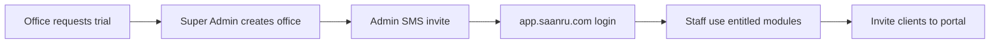

# SAANRU Marketing — Build Plan

**Website:** `saanru.com`  
**Audience:** Prospective law offices (public visitors)  
**Reference:** MLF feature set (for accurate product copy)  
**Sibling docs:** [Super Admin](./01-website-super-admin.md) · [Office Portal](./02-website-office-portal.md)

---

## Purpose

Public marketing site that explains SAANRU, lists features and pricing, and drives **trial / contact** requests. No staff login, no case data, no Razorpay checkout on this domain.

**Checkout lives on Office Portal** (`app.saanru.com/billing`) after an office is provisioned by Super Admin.

---

## Stack

| Layer | Choice |
|-------|--------|
| Framework | Next.js App Router · React |
| Styling | Tailwind · shadcn-style components |
| Content | Static/markdown pages; pricing from seed constants |
| Deploy | `apps/marketing` in monorepo · `saanru.com` Vercel project |

**No** JWT session · **No** Prisma in v1 (optional contact form → email/API later)

**Integration:** See [full product plan](../saanru_docs_split_336dbf47.plan.md) — marketing → Super Admin onboarding → Office Portal. Checkout stays on portal `/billing`, not marketing.

---

## Architecture

```text
apps/marketing/
  app/
    page.tsx              # home
    features/page.tsx
    pricing/page.tsx
    how-it-works/page.tsx
    security/page.tsx
    contact/page.tsx
    legal/[slug]/page.tsx
  components/
    hero.tsx
    feature-grid.tsx
    pricing-table.tsx
    cta-banner.tsx
    site-header.tsx
    site-footer.tsx
  config/
    pricing.ts            # plan catalog (mirror SA seed)
    features.ts           # feature list for copy
    legal.ts              # SAANRU legal pages
```

---

## Pages

| Route | Job |
|-------|-----|
| `/` | Hero, value prop, feature highlights, pricing teaser, CTA |
| `/features` | Full module list mapped to MLF parity (see below) |
| `/pricing` | Starter / Professional / Enterprise comparison + CTA |
| `/how-it-works` | Onboard → staff login → invite clients flow |
| `/security` | Tenancy, isolation, data handling (high-level) |
| `/contact` | Lead form: name, firm, mobile, email, message |
| `/legal/terms` | Terms of use (SAANRU product) |
| `/legal/privacy` | Privacy policy |
| `/legal/consultation-policy` | Optional — product consultation policy for offices using SAANRU |

---

## Feature copy (must match Office Portal)

Marketing must **not under-sell** the product. List all modules from [Office Portal plan](./02-website-office-portal.md):

### Core (all plans)

- Client register + CSV import
- Case board + hearings + filing checklist
- Day board (diary)
- Appointments + advocate availability
- Court roster (permanent courts + duty overrides)
- Work allotment (tasks)
- Employees + RBAC permissions matrix
- Activity audit log
- In-app notifications
- Global search (⌘K)
- **Client portal** (invite-only: own cases, book appointments, upload documents)

### Professional+

- Cash accounts ledger
- Office expenses + bill attachments
- Postal (dak) register
- Document vault (case/client/expense uploads)
- CSV bulk import (8 modules)
- Full reports / exports

### Enterprise

- HRMS (attendance, leave, holidays)
- Hearing SMS reminders (cron + diary send)
- Custom branding (logo + colors)
- Priority support flag

---

## Pricing table (inlined)

| Plan | Monthly | Yearly | Seats | SMS/mo | Storage | Best for |
|------|---------|--------|-------|--------|---------|----------|
| **Starter** | ₹1,999 | ₹19,990 | 5 | 200 | 2 GB | Solo / small chamber |
| **Professional** | ₹4,999 | ₹49,990 | 25 | 1,000 | 20 GB | Growing firm with accounts |
| **Enterprise** | ₹9,999 | ₹99,990 | 100 | 5,000 | 100 GB | Full ops + HRMS + SMS |

Yearly ≈ 2 months free. 14-day trial on first activate (configured by Super Admin).

### Plan comparison matrix (for `/pricing`)

| Feature | Starter | Professional | Enterprise |
|---------|---------|--------------|------------|
| Clients, cases, diary | ✓ | ✓ | ✓ |
| Appointments, availability | ✓ | ✓ | ✓ |
| Court roster | ✓ | ✓ | ✓ |
| Client portal | ✓ | ✓ | ✓ |
| Tasks, employees, permissions | ✓ | ✓ | ✓ |
| Basic reports | ✓ | — | — |
| Accounts, expenses, dak | — | ✓ | — |
| Documents + CSV import | — | ✓ | — |
| Full reports | — | ✓ | ✓ |
| HRMS | — | — | ✓ |
| Hearing SMS | — | — | ✓ |
| Custom branding | logo | logo+color | full |

---

## CTAs

| CTA | Target (v1) |
|-----|-------------|
| "Start free trial" | `/contact` form (sales/onboarding — SA creates office) |
| "Talk to us" | `/contact` or `tel:` / WhatsApp link |
| "Login" (header) | `https://app.saanru.com/login` |
| "Platform admin" (footer, small) | `https://admin.saanru.com/login` |

**v1 locked:** No public self-serve office creation on marketing. Super Admin provisions office + trial → admin gets SMS invite to portal.

---

## How it works (page content)



1. Law office contacts SAANRU or is onboarded by platform team
2. Super Admin creates office + 14-day trial + first admin
3. Admin sets PIN on Office Portal
4. Staff added (within seat limit); modules gated by plan
5. Clients invited to portal for own cases / appointments / documents
6. Admin upgrades at `/billing` when ready

---

## Security page (high-level)

- **Multi-tenant isolation:** every row scoped by `officeId`; cross-office access returns 404
- **Separate apps:** Super Admin, Office Portal, Marketing — separate cookies/JWT secrets
- **Auth:** Mobile + PIN + OTP; role-based permissions per office
- **Files:** Stored under `offices/{OFF}/…` with plan storage quotas
- **Payments:** Razorpay on Office Portal only; no card data on marketing site
- **Audit:** Activity log for staff actions

Link to technical detail in Office Portal doc for engineers evaluating the product.

---

## Legal pages

Adapt structure from MLF [`config/company/legal.ts`](../../config/company/legal.ts) for **SAANRU the product** (not a single law firm):

- Terms of use — SaaS terms, acceptable use, limitation of liability
- Privacy — data collected (office + client data processed on behalf of offices), storage, subprocessors (MongoDB Atlas, Razorpay, SMS provider)
- Consultation policy — optional; explains SAANRU is software, not legal advice

Each page: slug, title, `updatedAt`, intro, sections[].

---

## Contact form

**Fields:** name, firm name, mobile, email, city, message, plan interest (dropdown)

**v1 handling:** POST to `/api/contact` → email to sales OR store in `Lead` collection (optional v1.1)

**Validation:** Zod; rate-limit by IP

---

## Non-goals

- Staff or client login on `saanru.com`
- Case/client data display
- Razorpay checkout on marketing domain
- Blog/docs KB (v1.1)
- Custom domains per office
- Live demo sandbox (v1.1)

---

## UI / brand

- SAANRU brand (not office-specific)
- Professional legal-tech aesthetic; accessible contrast
- Mobile-responsive; fast LCP (static where possible)
- Header: Logo · Features · Pricing · How it works · Contact · Login (→ portal)
- Footer: Legal links · Contact · © SAANRU

Reuse shadcn primitives from shared `packages/ui` if monorepo shares UI.

---

## SEO

- Title/description per page
- Open Graph images
- `sitemap.xml`, `robots.txt`
- Structured data for SoftwareApplication on home/pricing

---

## Implementation phases (this app)

| Phase | Deliverable |
|-------|-------------|
| 1 | Home + header/footer + legal pages |
| 2 | Features + pricing pages |
| 3 | How-it-works + security |
| 4 | Contact form + analytics |
| 5 | SEO polish, deploy `saanru.com` |

Can ship after Super Admin + Portal MVP; marketing does not block product launch.

---

## Test checklist

- All pages load without auth
- Pricing numbers match Super Admin seed plans
- Feature list includes court roster, expenses, client portal, HRMS
- Login links go to `app.saanru.com/login`
- Contact form validates and submits
- Legal pages render all slugs
- No portal cookies set on marketing domain
