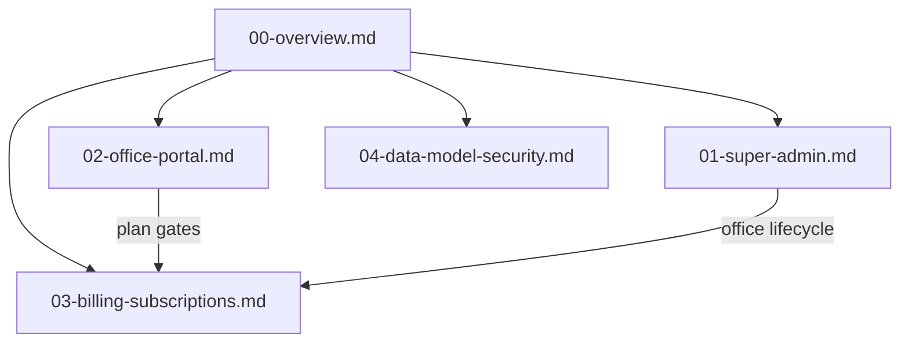

# SAANRU Plan Docs — Split and Complete

## Goal

Replace the single dense file [`docs/multi-office_saas_plan_3be4eead.plan.md`](docs/multi-office_saas_plan_3be4eead.plan.md) with a **docs pack** under `docs/saanru/`, so each surface is readable on its own, and every MLF feature/flow that SAANRU must copy is listed with routes, APIs, perms, and plan gates.

**Assumption locked:** “Office website” = **Office Portal** (`app.saanru.com`) for **staff + client** roles (same domain; client = limited invite-only portal). No separate third client domain in v1.

---

## New file layout

| File | Audience | Contents |
|------|----------|----------|
| [`docs/saanru/00-overview.md`](docs/saanru/00-overview.md) | Everyone | Product name, two apps, locked decisions, repo layout, phase roadmap, test checklist, links to other docs |
| [`docs/saanru/01-super-admin.md`](docs/saanru/01-super-admin.md) | Platform owners | Full Super Admin routes, wizard, APIs, danger actions, what SA **must not** do (no case/client edits) |
| [`docs/saanru/02-office-portal.md`](docs/saanru/02-office-portal.md) | Office staff product | **Complete** MLF feature/flow parity — one section per module with route → API → model → perms → plan gate |
| [`docs/saanru/03-billing-subscriptions.md`](docs/saanru/03-billing-subscriptions.md) | Billing | Plans, prices, entitlements matrix, Razorpay flows, usage quotas, Portal `/billing` + SA overrides |
| [`docs/saanru/04-data-model-security.md`](docs/saanru/04-data-model-security.md) | Engineers | Prisma models, `officeId` rules, ID prefixes, auth cookies, isolation, env |

**Old plan file:** Keep [`docs/multi-office_saas_plan_3be4eead.plan.md`](docs/multi-office_saas_plan_3be4eead.plan.md) as a short **redirect stub** pointing at `docs/saanru/` (so existing links don’t die).

Reference MLF (read-only) stays: [`docs/website-guide.md`](docs/website-guide.md), [`docs/application-flows.md`](docs/application-flows.md), [`config/company/nav.ts`](config/company/nav.ts).

---

## Gaps to close (MLF live vs current SAANRU plan)

Verified against portal nav + website guide — these are **in MLF today** but **missing or thin** in the current plan:

| Gap | MLF today | Action in new docs |
|-----|-----------|--------------------|
| **Court roster** | `/court-roster`, `CourtDutyOverride`, permanent `User.defaultCourts` | Add as portal module D (Schedule); Starter+; perms via `employees.view` / edit as in MLF |
| **Courts / locations pickers** | `/api/courts`, `/api/locations`, cascade UI | Document as shared platform seed data (not per-office tables) |
| **Legal pages** | `/legal/terms`, privacy, consultation-policy | Portal public allowlist + SAANRU-branded copy |
| **Designations** | `config/company/designations.ts` | Per-office configurable titles (seed defaults) |
| **Office files** | `/api/office-files/[slug]` private PDFs | Optional Enterprise branding/docs; or defer to v1.1 — **include as Professional+ office docs slot** only if simple; else list under Out of scope with note |
| **Nav completeness** | Schedule includes Court roster | Update portal nav table |
| **Flow depth** | `website-guide.md` style steps | Portal doc uses same “purpose → IDs → path → steps” pattern per feature |

Also fold in existing plan strengths unchanged: tenancy, Razorpay plans, Super Admin wizard, billing gates, phases 0–6.

---

## Doc content outline (what each file will contain)

### `00-overview.md`
- SAANRU vs MLF (reference only; new monorepo)
- Surfaces table: `admin.saanru.com` / `app.saanru.com` / marketing later
- Architecture diagram (owner → SA → DB; office → portal → Razorpay)
- Locked decisions table
- Phase roadmap (0–6) + link to test checklist
- Index of sibling docs

### `01-super-admin.md`
- Auth (mobile/PIN/OTP), cookie `saanru_sa_access`
- Full screen map (`/`, `/offices`, wizard, `/plans`, `/subscriptions`, `/invoices`, …)
- Create-office wizard steps (profile → branding → plan → modules → first admin → review)
- Danger zone: suspend / close / complimentary / force-reset PIN
- API catalog
- Explicit non-goals: no cases, clients, diary, etc.

### `02-office-portal.md` (largest — full feature inventory)
Mirror MLF modules with SAANRU gates. Sections:

1. Auth + office picker  
2. RBAC / modules / UpgradePrompt  
3. **Client portal** (invite-only `client` role on same app — own cases/hearings RO, book office/call, upload docs; Starter+)  
4. Home dashboard  
5. Clients (+ Invite to portal)  
6. Cases + hearings + checklist  
7. Appointments + availability + convert-case  
8. **Court roster** (new vs old plan)  
9. Diary  
10. Accounts / Expenses / Documents  
11. Tasks / Dak / HRMS  
12. Employees / Permissions  
13. Notifications / Search / Reports / Activity / Profile  
14. Billing UI (summary + link to billing doc)  
15. Cron hearing SMS  
16. CSV imports  
17. Shared pickers: courts, locations  
18. Public legal pages  
19. Final nav (with Court roster under Schedule; plan asterisks; client nav subset)

Each section: route(s), APIs, unitId prefixes, permissions, plan entitlement, happy-path steps (from MLF website-guide).

### `03-billing-subscriptions.md`
- Plan catalog + module matrix (update matrix to include court-roster on all plans)
- Subscription states + Office.status interaction  
- Razorpay sequence + webhook idempotency  
- Usage: seats / SMS / storage  
- Portal + Super Admin billing APIs  

### `04-data-model-security.md`
- Platform models + office-scoped domain models (incl. `CourtDutyOverride`)  
- ID rules, indexes `(officeId, …)`  
- JWT claims (`sub`, `oid`), cookie names  
- Isolation / 404 cross-office  
- Env / seed  

---

## Implementation approach (docs only)

1. Create `docs/saanru/` and write the five markdown files above (content migrated + expanded from the current plan + MLF parity gaps).  
2. Turn the old plan file into a stub that links to `docs/saanru/00-overview.md`.  
3. No code/schema changes in this pass — documentation/planning only.

---

## Success criteria

- Someone can build **Super Admin** from `01` alone.  
- Someone can build **Office Portal** from `02` alone and not miss court roster or any nav item in [`config/company/nav.ts`](config/company/nav.ts).  
- Billing and tenancy rules live in one place each (`03`, `04`).  
- Overview stays short; deep detail is in the split docs.