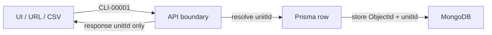

# Schema & API Reference (ID-first)

Lookup guide for **IDs**, **models**, and **APIs**. For how pages and flows use these, see [website-guide.md](./website-guide.md).

**Stack:** Next.js · Prisma 6 · MongoDB Atlas · JWT · 2Factor SMS  
**Schema source:** [`prisma/schema.prisma`](../prisma/schema.prisma) · **Prefixes:** [`config/company/ids.ts`](../config/company/ids.ts)

---

## Golden ID rules

1. **Never** put Mongo `_id` / `*Id` ObjectIds in URLs, forms, CSV, JWT (new tokens), or public API JSON.
2. **Always** resolve `unitId` → row at the API boundary, then use ObjectId for writes/joins.
3. **Dual FK:** if schema has `xId` + `xUnitId`, write/clear **both** together (never one alone).
4. **Soft links** (Dak/Task `caseUnitId` only) are filter/display hints — not DB integrity; validate on write.
5. **Court ≠ office:** `CSE` = office case register; `caseNumber` / `filingNumber` / `cnr` = court/eCourts.
6. **Auth identity:** login = `mobile`; session JWT `sub` = employee `unitId` (`EMP-#####`).



There is **no** field named `registerId`. “Case register” / office case id = `Case.unitId` (`CSE-#####`).

---

## ID glossary

### Public office IDs (`unitId`)

Generated by `nextUnitId()` via `IdCounter`. Format: `{PREFIX}-{#####}` (5-digit pad).

| People say | Field | Prefix / example | Entity |
|------------|-------|------------------|--------|
| User / employee id | `User.unitId` | `EMP-00001` | Staff login user |
| Client id | `Client.unitId` | `CLI-00001` | Client |
| Case / register id | `Case.unitId` | `CSE-00001` | Office case register |
| Hearing id | `Hearing.unitId` | `HRG-00001` | Hearing |
| Appointment id | `Appointment.unitId` | `APT-00001` | Booking |
| Payment id | `CashPayment.unitId` | `PAY-00001` | Cash ledger |
| Expense id | `OfficeExpense.unitId` | `EXP-00001` | Office expense |
| Document id | `Document.unitId` | `DOC-00001` | Uploaded file |
| Task id | `OfficeTask.unitId` | `TSK-00001` | Office task |
| Dak id | `DakEntry.unitId` | `DAK-00001` | Postal register |
| Leave id | `LeaveRequest.unitId` | `LVE-00001` | Leave |
| Attendance id | `Attendance.unitId` | `ATT-00001` | Attendance day |
| Weekly hours id | `AdvocateWeeklyHours.unitId` | `AWH-00001` | Advocate hours |
| Time block id | `AdvocateTimeBlock.unitId` | `ATB-00001` | Unavailability block |
| Holiday id | `OfficeHoliday.unitId` | `HOL-00001` | Office holiday |
| Notification id | `Notification.unitId` | `NTF-00001` | Inbox item |

### Court / external (not `unitId`)

| Label | Field | Notes |
|-------|-------|-------|
| Court case number | `Case.caseNumber` | Court-allotted number |
| Filing number | `Case.filingNumber` | Pre-registration filing no. |
| CNR | `Case.cnr` | eCourts 16-char |
| Case year | `Case.caseYear` | Year, not an id |
| FIR number | `Case.firNumber` | Police FIR |
| Login mobile | `User.mobile` / `Client.mobile` | Stored as `91…` |
| OTP session | `OtpSession.sessionId` | 2Factor AUTOGEN3 `Details` |
| OTP proof | `ConsumedOtpProof.jti` | One-time JWT id |
| Dak tracking | `DakEntry.trackingNo` | Courier/post tracking |
| File storage key | `Document.fileKey`, `User.photoKey` | Local path under `uploads/` |

### Dual FK vs soft link

| Feature | Link style | Fields |
|---------|------------|--------|
| Case → Client | Dual | `clientId` + `clientUnitId` |
| Hearing → Case | Dual | `caseId` + `caseUnitId` |
| Payment → Client / Case | Dual | both pairs (case optional) |
| Document → Case / Client / Expense | Dual | optional pairs |
| Expense → Bill document | Dual | `billDocumentId` + `billDocumentUnitId` |
| Task → Assignee | Dual | `assigneeId` + `assigneeUnitId` |
| Appointment → Client / Case | Dual | both pairs (optional) |
| HRMS / Notification → User | Dual | `userId` + `userUnitId` |
| Task → Case | Soft | `caseUnitId` only |
| Dak → Case / Client | Soft | `caseUnitId` / `clientUnitId` only |

**Actor fields** (`createdById`, `voidedById`, `uploadedById`, `approvedById`) are ObjectId-only and **server-side**. Public JSON uses `{ unitId, name }` actors or audit `actorUnitId` — never raw ObjectIds.

---

## Models (22)

### Auth / access / ops

| Model | Public id | Key fields | Notes |
|-------|-----------|------------|-------|
| `User` | `EMP` | `mobile`, `roles[]`, `pinHash`, `isActive`, profile | Login + employees |
| `OtpSession` | — | `mobile`, `sessionId`, `purpose`, `expiresAt` | 2Factor OTP |
| `ConsumedOtpProof` | — | `jti`, `mobile`, `purpose` | Replay guard |
| `RolePermission` | — | `role`, `module`, `action`, `allowed` | RBAC matrix |
| `AuditLog` | — | `actorUnitId`, `entity`, `entityUnitId`, `action` | Uses public ids |
| `IdCounter` | — | `entity`, `seq` | `unitId` sequences |
| `RateLimit` | — | `key`, `count`, `resetAt` | Throttle |

### Practice

| Model | Public id | Key fields | Relations |
|-------|-----------|------------|-----------|
| `Client` | `CLI` | name, mobiles, address, `smsConsent`, `matterBrief` | ← Case, Payment, Doc, Appt, Dak |
| `Case` | `CSE` | court fields, `status`, advocates, fees, checklist | → Client (dual); ← Hearing, … |
| `Hearing` | `HRG` | `hearingDate`, purpose, adjourn, `smsSentAt` | → Case (dual) |
| `Document` | `DOC` | `docType`, `fileKey`, mime/size | → Case/Client/Expense (optional dual) |
| `Appointment` | `APT` | `scheduledAt`, `advocateMobile`, `status` | → Client/Case (optional dual) |

### Money

| Model | Public id | Key fields | Relations |
|-------|-----------|------------|-----------|
| `CashPayment` | `PAY` | `type`, `amount`, `status`, void fields | → Client (required dual), Case (optional) |
| `OfficeExpense` | `EXP` | `expenseDate`, `category`, `amount`, `paymentMode`, void | ↔ Document bill (optional dual) |

### Office / HRMS / calendar

| Model | Public id | Key fields | Relations |
|-------|-----------|------------|-----------|
| `DakEntry` | `DAK` | `direction` in\|out, subject, `trackingNo` | Soft `caseUnitId` / `clientUnitId` |
| `OfficeTask` | `TSK` | `kind`, `status`, `workDate`, `finishNote` | Dual assignee; soft `caseUnitId` |
| `OfficeHoliday` | `HOL` | `fromDate`/`toDate` (IST YYYY-MM-DD), title | — |
| `Notification` | `NTF` | `type`, title, body, `href`, `readAt` | → User (dual) |
| `Attendance` | `ATT` | `date` IST, check-in/out + geo | → User (dual); unique per user+date |
| `LeaveRequest` | `LVE` | date range strings, `status` | → User (dual); `approvedById` ObjectId |
| `AdvocateWeeklyHours` | `AWH` | weekday 0–6, `startTime`/`endTime` | → User (dual) |
| `AdvocateTimeBlock` | `ATB` | `startsAt`/`endsAt`, `kind` | → User (dual) |

### Enums / statuses

| Enum | Values |
|------|--------|
| `UserRole` | `admin`, `sub_admin`, `staff`, `advocate`, `accountant` |
| `OtpPurpose` | `setup`, `forgot_pin` |
| `CaseStatus` | pipeline: `enquiry` → `engaged` → `pre_filing` → `under_filing` ↔ `filing_defect` → `active` → `reserved` → `disposed` → `archived`; exits: `withdrawn`, `transferred`. Legacy reads: `pending`, `listed` |
| `PaymentType` | `advance`, `partial`, `full`, `consultation`, `court_fee`, `stamp`, `copying`, `travel`, `clerkage`, `other` |
| `PaymentStatus` | `pending`, `paid`, `void` |
| `AppointmentStatus` | `scheduled`, `completed`, `cancelled` |
| `LeaveStatus` | `pending`, `approved`, `rejected`, `cancelled` |
| `DocumentType` | `judgment`, `order`, `pleading`, `vakalatnama`, `petition`, `affidavit`, `evidence`, `id_proof`, `receipt`, `other` |
| `OfficeExpenseCategory` | `stationery`, `utilities`, `maintenance`, `travel`, `refreshments`, `equipment`, `professional_services`, `misc`, `others` |
| `ExpensePaymentMode` | `cash`, `upi`, `card`, `bank`, `other` |

Soft string enums (Prisma `String`): Task `kind` / `status`; Dak `direction`; Appointment `mode`; Advocate block `kind`; Notification `type`.

Case transitions: [`config/company/case-pipeline.ts`](../config/company/case-pipeline.ts).

---

## Relationship sketch

```text
User ──┬── Attendance / LeaveRequest / Notification
       ├── AdvocateWeeklyHours / AdvocateTimeBlock
       └── createdBy / assignee / voidedBy / uploadedBy (ObjectId server-side)

Client ──┬── Case ──┬── Hearing
         │          ├── CashPayment / Document / Appointment
         │          └── Dak / OfficeTask (soft unitId)
         └── CashPayment / Document / Appointment / Dak

OfficeExpense ↔ Document (bill DOC)
```

No Prisma `@relation` blocks — links are manual ObjectId + `unitId` pairs.

---

## API catalog

Response envelope: `{ ok: true, data }` or list `{ ok: true, data, meta }` · error `{ ok: false, error: { code, message } }`.

Path params are always **`[unitId]`** (public), never Mongo `_id`.

### Auth

| Methods | Path | Purpose |
|---------|------|---------|
| POST | `/api/auth/check-mobile` | Next step: PIN vs OTP setup |
| POST | `/api/auth/login` | Verify PIN → set cookie |
| POST | `/api/auth/send-otp` | OTP (`setup` \| `forgot_pin`) |
| POST | `/api/auth/verify-otp` | → `otpProofToken` |
| POST | `/api/auth/setup-pin` | Set PIN (may create user) |
| POST | `/api/auth/forgot-pin/reset` | Reset PIN after proof |
| GET | `/api/auth/me` | Current user |
| POST | `/api/auth/logout` | Clear cookies |
| GET, POST | `/api/auth/session-expired` | Clear → `/login` |

### Clients / cases / hearings

| Methods | Path | Purpose |
|---------|------|---------|
| GET, POST | `/api/clients` | List / create (`CLI`) |
| GET, PATCH | `/api/clients/[unitId]` | Get / update |
| POST | `/api/clients/import` | CSV |
| GET, POST | `/api/cases` | List / create (`CSE`) |
| GET, PATCH | `/api/cases/[unitId]` | Get / update |
| PATCH | `/api/cases/[unitId]/status` | Status transition |
| PATCH | `/api/cases/[unitId]/checklist` | Filing checklist |
| POST | `/api/cases/[unitId]/hearings` | Add hearing (`HRG`) |
| POST | `/api/cases/import` | CSV |
| POST | `/api/hearings/[unitId]/adjourn` | Adjourn → new hearing |
| POST | `/api/hearings/import` | Hearings CSV |

### Appointments / availability / advocates

| Methods | Path | Purpose |
|---------|------|---------|
| GET, POST | `/api/appointments` | List / book (`APT`) |
| GET, PATCH | `/api/appointments/[unitId]` | Get / update |
| POST | `/api/appointments/[unitId]/convert-case` | Convert → enquiry case |
| GET | `/api/appointments/availability` | Day slots |
| POST | `/api/appointments/import` | CSV |
| GET | `/api/advocates` | Advocate picker |
| GET, PUT | `/api/advocates/availability/hours` | Weekly hours (`AWH`) |
| GET, POST | `/api/advocates/availability/blocks` | Time blocks (`ATB`) |
| PATCH, DELETE | `/api/advocates/availability/blocks/[unitId]` | Edit / delete block |

### Accounts / expenses / documents

| Methods | Path | Purpose |
|---------|------|---------|
| GET, POST | `/api/accounts` | Payments list / create (`PAY`) |
| GET, PATCH | `/api/accounts/[unitId]` | Get / update |
| POST | `/api/accounts/[unitId]/void` | Void payment |
| POST | `/api/accounts/import` | CSV |
| GET, POST | `/api/expenses` | Expenses list / create (`EXP`) |
| GET, PATCH | `/api/expenses/[unitId]` | Get / update (+ bill upload) |
| POST | `/api/expenses/[unitId]/void` | Void expense |
| GET, POST | `/api/documents` | List / upload (`DOC`) |
| DELETE | `/api/documents/[unitId]` | Delete |
| GET | `/api/documents/[unitId]/download` | Download file |

### Employees / profile

| Methods | Path | Purpose |
|---------|------|---------|
| GET, POST | `/api/employees` | List / create (`EMP`) |
| GET, PATCH | `/api/employees/[unitId]` | Get / update |
| POST | `/api/employees/[unitId]/deactivate` | Deactivate |
| POST | `/api/employees/[unitId]/reactivate` | Reactivate |
| POST | `/api/employees/[unitId]/force-reset-pin` | Admin PIN reset |
| POST | `/api/employees/import` | CSV |
| GET | `/api/users/[unitId]/photo` | Profile photo |
| GET, PATCH | `/api/profile` | Own profile |
| POST, DELETE | `/api/profile/photo` | Upload / remove photo |

### Tasks / dak / diary / HRMS

| Methods | Path | Purpose |
|---------|------|---------|
| GET, POST | `/api/tasks` | List / create (`TSK`) |
| PATCH | `/api/tasks/[unitId]` | Update |
| POST | `/api/tasks/import` | CSV |
| GET, POST | `/api/dak` | List / create (`DAK`) |
| PATCH, DELETE | `/api/dak/[unitId]` | Update / delete |
| POST | `/api/dak/import` | CSV |
| GET | `/api/diary` | Day board aggregate |
| GET | `/api/diary/tomorrow-notify` | In-app notify tomorrow |
| POST | `/api/diary/send-hearing-sms` | Manual hearing SMS |
| GET, POST | `/api/hrms/attendance` | Attendance list |
| POST | `/api/hrms/attendance/check-in` | Check-in |
| POST | `/api/hrms/attendance/check-out` | Check-out |
| GET, POST | `/api/hrms/leave` | Leave list / request |
| POST | `/api/hrms/leave/[unitId]/decide` | Approve / reject |
| POST | `/api/hrms/leave/[unitId]/cancel` | Cancel |
| GET, POST | `/api/hrms/holidays` | Office holidays |
| PATCH, DELETE | `/api/hrms/holidays/[unitId]` | Edit / delete |
| GET | `/api/hrms/presence` | Who’s in |

### Notifications / search / reports / misc

| Methods | Path | Purpose |
|---------|------|---------|
| GET | `/api/notifications` | Inbox |
| GET | `/api/notifications/unread-count` | Badge |
| GET | `/api/notifications/stream` | SSE (opt-in) |
| PATCH | `/api/notifications/[unitId]/read` | Mark read |
| POST | `/api/notifications/read-all` | Mark all read |
| GET | `/api/dashboard/summary` | Home widgets |
| GET | `/api/search` | Global ⌘K |
| GET | `/api/activity` | Audit log |
| GET | `/api/exports` | Excel (`type=` …) |
| GET, PUT | `/api/permissions/matrix` | Load / save matrix |
| POST | `/api/permissions/preview` | Preview effective perms |
| GET | `/api/courts` | Court catalog |
| GET | `/api/courts/meta` | Court meta |
| GET | `/api/locations/meta` | Location meta |
| GET | `/api/office-files/[slug]` | Static office PDFs |
| GET, POST | `/api/cron/hearing-sms` | Scheduled hearing SMS (`CRON_SECRET`) |

**Export `type` values:** `cases`, `clients`, `employees`, `tasks`, `dak`, `accounts`, `expenses`, `appointments`, `fees-outstanding`, `attendance`.

---

## Zod / config companions

| Area | File |
|------|------|
| Auth | `lib/validations/auth.schema.ts` |
| Clients | `lib/validations/clients.schema.ts` |
| Cases / hearings | `lib/validations/cases.schema.ts` |
| Accounts | `lib/validations/accounts.schema.ts` |
| Expenses | `lib/validations/expenses.schema.ts` |
| Appointments | `lib/validations/appointments.schema.ts` |
| Documents | `lib/validations/documents.schema.ts` |
| Dak | `lib/validations/dak.schema.ts` |
| Tasks | `lib/validations/tasks.schema.ts` |
| HRMS | `lib/validations/hrms.schema.ts` |
| Availability | `lib/validations/availability.schema.ts` |
| Employees | `lib/validations/employees.schema.ts` |
| Case pipeline | `config/company/case-pipeline.ts` |
| ID prefixes | `config/company/ids.ts` + `lib/ids/` |

---

## Also see

- [website-guide.md](./website-guide.md) — flows and pages  
- [application-flows.md](./application-flows.md) — deeper flow notes  
- [prisma-database.md](./prisma-database.md) — Atlas connect / deploy  
- [prisma/data/README.md](../prisma/data/README.md) — CSV import order  
