# MLF site architecture

How the law-firm portal works: **pages → APIs → Prisma → MongoDB**, every user flow, schema connections, and how those flows use each other.

**How to read diagrams:** mermaid blocks render in GitHub and Cursor **Markdown preview** (Open Preview). Every important flow also has an **ASCII** diagram so the path is visible in the raw `.md` file.

**Stack:** Next.js 16 App Router · React 19 · Prisma 6 · MongoDB Atlas · custom JWT (`jose`) · 2Factor SMS · Cloudinary

**Also see:** [schema-api-reference.md](./schema-api-reference.md) (ID glossary) · [prisma-database.md](./prisma-database.md) (Atlas / deploy) · [`prisma/schema.prisma`](../prisma/schema.prisma) · [CSV import order](../prisma/data/README.md)

This file is written from the **live codebase**. Older notes in `website-guide.md` / `application-flows.md` may lag (they still omit court roster, client portal, Cloudinary in places).

---

Diagrams use **mermaid** (GitHub / Cursor Markdown preview) **and** ASCII so the path is visible in any editor.

## Contents

1. [What this product is](#1-what-this-product-is)
2. [System map — how a request runs](#2-system-map--how-a-request-runs)
3. [Super admin setup](#3-super-admin-setup)
4. [Schema and connections](#4-schema-and-connections)
5. [Auth flows](#5-auth-flows)
6. [Domain flows](#6-domain-flows)
7. [How flows connect](#7-how-flows-connect)
8. [External services](#8-external-services)
9. [API catalog](#9-api-catalog)

---

## 1. What this product is

MLF is a **single-office** law-firm portal. There is no multi-tenant Org model and no public self-signup.

| Who | How they exist | What they see |
|-----|----------------|---------------|
| **Staff** | Admin creates a `User` (`EMP-#####`) with roles `admin` / `sub_admin` / `staff` / `advocate` / `accountant` | Full office nav (filtered by permissions) |
| **Client portal** | Staff invites via `POST /api/clients/[unitId]/portal-access` — a `User` with `roles: ["client"]` and `clientUnitId = CLI-#####` | Home, cases, appointments, documents, profile, notifications, legal |

**Not in this product:** OAuth/social login, email/password signup, Stripe/Razorpay, email provider, S3, AI, tRPC, Next.js `"use server"` actions, NextAuth/Clerk.

**Money** is an office **cash ledger** (`CashPayment` / `PAY`) plus **office expenses** (`OfficeExpense` / `EXP`) — not online checkout.

**IDs in the UI and APIs** are always public `unitId` strings (`CLI-00001`, `CSE-00012`). Mongo `_id` stays inside API handlers.

---

## 2. System map — how a request runs

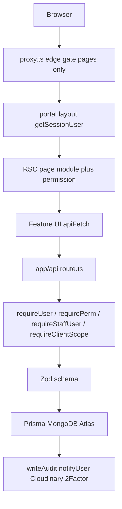

### Folders

| Area | Path | Role |
|------|------|------|
| App Router | `app/` | Pages, layouts, REST `route.ts` |
| Portal | `app/(portal)/` | Logged-in shell |
| Auth UI | `app/(auth)/login/` | Phone / PIN / OTP |
| Public | `app/(public)/legal/` | Legal pages |
| API | `app/api/**` | REST only — no `/api/v1`, no `pages/api` |
| Features | `features/<domain>/` | Client UI + optional `server/serialize.ts` |
| Shared | `shared/` | AppShell, ImportDialog, search, hooks |
| Libs | `lib/` | auth, rbac, api, db, storage, validations, imports |
| Config | `config/company/` | modules, nav, permissions, IDs, courts, SMS |
| Edge | `proxy.ts` | Login gate for **pages** (matcher skips `api`) |
| DB | `prisma/schema.prisma` | 23 models, Mongo — **no Prisma `@relation` blocks** |

### Feature pattern (code)

```text
app/(portal)/<domain>/page.tsx          ← RSC: session + module + permission
features/<domain>/components/*-page.tsx ← client UI
features/<domain>/server/serialize.ts   ← unitId-shaped JSON (when present)
app/api/<domain>/route.ts               ← list / create
app/api/<domain>/[unitId]/route.ts      ← get / update / delete
lib/validations/<domain>.schema.ts      ← Zod
```

Full domains with serialize helpers include clients, cases, employees, appointments, accounts, dak, tasks, hrms, documents. Thin domains (UI + API): diary, reports, activity, permissions, availability, court-roster, notifications, profile, home, auth.

### Four auth layers

| Layer | File | What it does |
|-------|------|----------------|
| 1. Edge | `proxy.ts` | JWT cookie check for **pages only**. Guests → `/login`. Signed-in on `/login` → `/`. Client-only roles → [path allowlist](#staff-vs-client). Matcher: `/((?!_next|favicon.ico|images|api).*)` — **`/api` is not gated here**. |
| 2. Layout | `app/(portal)/layout.tsx` | `getSessionUser()` from cookie. No user → `/api/auth/session-expired`. DB down → `DbUnavailable` (does **not** clear cookies). |
| 3. Page | `app/(portal)/…/page.tsx` | `isModuleEnabled` + permission string for UX. |
| 4. API | `lib/api/guard.ts` | Real enforcement. Reloads `User` from DB; does **not** trust JWT `roles` for permissions. |

There is no `middleware.ts`. Next 16 uses `proxy.ts` as the edge gate.

### End-to-end: opening a portal page (line by line)

```text
Browser GET /cases
        |
        v
proxy.ts  (matcher skips /api, _next, favicon, images)
  1. Read cookie mlf_access
  2. jwtVerify HS256 with JWT_SECRET; require typ=access and sub
  3. If missing/invalid and path is not /login or /legal/*  -->  302 /login
  4. If valid and path is /login  -->  302 /
  5. If JWT roles are only "client" and path not allowlisted  -->  302 /
  6. Else NextResponse.next()
        |
        v
app/(portal)/layout.tsx
  7. getSessionUser()  [lib/auth/session-user.ts]
       a. cookies().get(mlf_access)
       b. verifyAccessToken
       c. findUserByAccessSub(payload.sub)  -- unitId, legacy ObjectId fallback
       d. user.isActive && accessSessionMatches(sv)
       e. toPublicUser  -- RolePermission union as permissions[]
  8. Mongo down --> DbUnavailable (cookie NOT cleared)
  9. No user --> redirect /api/auth/session-expired (clears cookie --> /login)
 10. Else <AppShell user={PublicUser}>  -- nav filtered by permissions + staffOnly/clientOnly
        |
        v
app/(portal)/cases/page.tsx
 11. isModuleEnabled("cases") + permission check for UX
 12. Render features/cases client UI
        |
        v
apiFetch("/api/cases")
 13. fetch with credentials:include  [lib/api/client.ts]
        |
        v
app/api/cases/route.ts  (NOT seen by proxy.ts)
 14. apiHandler
 15. requirePerm(cases, view)  -- getCurrentUser + hasPermission from DB
 16. Zod query, Prisma findMany, serialize unitIds
 17. jsonOk({ data, meta })
        |
        v
UI list. 401 on later calls --> window.location /api/auth/session-expired
```

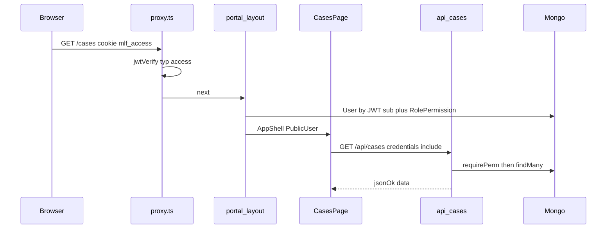

**Guards**

| Helper | Meaning |
|--------|---------|
| `requireUser` | Any authenticated **active** user |
| `requirePerm(module, action)` | Module flag on + `RolePermission` (admin always full catalog) |
| `requireRole(roles[])` | Role membership |
| `requireStaffUser` | Rejects pure `client` sessions |
| `requireClientScope` | Pure client + linked `clientUnitId` |

Permissions are loaded from `RolePermission` in `lib/rbac`, not from the JWT.

### Browser → API

| Helper | File | Use |
|--------|------|-----|
| `authFetch` | `lib/api/client.ts` | Login steps (JSON POST, cookies) |
| `apiFetch` | same | Portal CRUD. `credentials: "include"`. Non-auth **401** → `window.location` `/api/auth/session-expired` |
| `apiDownload` | same | File download with cookies |

Envelope: `{ ok: true, data }` or list `{ ok: true, data: [], meta }` · error `{ ok: false, error: { code, message } }`.

Mobile / native can also send `Authorization: Bearer <accessToken>` (returned in login JSON). CORS via `applyCorsHeaders` / `corsPreflight` in `lib/auth/session.ts`.

### Public IDs vs Mongo

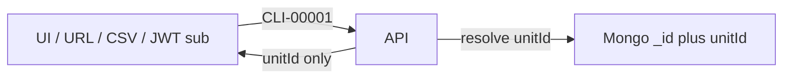

- Prefixes: `config/company/ids.ts`. Generation: `nextUnitId()` + `IdCounter` in `lib/ids/`.
- **Dual FK:** when both `xId` and `xUnitId` exist, write or clear them **together**.
- **No `registerId`.** Office case id = `Case.unitId` (`CSE`). Court identifiers = `caseNumber` / `filingNumber` / `cnr`.
- JWT `sub` is `User.unitId` (`EMP-…` or portal user unitId), never Mongo `_id`.

### Staff vs client

`lib/auth/client-portal.ts`:

- Staff roles: `admin`, `sub_admin`, `staff`, `advocate`, `accountant`.
- Client-only: `roles` are **only** `client`.
- Allowed paths: `/`, `/cases`, `/appointments`, `/documents`, `/profile`, `/notifications`, `/legal`.
- Nav: `staffOnly` / `clientOnly` on `config/company/nav.ts`. Staff hitting `/documents` are redirected home; that page is the client document inbox.

---

## 3. Super admin setup

There is **no signup form**. The first `admin` user is created from **env**, then they log in with mobile + PIN (or OTP if PIN was never set). Permissions rows are seeded on first RBAC read.

```text
.env
  SUPER_ADMIN_MOBILE = 10-digit or 91XXXXXXXXXX
  ADMIN_MOBILE       = legacy alias (used if SUPER_ADMIN is unset)
  ADMIN_MOBILE_1     = extra bootstrap mobile (optional)
  SEED_PIN           = default PIN if none set yet (default 123456)
        |
        +-- npm run db:seed          prisma/seed.ts  seedAdmin()
        +-- npx tsx scripts/ensure-super-admin.ts
        +-- first POST /api/auth/check-mobile   ensureEnvAdminUser()
        |
        v
Mongo User
  unitId        EMP-#####
  mobile        91XXXXXXXXXX   (unique login)
  roles         ["admin","advocate"]  Managing Partner defaults + admin
  designation   Managing Partner
  name          Super Admin
  pinHash       bcrypt of SEED_PIN  (only if pinHash was empty)
  isActive      true
        |
        v
Login at /login  -->  cookie mlf_access  -->  AppShell with full admin catalog
```

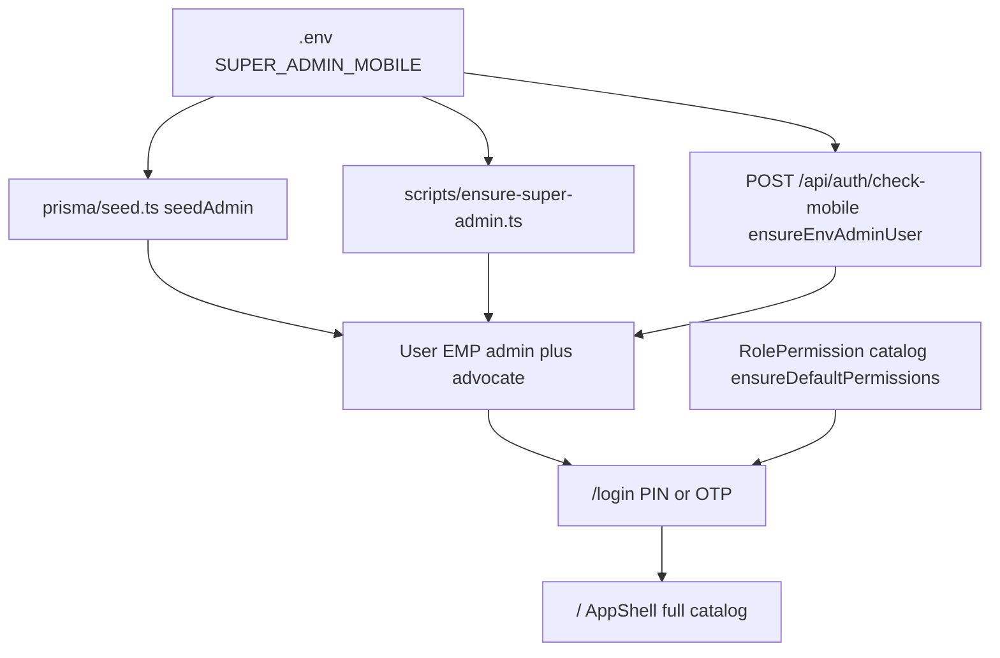

### 3.1 Env → normalized mobile

File: `lib/auth/mobile.ts`

1. Read `SUPER_ADMIN_MOBILE`, then `ADMIN_MOBILE`, then `ADMIN_MOBILE_1`.
2. `normalizeMobile`: 10 digits starting 6–9 → `91` + digits; 12 digits starting `91` kept as-is; anything else is ignored.
3. `getEnvAdminMobiles()` = unique set. `getEnvAdminMobile()` = first. `isEnvAdminMobile(mobile91)` = membership test.
4. Login APIs always store and look up `91…`. The UI sends 10 digits; the server prepends `91`.

Without a valid env mobile, seed **skips** admin creation. `check-mobile` will return `not_found` for unknown numbers (no public signup).

### 3.2 Path A — `npm run db:seed` (full office seed)

File: `prisma/seed.ts` → `seedAdmin()` after `seedPermissions()`.

Line by line:

1. `seedPermissions()` upserts every row from `config/company/permissions-defaults.ts` (`role` × `module.action` × `allowed`).
2. `seedAdmin()` calls `getEnvAdminMobile()`. If null, logs skip and returns.
3. `hashPin(SEED_PIN)` — bcrypt 12 rounds, 6 digits (`lib/auth/pin.ts`).
4. `prisma.user.findUnique({ where: { mobile: adminMobile } })`.
5. Merge roles: existing roles ∪ `designationDefaultRoles["Managing Partner"]` (`admin` + `advocate`) ∪ `"admin"`. Advocate is included so the chamber head appears in booking / case lists.
6. **If user exists:** update roles, fill name/designation if empty, `isActive: true`, clear PIN lock. **Keep existing `pinHash`** (Forgot PIN / setup must not be overwritten). Only write `pinHash` when it was null.
7. **If no user:** `nextUnitId("employee")` → `EMP-#####` via `IdCounter`. Create User with Managing Partner defaults, name `Super Admin`, `pinHash`.
8. Seed may also create roster employees (`OFFICE_ROSTER`) and sample CSV data unless wipe flags are set.

Related flags: `--wipe-keep-admin` deletes business data and non-admin users but keeps env super-admin + `RolePermission`. `--reset-staff` / `--wipe-keep-staff` are staff-reset variants.

### 3.3 Path B — `npx tsx scripts/ensure-super-admin.ts`

Same idea, **all** `getEnvAdminMobiles()`, no sample data.

1. Fail if no env mobiles.
2. For each mobile: find by `91…` **or** bare 10-digit (legacy storage).
3. Existing → force `mobile` to `91…`, `isActive`, add `admin` to roles, set PIN only if missing.
4. Missing → create `EMP-#####`, Managing Partner roles, PIN = `SEED_PIN`. Name is `Super Admin` only for the `SUPER_ADMIN_MOBILE` number.

This script is **not** wired in `package.json`; run it when you need the admin row without a full seed.

### 3.4 Path C — first login (no seed required)

File: `lib/auth/bootstrap-admin.ts` `ensureEnvAdminUser(mobile91)`.

Called from `POST /api/auth/check-mobile` (always, after rate-limit) and from `POST /api/auth/verify-otp` when `purpose=setup` and the user is still missing.

Line by line inside `ensureEnvAdminUser`:

1. If `!isEnvAdminMobile(mobile91)` → return `null` (ordinary numbers are never auto-created).
2. `findUserByLoginMobile` — query `mobile in [91…, 10-digit alias]`.
3. Build roles = existing ∪ Managing Partner defaults ∪ `admin`.
4. Existing: same as seed — revive `isActive`, clear lock, keep PIN if set, else `hashPin(SEED_PIN)`.
5. Missing: `nextUnitId("employee")`, create Super Admin / Managing Partner / `pinHash`.

Then `check-mobile` re-reads the user:

| DB state | JSON `status` | LoginForm next step |
|----------|---------------|---------------------|
| Active + `pinHash` | `pin` | Enter PIN → `POST /api/auth/login` |
| Active, no `pinHash` | `otp_required` | Send OTP setup |
| Inactive | `not_found` (hides existence) | Error: contact admin |
| No user, env admin | `otp_required` | OTP (user created on verify if still missing) |
| No user, not env admin | `not_found` | Error: contact admin |

**Default PIN `123456` is weak.** The UI `isWeakPin` blocks it on **setup-pin / forgot-pin**. First login after seed uses `POST /api/auth/login` with `SEED_PIN` even if weak — then change PIN via Forgot PIN. If seed never set a PIN, OTP setup forces a strong PIN.

### 3.5 Super admin first login (PIN already set by seed)

```text
1. Open /login
2. LoginForm step=phone  [features/auth/components/login-form.tsx]
3. Enter 10-digit mobile  (must match env after normalize)
4. PhoneStep onSubmit --> handleCheckMobile
     authFetch POST /api/auth/check-mobile { mobile }
5. Route: Zod checkMobileSchema --> normalizeMobile
     rateLimit check-mobile 20 / 15min
     ensureEnvAdminUser(mobile)     <-- creates/revives admin
     findUnique by 91-mobile
     return { status: "pin" }
6. LoginForm setStep("pin")
7. Enter 6-digit PIN (SEED_PIN unless already changed)
8. handleLogin --> POST /api/auth/login { mobile, pin }
9. Route: Zod loginSchema --> normalize --> rateLimit 10 / 15min
     findUserByLoginMobile
     isActive + pinHash required
     isPinLocked? --> 423 PIN_LOCKED
     verifyPin bcrypt
     fail --> increment failedPinAttempts; at 5 --> pinLockedUntil +15min
     success --> issueAuthTokens:
        signAccessToken { sub: EMP-…, mobile, roles, sv, typ:access }  7d HS256
        update lastLoginAt, clear lock counters
        toPublicUser + getEffectivePermissionsForRoles
        admin role --> full PERMISSION_CATALOG (lib/rbac)
     Set-Cookie mlf_access=JWT httpOnly SameSite=lax Max-Age=7d
     JSON { user, accessToken }  (Bearer for mobile apps)
10. LoginForm goHome: router.replace("/") + refresh
11. proxy.ts: cookie valid, not on /login --> allow /
12. portal layout getSessionUser --> AppShell
13. Nav shows all staff items (admin permissions)
```

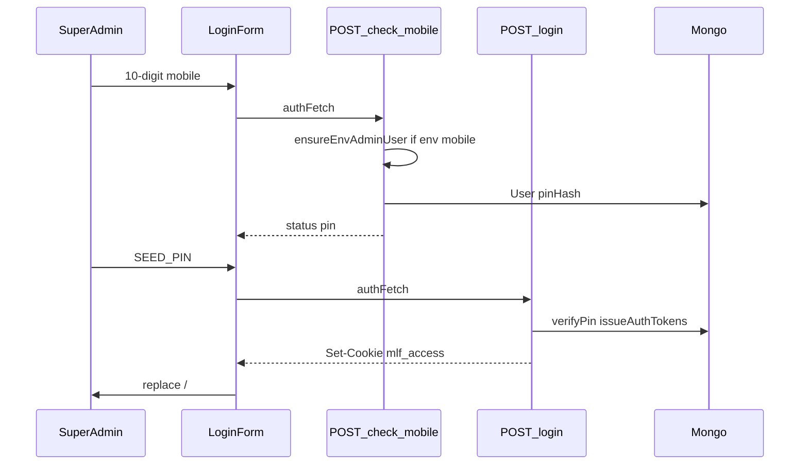

### 3.6 Super admin first login (OTP, no PIN yet)

If `ensureEnvAdminUser` created the row **without** a usable PIN, or PIN was force-reset:

```text
check-mobile --> otp_required
LoginForm sendOtp("setup")
  POST /api/auth/send-otp { mobile, purpose: "setup" }
    allowed if (user active && !pinHash) OR (!user && isEnvAdminMobile)
    2Factor sendOtpSms(mobile) --> sessionId
    delete old OtpSession for mobile+purpose; create new 10min
LoginForm step=otp_setup
  POST /api/auth/verify-otp { mobile, otp, purpose: setup }
    load latest unverified unexpired OtpSession
    verifyOtpSms(sessionId, otp)
    mark verified
    if no user && env admin --> ensureEnvAdminUser
    signOtpProofToken { mobile, purpose, jti } TTL 10m
LoginForm step=setup_pin (store otpProofToken)
  POST /api/auth/setup-pin { pin, confirmPin, otpProofToken }
    reject weak PIN BEFORE consume
    consumeOtpProof: verify JWT, insert ConsumedOtpProof.jti (replay block)
    User must exist, active, pinHash empty
    pinHash = bcrypt; sessionVersion++
    issueAuthTokens + cookie  (same as login)
```

`setup-pin` does **not** create the User. Creation is `ensureEnvAdminUser` on check-mobile / verify-otp.

### 3.7 Permissions for admin

`lib/rbac/index.ts` calls `ensureDefaultPermissions()` (`lib/rbac/ensure-permissions.ts`) on first permission read:

1. If admin's `RolePermission` rows already cover `PERMISSION_CATALOG` and all roles exist → no write.
2. Else upsert seed rows. **Admin updates always `allowed: true`**. Other roles: `create` from seed, `update: {}` so an admin's matrix edits are not clobbered.

`getEffectivePermissionsForRoles`: union of allowed keys; **if roles include `admin`, return the full catalog** regardless of holes in the matrix.

Admin-only extra rules (`lib/rbac/employee-guards.ts`): only admin can assign/manage another admin; cannot deactivate/remove the last active admin.

### 3.8 After super admin is in

The super admin uses **Employees** to create staff (`POST /api/employees`) — those users are **not** env-bootstrap; they get OTP setup (`otp_required`) until they set a PIN. Clients are invited separately (`portal-access`). Env mobiles remain special: every `check-mobile` will revive them if deactivated.

---

## 4. Schema and connections

Mongo has **no Prisma `@relation`**. Links are either **dual** (`ObjectId` + public `unitId`) or **soft** (`*UnitId` only, validated in the app). Actor fields (`createdById`, `voidedById`, `uploadedById`) are ObjectId-only and stay server-side.

### Models (23) and prefixes

| Model | Prefix | Role |
|-------|--------|------|
| User | `EMP` | Login; staff or client portal |
| Client | `CLI` | Registry / intake |
| Case | `CSE` | Matter hub |
| Hearing | `HRG` | Listed dates on a case |
| Document | `DOC` | File metadata; bytes in Cloudinary (`fileKey`) |
| Appointment | `APT` | Consultation slot |
| CashPayment | `PAY` | Client cash ledger |
| OfficeExpense | `EXP` | Office spend |
| DakEntry | `DAK` | Postal in/out |
| OfficeTask | `TSK` | Work allotment |
| Attendance | `ATT` | IST day check-in/out |
| LeaveRequest | `LVE` | Leave |
| AdvocateWeeklyHours | `AWH` | Recurring availability |
| AdvocateTimeBlock | `ATB` | One-off unavailability |
| OfficeHoliday | `HOL` | Office-wide closed days |
| CourtDutyOverride | `CDU` | Temporary court cover |
| Notification | `NTF` | In-app inbox |
| OtpSession | — | 2Factor session id |
| ConsumedOtpProof | — | OTP JWT `jti` replay block |
| RolePermission | — | RBAC matrix |
| AuditLog | — | Mutations |
| IdCounter | — | `unitId` sequences |
| RateLimit | — | Login / OTP / import / search / upload |

### Relationship map

```text
User EMP
  |-- clientUnitId (soft unique) --> Client CLI
  |-- dual --> Attendance, Leave, Hours, TimeBlocks, Notification, Tasks(assignee), CDU
Client CLI
  |-- dual required --> Case CSE  ★ hub
  |-- dual --> CashPayment, Document, Appointment
  |-- soft --> DakEntry
Case CSE
  |-- dual --> Hearing HRG
  |-- dual optional --> CashPayment, Document, Appointment
  |-- soft --> DakEntry, OfficeTask
OfficeExpense EXP <--dual bill--> Document DOC
Auth satellites: OtpSession / ConsumedOtpProof (by mobile), RolePermission (by role)
```

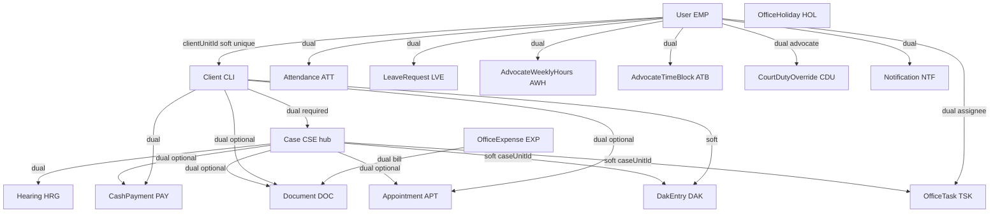

Auth satellites (`OtpSession`, `ConsumedOtpProof`) key by **mobile**, not FK. `RolePermission` keys by `UserRole`. `AuditLog` stores `actorUnitId` / `entityUnitId` (public ids).

### Dual FK vs soft vs mobile

| From → To | Style | Fields |
|-----------|-------|--------|
| Case → Client | Dual required | `clientId` + `clientUnitId` |
| Hearing → Case | Dual | `caseId` + `caseUnitId` |
| CashPayment → Client / Case | Dual (case optional) | |
| Document → Case / Client / Expense | Dual optional | |
| OfficeExpense → Document (bill) | Dual optional | `billDocumentId` + `billDocumentUnitId` |
| Appointment → Client / Case | Dual optional | |
| OfficeTask → User | Dual | `assigneeId` + `assigneeUnitId` |
| Attendance / Leave / Hours / Blocks / Notification → User | Dual | |
| CourtDutyOverride → User | Dual | `advocateUserId` + `advocateUnitId` (+ mobile) |
| User → Client (portal) | Soft unique | `User.clientUnitId` → `Client.unitId` |
| OfficeTask → Case | Soft | `caseUnitId` |
| DakEntry → Case / Client | Soft | `caseUnitId` / `clientUnitId` |
| Case / Hearing / Appointment → Advocate | Soft by **mobile** | `primaryAdvocateMobile`, `appearingAdvocateMobile`, `advocateMobile` → `User.mobile` |

Hearing SMS uses `appearingAdvocateMobile` if set, else the case `primaryAdvocateMobile`.

### Enums

| Enum | Values |
|------|--------|
| `UserRole` | `admin`, `sub_admin`, `staff`, `advocate`, `accountant`, `client` |
| `OtpPurpose` | `setup`, `forgot_pin` |
| `CaseStatus` | `enquiry` → `engaged` → `pre_filing` → `under_filing` → `filing_defect` → `active` → `reserved` → `disposed` / `withdrawn` / `transferred` / `archived`. Deprecated leftovers: `pending`, `listed` |
| `PaymentType` | `advance`, `partial`, `full`, `consultation`, `court_fee`, `stamp`, `copying`, `travel`, `clerkage`, `other` |
| `PaymentStatus` | `pending`, `paid`, `void` |
| `AppointmentStatus` | `scheduled`, `completed`, `cancelled` |
| `LeaveStatus` | `pending`, `approved`, `rejected`, `cancelled` |
| `DocumentType` | `judgment`, `order`, `pleading`, `vakalatnama`, `petition`, `affidavit`, `evidence`, `id_proof`, `receipt`, `other` |
| `OfficeExpenseCategory` | stationery, utilities, maintenance, travel, refreshments, equipment, professional_services, misc, others |
| `ExpensePaymentMode` | cash, upi, card, bank, other |

String “enums” in comments: Task `kind` / `status`; Dak `direction` (`in` \| `out`); Appointment `mode` (`office` \| `call` \| `video`); AdvocateTimeBlock `kind`; Notification `type`; Case `ourSide`.

Pipeline rules live in `config/company/case-pipeline.ts` (`canTransitionStatus`). Court-board wording stays in `Case.stage` (free text).

### Schema note

`CourtDutyOverride.createdById` annotation in Prisma is truncated (`@db.ObjectI`). App still treats it as ObjectId. Do not “fix” in this doc-only change.

---

## 5. Auth flows

**Purpose:** Login is **Indian mobile + 6-digit PIN**. OTP (2Factor, 4 digits) is only for **first PIN** and **forgot PIN**. Session is a **stateless 7-day HS256 JWT** in httpOnly cookie `mlf_access`. Invalidation is `User.sessionVersion` vs JWT claim `sv`.

**There is no public signup.** Super-admin bootstrap: [section 3](#3-super-admin-setup). Staff are created by admin; clients are invited.

**LoginForm steps** (`features/auth/components/login-form.tsx`): `phone` → `pin` | `otp_setup` → `setup_pin` | `otp_forgot` → `reset_pin`.

```text
                    [phone]  POST check-mobile
                       |
         +-------------+--------------+
         | pin         | otp_required | not_found
         v             v              v
       [pin]      sendOtp setup     error stay phone
         |             |
         |             v
         |         [otp_setup]  POST verify-otp
         |             |
         |             v
         |         [setup_pin]  POST setup-pin --> cookie --> /
         |
         +-- POST login --> cookie --> /
         +-- Forgot --> sendOtp forgot_pin --> [otp_forgot]
                              --> verify-otp --> [reset_pin]
                              --> POST forgot-pin/reset --> cookie --> /
```

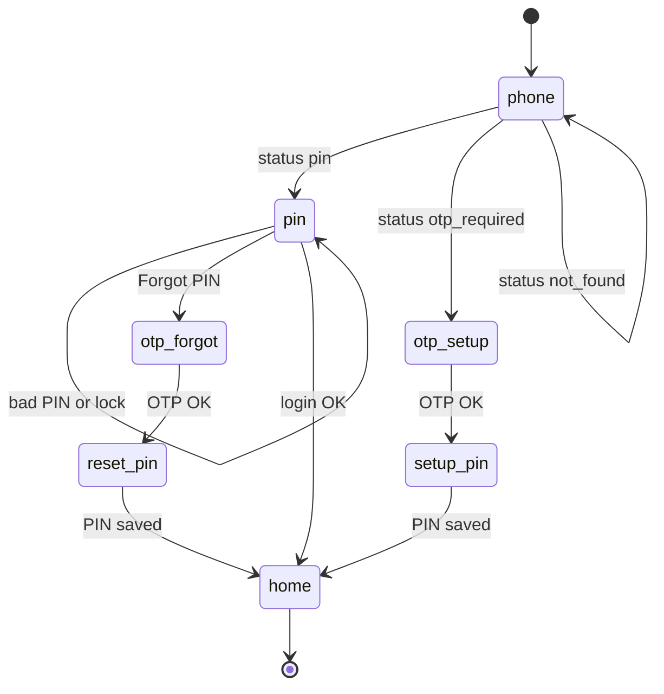

**Key files**

| Path | Role |
|------|------|
| `features/auth/components/login-form.tsx` | Step machine; `authFetch` |
| `features/auth/components/{phone,pin,otp}-step.tsx` | Step UIs |
| `lib/auth/jwt.ts` | `signAccessToken`, `signOtpProofToken` |
| `lib/auth/session.ts` | Cookies, `getCurrentUser`, `issueAuthTokens`, CORS |
| `lib/auth/session-user.ts` | RSC `getSessionUser` |
| `lib/auth/pin.ts` | bcrypt, 5 attempts / 15 min lock |
| `lib/auth/otp-proof.ts` | Consume `jti` into `ConsumedOtpProof` |
| `lib/services/two-factor.service.ts` | SMS OTP + transactional SMS |
| `lib/validations/auth.schema.ts` | Zod |
| `app/api/auth/*` | HTTP |

**JWT access claims** (`typ: "access"`, TTL 7d)

| Claim | Meaning |
|-------|---------|
| `sub` | `User.unitId` |
| `mobile` | Normalized `91…` |
| `roles` | Hint for edge client path lock; API reloads user |
| `cid` | Optional `clientUnitId` |
| `sv` | Must match `User.sessionVersion` |

OTP proof JWT (`typ: "otp_proof"`, 10m): `mobile`, `purpose`, `jti` — consumed once in `ConsumedOtpProof`.

PIN lock: `failedPinAttempts`, `pinLockedUntil`. Weak PINs rejected on setup/reset (`lib/auth/pin-rules.ts`). Auth routes rate-limited (`RateLimit` collection). Cookie: httpOnly, `SameSite=lax`, `secure` in production, path `/`.

### 5.1 Returning user (PIN) — line by line

Applies to staff and clients who already have `pinHash`. Super-admin after seed: [§3.5](#35-super-admin-first-login-pin-already-set-by-seed).

```text
UI PhoneStep
  --> POST /api/auth/check-mobile
  --> POST /api/auth/login
  --> Set-Cookie mlf_access
  --> router.replace("/")
  --> proxy + layout + AppShell
```

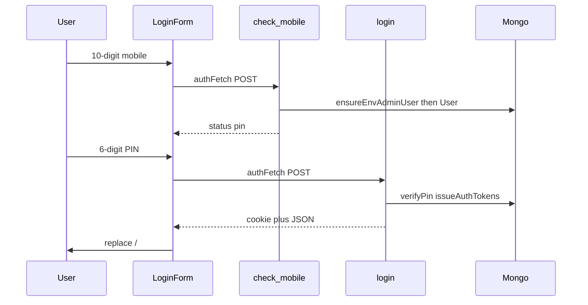

1. Render `/login` (`app/(auth)/login/page.tsx`). `proxy.ts` allows `/login` without a cookie.
2. `LoginForm` `step=phone`. User types 10 digits. Client checks length 10 and first digit 6–9.
3. `handleCheckMobile` → `authFetch("/api/auth/check-mobile", { mobile })` (`credentials: include`, JSON).
4. **API** `app/api/auth/check-mobile/route.ts`: parse JSON → `checkMobileSchema` → `normalizeMobile` → `rateLimit` (20 / 15 min per IP+mobile) → `ensureEnvAdminUser` → `findUnique({ mobile })`.
5. Response `{ status: "pin" }` → `setStep("pin")`, `PinStep`.
6. `handleLogin` → `POST /api/auth/login` `{ mobile, pin }`.
7. **API** `login/route.ts`: `loginSchema` → normalize → rateLimit (10 / 15 min) → `findUserByLoginMobile`.
8. Reject if missing / inactive / no `pinHash` (`INVALID_CREDENTIALS` 401).
9. If `pinLockedUntil` in the future → 423 `PIN_LOCKED` + `retryAfterSec`. UI starts countdown.
10. `verifyPin` (bcrypt). Fail: atomic `updateMany` — at 5 failures set `pinLockedUntil` +15 min; else increment `failedPinAttempts`.
11. Success: `issueAuthTokens` (`lib/auth/session.ts`):
    - `signAccessToken` HS256 7d (`sub=unitId`, `roles`, `sv`, optional `cid`).
    - `User.update`: `lastLoginAt`, `failedPinAttempts=0`, `pinLockedUntil=null`.
    - `toPublicUser` + `getEffectivePermissionsForRoles`.
12. `attachAuthCookies`: set `mlf_access`, expire leftover `mlf_refresh`.
13. JSON also returns `accessToken` for native Bearer clients.
14. UI toast + `router.replace("/")` + `router.refresh()`.
15. `proxy.ts` sees valid cookie on `/` → next. Layout `getSessionUser` → `AppShell`.

### 5.2 First-time PIN (OTP setup) — line by line

Used when: new employee (admin created User with no PIN), client invite with no PIN, env admin with empty `pinHash`, after force-reset.

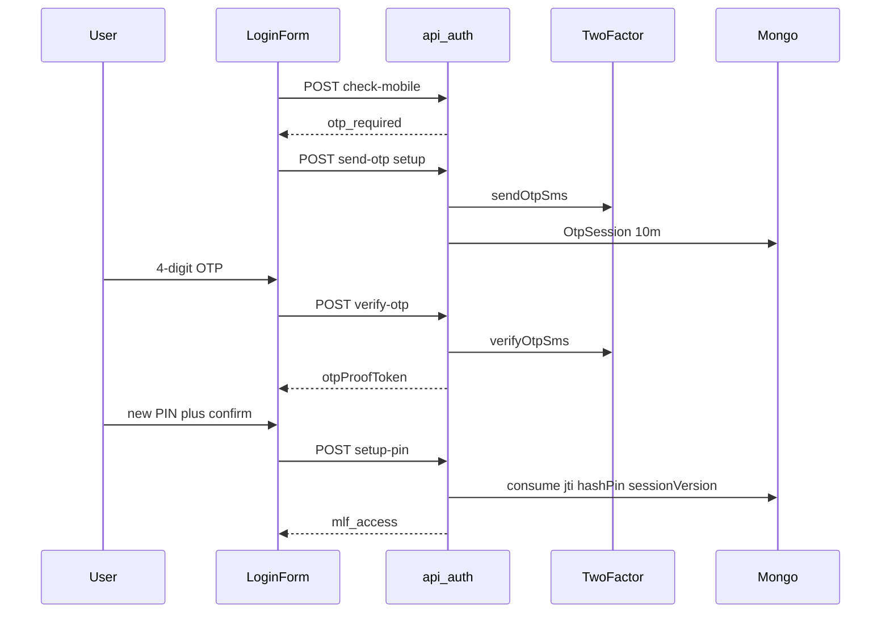

1. `check-mobile` → `{ status: "otp_required" }` (active user, `pinHash` null).
2. `LoginForm` immediately `sendOtp("setup")` — does not wait for another click.
3. **`POST /api/auth/send-otp`**: Zod `sendOtpSchema`. Rate-limit IP (10/15m) then `otp:{mobile}` (3/15m).
4. Allowed for setup only if `(user && isActive && !pinHash) || (!user && isEnvAdminMobile)`. Else 400 FORBIDDEN.
5. `sendOtpSms(mobile)` → 2Factor AUTOGEN3 → `sessionId`.
6. Delete prior `OtpSession` for that mobile+purpose; insert new (`expiresAt` +10 min, `verified: false`).
7. UI `step=otp_setup`, 60s resend countdown. User enters 4-digit OTP.
8. **`POST /api/auth/verify-otp`**: rate-limit; load latest unverified unexpired `OtpSession`; `verifyOtpSms(sessionId, otp)`; mark `verified`.
9. If `purpose=setup` and no user: `ensureEnvAdminUser` for env mobiles only. Ordinary numbers must already exist (employee create / portal invite).
10. `signOtpProofToken` → UI stores `otpProofToken`, `step=setup_pin`.
11. UI rejects mismatch / weak PIN client-side (`isWeakPin`).
12. **`POST /api/auth/setup-pin`**: rate-limit; Zod; reject weak PIN **before** consume; `consumeOtpProof(token, "setup")` inserts `ConsumedOtpProof.jti` (unique — replay returns null).
13. Load User by `proof.mobile`. Must be active and `pinHash` empty (else CONFLICT: use login or forgot).
14. `pinHash = hashPin`; `sessionVersion += 1`; `issueAuthTokens` + cookie.

### 5.3 Forgot PIN — line by line

User already has `pinHash`. From `PinStep` “Forgot”.

```text
[pin] --Forgot--> POST send-otp purpose=forgot_pin
              --> [otp_forgot] --> POST verify-otp
              --> [reset_pin] --> POST /api/auth/forgot-pin/reset
              --> cookie (old JWTs dead: sv bumped)
```

1. `handleForgotPin` → `sendOtp("forgot_pin")`.
2. **send-otp** requires existing **active** user **with** `pinHash`. Else 400 (does not reveal random numbers as resettable).
3. Same SMS + `OtpSession` as setup, `purpose=forgot_pin`.
4. verify-otp: user must still be active with PIN; issue `otpProofToken` with `purpose=forgot_pin`.
5. **`POST /api/auth/forgot-pin/reset`**: weak-PIN check → `consumeOtpProof(..., "forgot_pin")` → new `pinHash`, clear lock, `sessionVersion++` → `issueAuthTokens`.
6. Any other browser still holding the old cookie fails `accessSessionMatches` → treated as logged out.

### 5.4 Logout and session expiry — line by line

```text
Logout button
  --> performLogout
  --> POST /api/auth/logout
  --> clearAuthCookies (mlf_access + mlf_refresh maxAge 0)
  --> router.replace(/login)

Mid-session 401 (apiFetch, not /api/auth/*)
  --> window.location /api/auth/session-expired
  --> GET clears cookies, 302 /login

Portal layout getSessionUser() === null
  --> redirect /api/auth/session-expired
  (deactivated, sv mismatch, missing cookie)

Mongo down in layout
  --> DbUnavailable  -- cookies kept
```

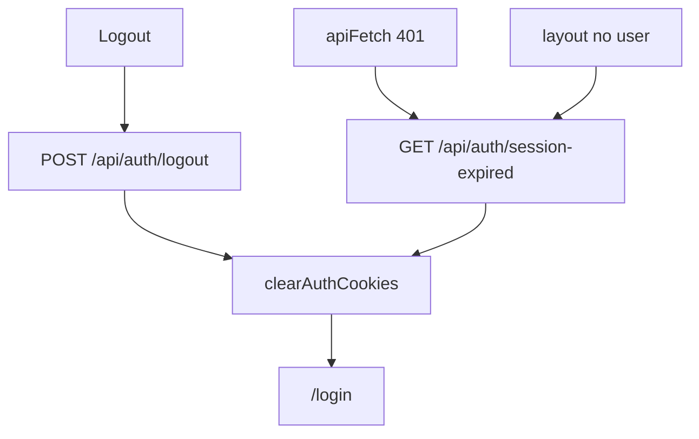

### 5.5 Admin force-reset PIN — line by line

1. Staff with `employees.edit` opens employee detail.
2. `POST /api/employees/[unitId]/force-reset-pin` (`apiHandler` + `requirePerm`).
3. Load target by `unitId`. `requireAdminToManageAdmin` — cannot reset a higher/peer admin unless actor is admin.
4. `pinHash = null`, clear lock counters, `sessionVersion += 1`.
5. `writeAudit` `employee.force_reset_pin`.
6. Target’s current JWT dies immediately. Next `/login` → `check-mobile` → `otp_required` → §5.2.

### 5.6 Client portal invite — line by line

```text
Staff /clients/CLI-xxxxx
  --> POST /api/clients/CLI-xxxxx/portal-access   clients.edit
  --> User { roles:[client], clientUnitId:CLI-xxxxx, mobile: client.mobile 91… }
  --> Client logs in same LoginForm
  --> proxy allowlist + APIs scoped to that CLI
```

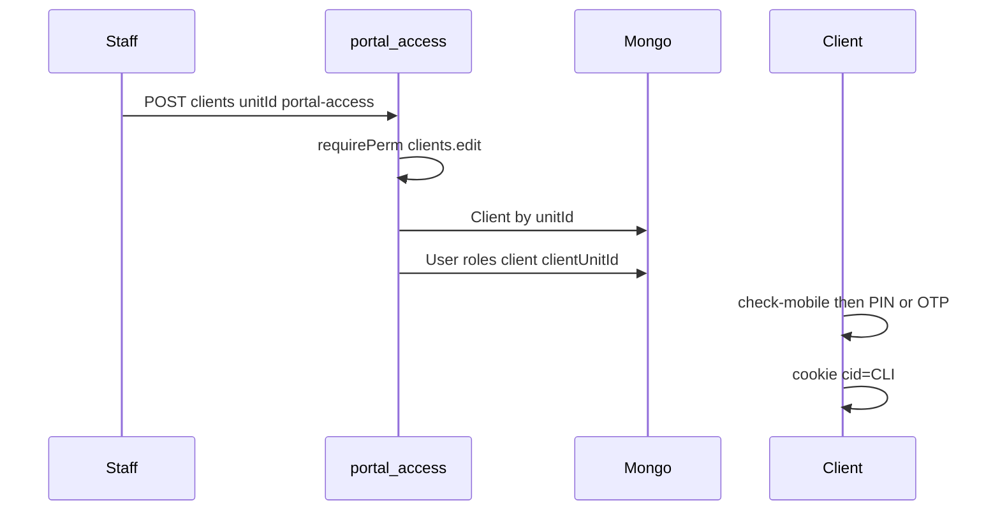

1. `requirePerm(clients, edit)`. Resolve `Client` by `unitId`.
2. `normalizeMobile(client.mobile)` — invalid mobile blocks invite.
3. `ensureDefaultPermissions()` so `client` role keys exist.
4. If `User` already unique-on `clientUnitId`: reactivate if needed (`isActive: true`).
5. Else create User (`nextUnitId("employee")` still used for portal users — public id is `EMP-#####` even for clients), `roles: ["client"]`, `clientUnitId`, **no PIN** → first login is OTP setup.
6. GET portal-access returns invite status (`hasPin`, `lastLoginAt`). DELETE revokes (`isActive` false).
7. Client JWT includes `cid`. `requireClientScope` / `assertOwnsClientUnit` filter cases, appointments, documents. Edge `proxy.ts` blocks `/employees`, `/accounts`, etc.

### 5.7 RBAC — line by line

```text
User.roles[]  -->  RolePermission rows (union allowed=true)
              -->  PublicUser.permissions  ["cases.view", ...]
              -->  sidebar (nav.ts permission + staffOnly/clientOnly)
              -->  page.tsx UX gate
              -->  requirePerm  (real enforcement; reloads User from DB)
```

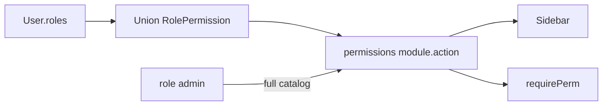

1. `hasPermission(userId, module, action)` loads User, `ensureDefaultPermissions`, then `getEffectivePermissions`.
2. Admin → every catalog key. Others → union of `RolePermission` where `allowed`.
3. `requirePerm` also `requireModuleEnabled` (`config/company/modules.ts`).
4. `/permissions` UI: `GET/PUT /api/permissions/matrix` (`permissions.view` / `edit`). PUT must not remove last admin’s access in a way that locks the office (UI preview: `POST /api/permissions/preview`).
5. Client defaults: `dashboard.view`, `cases.view`/`upload`, `appointments.view`/`create`/`cancel`. Row scope is still `clientUnitId`.

---

## 6. Domain flows

Each section: purpose → schema → code path → APIs → diagram → connections. **Preview this file in GitHub or Cursor Markdown preview to render mermaid;** ASCII is under each flow so the path is visible in the raw file.

### 6.1 Home / dashboard

**Who:** Staff (and clients with `dashboard.view`). **Page:** `/` · `app/(portal)/page.tsx` · `features/home/`

**API:** `GET /api/dashboard/summary` — `requirePerm(dashboard, view)`

Shows counts, upcoming hearings, presence widgets. Links out to diary, cases, HRMS, appointments.

**End-to-end**

```text
GET /  -->  layout AppShell
       -->  features/home
       -->  apiFetch GET /api/dashboard/summary
       -->  requirePerm dashboard.view
       -->  Prisma counts (cases, hearings, presence)
       -->  jsonOk data  -->  widgets + links
```

1. After login, `router.replace("/")`.
2. `proxy.ts` + layout session (see §2).
3. `app/(portal)/page.tsx` gates `dashboard.view`.
4. Client UI `apiFetch("/api/dashboard/summary")`.
5. `app/api/dashboard/summary/route.ts` `requirePerm(dashboard, view)` then aggregates.
6. Clicks go to `/diary`, `/cases`, `/hrms`, `/appointments` (those flows below).

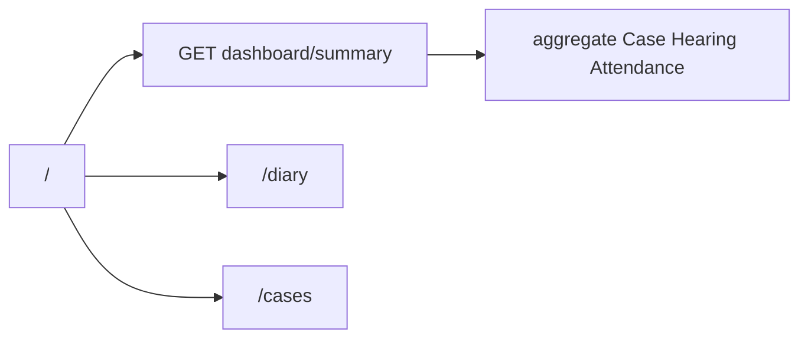

---

### 6.2 Clients + portal invite

**Who:** Staff. **Pages:** `/clients`, `/clients/[unitId]`

**Schema:** `Client` (`CLI`). Portal: `User.clientUnitId` → this `unitId`.

**Code:** `features/clients/` · `lib/validations/clients.schema.ts` · `features/clients/server/serialize.ts`

| Method | Path | Guard |
|--------|------|-------|
| GET, POST | `/api/clients` | `clients.view` / `create` |
| GET, PATCH | `/api/clients/[unitId]` | `view` / `edit` |
| GET, POST, DELETE | `/api/clients/[unitId]/portal-access` | `view` / `edit` |
| POST | `/api/clients/import` | `clients.create` (+ `edit` for upsert) |

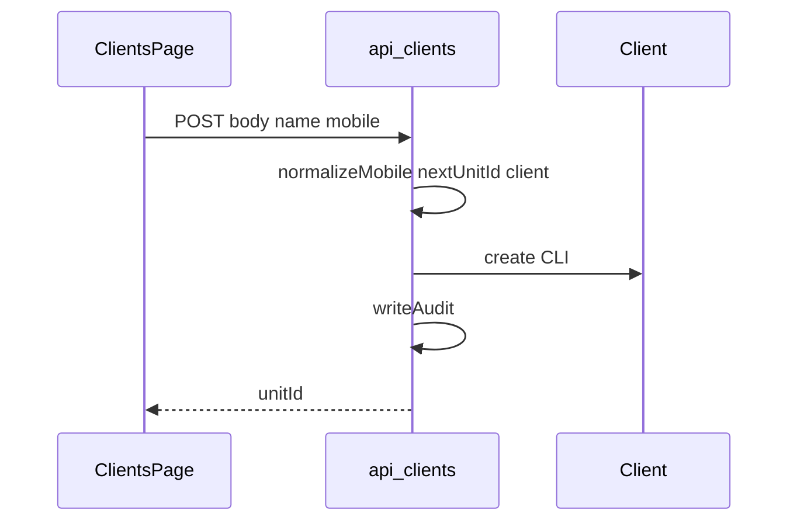

**End-to-end (create + invite)**

```text
/clients  -->  features/clients  -->  POST /api/clients
  Zod clients.schema  -->  normalizeMobile  -->  nextUnitId("client")
  -->  Prisma Client CLI  -->  writeAudit  -->  list GET /api/clients?page=&q=

/clients/CLI-xxxxx  -->  POST .../portal-access  -->  User roles=client
  -->  client LoginForm  (same §5)
```

1. Page `app/(portal)/clients/page.tsx` — `clients.view`; create button needs `clients.create`.
2. Form `apiFetch POST /api/clients` JSON.
3. `requirePerm(clients, create)` → Zod → unique mobile → `nextUnitId("client")` → insert → audit.
4. Detail `GET /api/clients/[unitId]`; PATCH for edits.
5. Invite: [§5.6](#56-client-portal-invite--line-by-line).
6. Import: [§6.19](#619-csv-import-cross-cutting).

**Connects to:** Cases (`clientUnitId` required), payments, documents on client detail, appointments, DAK soft link, portal invite → client login.

---

### 6.3 Cases, hearings, checklist

**Who:** Staff full CRUD; clients see **their** cases (`requireClientScope` / ownership). **Pages:** `/cases`, `/cases/[unitId]`

**Schema:** `Case` dual → Client; `Hearing` dual → Case. Advocates by mobile. `filingChecklist` Json; `battaDue`, `awaitingService`.

**Code:** `features/cases/` · `config/company/case-pipeline.ts` · `lib/validations/cases.schema.ts`

| Method | Path | Guard |
|--------|------|-------|
| GET, POST | `/api/cases` | `cases.view` / `create` |
| GET, PATCH | `/api/cases/[unitId]` | `view` / `edit` |
| PATCH | `/api/cases/[unitId]/status` | `edit` + `canTransitionStatus` |
| PATCH | `/api/cases/[unitId]/checklist` | `edit` |
| POST | `/api/cases/[unitId]/hearings` | `edit` — sets `nextHearingAt` |
| POST | `/api/hearings/[unitId]/adjourn` | `edit` — replacement `HRG` |
| POST | `/api/cases/import`, `/api/hearings/import` | `cases.upload` / `cases.edit` |

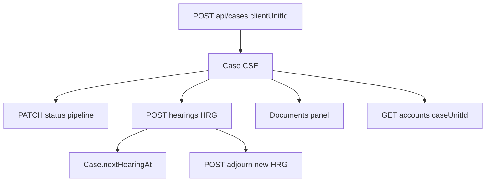

Hearing create/import may notify; import of **tomorrow** dates can send client SMS immediately (catch-up if cron already ran).

**End-to-end**

```text
/cases  -->  POST /api/cases { clientUnitId, court, advocates }
        -->  CSE dual-FK Client
        -->  GET /cases/CSE-xxxxx  (case + client + hearings + docs)
        -->  PATCH .../status  canTransitionStatus
        -->  POST .../hearings  -->  HRG + Case.nextHearingAt
        -->  POST /api/hearings/HRG-xxxxx/adjourn  -->  new HRG
        -->  GET /api/accounts?caseUnitId=CSE-xxxxx  fee snippet
        -->  POST /api/documents  (case parent)
```

1. Create requires `cases.create` and an existing `CLI`. Dual write `clientId` + `clientUnitId`.
2. Advocates stored as mobiles (`primaryAdvocateMobile`, `advocateMobiles[]`) — resolved from `GET /api/advocates`.
3. Status PATCH uses `config/company/case-pipeline.ts`; illegal transitions 400.
4. Hearing POST `cases.edit`; may `notifyUser`; SMS eligibility uses client `smsConsent`.
5. Adjourn creates a replacement hearing, keeps history on the old `HRG`.
6. Clients hitting `/cases` only see rows for their `clientUnitId`.

**Connects to:** Clients, documents, accounts fee rollup, diary, SMS, tasks (soft `CSE`), DAK, appointments `convert-case`, court roster (who appears).

---

### 6.4 Documents

**Who:** Staff upload on **case detail, client detail, expense bill**. Clients use **`/documents`** only (`clientOnly` nav). Staff opening `/documents` redirect to `/`.

**Schema:** `Document` (`DOC`) optional dual to Case / Client / Expense. `fileKey` = Cloudinary `public_id` (legacy local `uploads/` still readable). Bytes never in Mongo.

**Code:** `features/documents/` · `lib/storage` · `lib/cloudinary.ts` · `config/company/compliance.ts` (size/MIME)

| Method | Path | Guard |
|--------|------|-------|
| GET, POST | `/api/documents` | `requireUser`; list/upload then `requirePerm` by parent (`cases.*` / `accounts.*` / client scope) |
| DELETE | `/api/documents/[unitId]` | `requireUser` + ownership / perm |
| GET | `/api/documents/[unitId]/download` | `requireUser` + type/parent checks |
| GET | `/api/office-files/[slug]` | `requireStaffUser` — static PDFs in `private/office-files/` |

Client upload types: `id_proof`, `evidence`, `affidavit`, `other` (`CLIENT_UPLOAD_DOC_TYPES`).

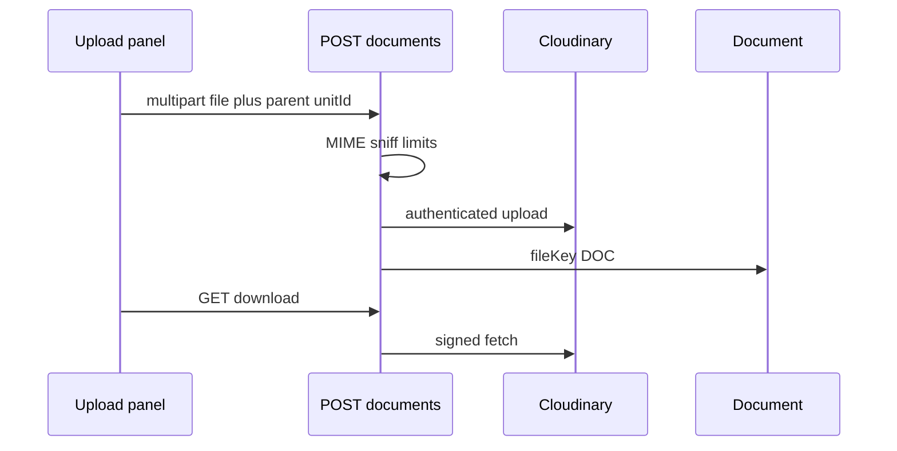

**End-to-end**

```text
Staff case/client/expense panel
  -->  FormData POST /api/documents
  -->  requireUser then perm by parent
  -->  MIME sniff + compliance limits
  -->  Cloudinary upload  -->  Document.fileKey = public_id
  -->  GET /api/documents/DOC-xxxxx/download  -->  signed bytes

Client /documents  -->  same API, types limited, parent = own CLI
```

**Connects to:** Cases, clients, expenses (bill round-trip), client portal.

---

### 6.5 Appointments → convert-case

**Who:** Staff book any (with rules); clients book scoped appointments. **Page:** `/appointments`

**Schema:** `Appointment` (`APT`) optional dual Client/Case; `advocateMobile`; `mode` office/call/video.

**Code:** `features/appointments/` · `lib/appointments/availability.ts`, `booking-rules.ts` · `config/company/booking.ts`

| Method | Path | Guard |
|--------|------|-------|
| GET, POST | `/api/appointments` | `view` / `create` |
| GET, PATCH | `/api/appointments/[unitId]` | `view` / edit-or-cancel |
| POST | `/api/appointments/[unitId]/convert-case` | Staff; `appointments.edit` **or** `cases.create`; modules cases+appointments on |
| GET | `/api/appointments/availability` | `appointments.view` |
| POST | `/api/appointments/import` | `appointments.create` |

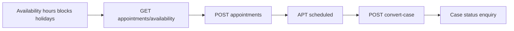

Convert creates an enquiry `CSE` and dual-links the appointment. Clients cannot convert.

**End-to-end**

```text
/availability  PUT hours / POST blocks
  -->  GET /api/appointments/availability?advocate=&date=
  -->  POST /api/appointments  slot + booking-rules
  -->  POST /api/appointments/APT-xxxxx/convert-case
  -->  new Case enquiry + Appointment dual Case FK
```

**Connects to:** Availability, holidays, advocates picker (`GET /api/advocates`), diary, cases, clients, notifications.

---

### 6.6 Availability

**Who:** Staff. **Page:** `/availability` (`staffOnly`)

**Schema:** `AdvocateWeeklyHours` (`AWH`), `AdvocateTimeBlock` (`ATB`), plus `OfficeHoliday`.

| Method | Path | Guard |
|--------|------|-------|
| GET, PUT | `/api/advocates/availability/hours` | `appointments.view` / `edit` |
| GET, POST | `/api/advocates/availability/blocks` | `view` / `edit` |
| PATCH, DELETE | `/api/advocates/availability/blocks/[unitId]` | `edit` |

**Feeds:** appointment slot calculation. **Connects to:** HRMS holidays, court time (blocks `kind` court/break/personal).

---

### 6.7 Court roster

**Who:** Staff with `employees.view` / `edit`. **Page:** `/court-roster`

**Schema:** Permanent follow list = `User.defaultCourts` Json. Temporary cover = `CourtDutyOverride` (`CDU`). Override **wins** for effective cover on a date range.

| Method | Path | Guard |
|--------|------|-------|
| GET | `/api/court-roster` | `employees.view` |
| GET, PUT | `/api/court-roster/permanent` | `employees.edit` |
| GET, POST | `/api/court-roster/overrides` | `employees.edit` |
| GET, PATCH, DELETE | `/api/court-roster/overrides/[unitId]` | `employees.edit` |
| GET | `/api/court-roster/available-advocates` | `employees.view` |

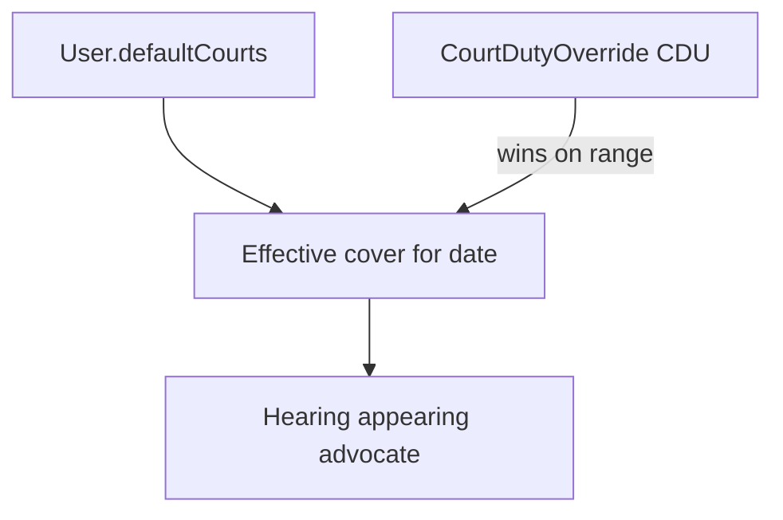

**Connects to:** Employees (advocates), hearings (who appears), new cases (primary default court `[0]`).

---

### 6.8 Diary + hearing SMS

**Who:** Staff. **Page:** `/diary` — allowed if **any** of cases / appointments / tasks is on with matching `*.view`.

**API:** `GET /api/diary` — `requireStaffUser` then soft-gate sections. Aggregates **IST day**: hearings + appointments + tasks.

Manual SMS: `POST /api/diary/send-hearing-sms`, `GET /api/diary/tomorrow-notify` — `cases.edit`.

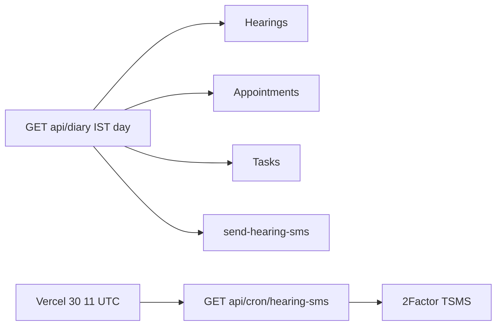

Cron auth is `CRON_SECRET` (`Authorization: Bearer` or `x-cron-secret`), **not** user JWT. Job: `lib/services/hearing-sms.job.ts` · templates `config/company/sms-templates.ts`. Sends to client mobile when `smsConsent`. Marks `Hearing.smsSentAt`.

**End-to-end**

```text
/diary?date=YYYY-MM-DD
  --> GET /api/diary  requireStaffUser
  --> hearings + appointments + tasks in IST bounds
  --> POST /api/diary/send-hearing-sms   cases.edit
  --> 2Factor TSMS  -->  Hearing.smsSentAt
Nightly: Vercel GET /api/cron/hearing-sms  CRON_SECRET
```

**Connects to:** Cases, appointments, tasks, clients, 2Factor.

---

### 6.9 Accounts (cash ledger)

**Who:** Staff. **Page:** `/accounts`

**Schema:** `CashPayment` (`PAY`) dual **required** Client, optional Case. Voidable (`status: void`).

| Method | Path | Guard |
|--------|------|-------|
| GET, POST | `/api/accounts` | `view` / `create` |
| GET, PATCH | `/api/accounts/[unitId]` | `view` / `edit` |
| POST | `/api/accounts/[unitId]/void` | `edit` |
| POST | `/api/accounts/import` | `accounts.upload` |

Case detail fee snippet: `GET /api/accounts?caseUnitId=CSE-…` (`features/accounts/server/fee-rollup.ts`).

**Not** a payment gateway. **Connects to:** Clients, cases, reports (`fees-outstanding`), optional receipt documents.

---

### 6.10 Expenses

**Who:** Staff. **Page:** `/expenses`

**Schema:** `OfficeExpense` (`EXP`) optional dual bill `Document`.

| Method | Path | Guard |
|--------|------|-------|
| GET, POST | `/api/expenses` | `view` / `create` |
| GET, PATCH | `/api/expenses/[unitId]` | `view` / `edit` |
| POST | `/api/expenses/[unitId]/void` | `edit` |

**Connects to:** Documents (bill), reports export `expenses`.

---

### 6.11 Tasks (work allotment)

**Who:** Staff. **Page:** `/tasks`

**Schema:** `OfficeTask` (`TSK`) dual assignee User; soft `caseUnitId`.

| Method | Path | Guard |
|--------|------|-------|
| GET, POST | `/api/tasks` | `view` / `create` |
| PATCH | `/api/tasks/[unitId]` | `edit` |
| POST | `/api/tasks/import` | `tasks.create` |

Create/assign may `notifyUser`. Due / `workDate` items appear on diary.

**Connects to:** Employees (assignee), cases (soft), diary, notifications.

---

### 6.12 DAK (postal)

**Who:** Staff. **Page:** `/dak` (nav label “Postal”)

**Schema:** `DakEntry` (`DAK`) soft `caseUnitId` / `clientUnitId` (may dangle if parent removed). `direction` in/out.

| Method | Path | Guard |
|--------|------|-------|
| GET, POST | `/api/dak` | `view` / `create` |
| PATCH, DELETE | `/api/dak/[unitId]` | `edit` |
| POST | `/api/dak/import` | `dak.create` |

**Connects to:** Cases/clients as display/filter hints only.

---

### 6.13 HRMS

**Who:** Staff. **Page:** `/hrms` (attendance, leave, holidays, history)

**Schema:** `Attendance` unique `[userId, date]` IST `YYYY-MM-DD`; `LeaveRequest`; `OfficeHoliday`.

| Method | Path | Guard |
|--------|------|-------|
| GET, POST | `/api/hrms/attendance` | `own_attendance` or `manage_attendance` (`all=1` / `userUnitIds`) |
| POST | `/api/hrms/attendance/check-in`, `check-out` | `own_attendance` |
| GET, POST | `/api/hrms/leave` | user / `own_leave` |
| POST | `/api/hrms/leave/[unitId]/decide` | `approve_leave` |
| POST | `/api/hrms/leave/[unitId]/cancel` | own or approve |
| GET, POST | `/api/hrms/holidays` | user / manage |
| PATCH, DELETE | `/api/hrms/holidays/[unitId]` | manage holidays |
| GET | `/api/hrms/presence` | `manage_attendance` |

Managers (`manage_attendance`) can view/export attendance for **everyone** (`all=1`) or **selected staff** (`userUnitIds=…`) from HRMS History. List/export accept `own_attendance` **or** `manage_attendance`.

**Connects to:** Employees, availability (holidays close slots), notifications, reports attendance export.

**End-to-end**

```text
/hrms
  --> POST /api/hrms/attendance/check-in   own_attendance  -->  ATT dual User
  --> POST /api/hrms/leave                 own_leave       -->  LVE pending
  --> POST /api/hrms/leave/LVE-xxxxx/decide  approve_leave -->  notifyUser
  --> GET  /api/hrms/presence              manage_attendance -->  home widget
Holidays close appointment slots (availability).
```

---

### 6.14 Employees / advocates

**Who:** Admin-ish staff. **Page:** `/employees`

**Schema:** `User` (`EMP`). Advocates = users with role `advocate`. Photos: `photoKey` Cloudinary; `GET /api/users/[unitId]/photo`.

| Method | Path | Guard |
|--------|------|-------|
| GET, POST | `/api/employees` | `view` / `create` |
| GET, PATCH | `/api/employees/[unitId]` | `view` / `edit` |
| POST | `.../deactivate`, `.../reactivate` | `employees.deactivate` |
| POST | `.../force-reset-pin` | `edit` |
| POST | `/api/employees/import` | `create` |
| GET | `/api/advocates` | `requireUser` (pickers) |

**Connects to:** Login (PIN/OTP), court roster, cases/appointments pickers, HRMS, tasks assignee.

**End-to-end (new staff)**

```text
Super admin /employees
  -->  POST /api/employees  { mobile, name, roles, designation }
  -->  User EMP  pinHash=null
  -->  employee /login  -->  otp_required  -->  §5.2 setup PIN
```

---

### 6.15 Permissions

**Who:** Staff with `permissions.view` / `edit`. **Page:** `/permissions`

| Method | Path | Guard |
|--------|------|-------|
| GET, PUT | `/api/permissions/matrix` | `view` / `edit` |
| POST | `/api/permissions/preview` | `requireUser` |

**Connects to:** Every API (`requirePerm`) and sidebar (`user.permissions`).

---

### 6.16 Notifications

**Who:** Any authenticated user (own inbox). Header bell + `/notifications`.

**Schema:** `Notification` dual → User. Types include leave_request, leave_decided, task_assigned, appointments, hearings, holidays, system.

**Producers:** `lib/notifications/notify.ts` (`notifyUser`, `scheduleNotify`).

| Method | Path | Guard |
|--------|------|-------|
| GET | `/api/notifications`, `unread-count` | `requireUser` |
| GET | `/api/notifications/stream` | SSE if `NEXT_PUBLIC_ENABLE_SSE=1` |
| PATCH | `/api/notifications/[unitId]/read` | own |
| POST | `/api/notifications/read-all` | own |

Without SSE, the shell polls. Hooks: `shared/hooks/use-notifications.ts`, `use-notification-stream.ts`.

---

### 6.17 Profile

**Who:** Any logged-in user. **Page:** `/profile` (user menu, not main nav)

`GET/PATCH /api/profile`, `POST/DELETE /api/profile/photo` — `requireUser`. Own `EMP` row only.

---

### 6.18 Search, reports, activity

| Flow | Entry | API | Guard |
|------|-------|-----|-------|
| Global search | ⌘K `shared/components/layout/global-search.tsx` | `GET /api/search?q=` | `requireUser` (rate-limited) |
| Reports | `/reports` | `GET /api/exports?type=` ExcelJS | `reports.view` then domain `*.view` (attendance: HRMS perms) |
| Activity | `/activity` | `GET /api/activity` | `activity.view`; writes via `lib/audit` `writeAudit` |

Export types: `cases`, `clients`, `employees`, `tasks`, `dak`, `accounts`, `expenses`, `appointments`, `fees-outstanding`, `attendance`.

---

### 6.19 CSV import (cross-cutting)

UI: `shared/components/data/import-dialog.tsx`. Server: `lib/imports/run-import.ts` (`createImportHandler`). Samples: `public/samples/*.sample.csv`.

**Always dry-run first**, then confirm (`dryRun: false`). Parent links **only by `*UnitId`**. Order: **clients → cases →** hearings / payments / dak / tasks / appointments ([`prisma/data/README.md`](../prisma/data/README.md)).

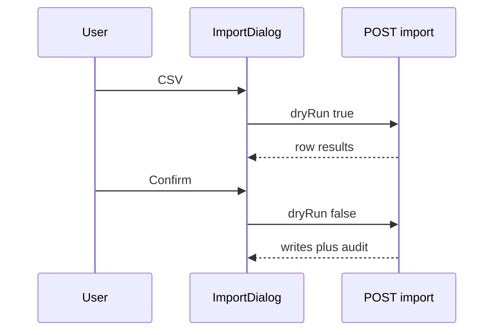

| Endpoint | Columns | Perm |
|----------|---------|------|
| `/api/clients/import` | `IMPORT_CLIENT_COLUMNS` | `clients.create` |
| `/api/cases/import` | `IMPORT_CASE_COLUMNS` | `cases.upload` |
| `/api/hearings/import` | `IMPORT_HEARING_COLUMNS` | `cases.edit` |
| `/api/accounts/import` | `IMPORT_PAYMENT_COLUMNS` | `accounts.upload` |
| `/api/employees/import` | `IMPORT_EMPLOYEE_COLUMNS` | `employees.create` |
| `/api/dak/import` | `IMPORT_DAK_COLUMNS` | `dak.create` |
| `/api/tasks/import` | `IMPORT_TASK_COLUMNS` | `tasks.create` |
| `/api/appointments/import` | `IMPORT_APPOINTMENT_COLUMNS` | `appointments.create` |

---

### 6.20 Cron hearing SMS

Vercel `vercel.json`: `30 11 * * *` → `GET /api/cron/hearing-sms` (`maxDuration` 300s). Same job can be POSTed with `CRON_SECRET`. Manual office send: diary routes above.

---

### 6.21 Reference data and unused

| Flow | Path | Notes |
|------|------|-------|
| Courts | `GET /api/courts`, `/api/courts/meta` | `requireUser` — form pickers |
| Locations | `GET /api/locations/meta` | `requireUser` |
| Legal | `/legal/[slug]` | Public; `config/company/legal.ts` |
| Know your rights | `features/know-your-rights/` | **No page wired** |

---

## 7. How flows connect

```mermaid
flowchart LR
  login["Login PIN or OTP"] --> home["Home"]
  clients["Clients"] --> cases["Cases"]
  cases --> hearings["Hearings"]
  hearings --> diary["Diary"]
  diary --> sms["Hearing SMS"]
  clients --> portal["Portal invite"]
  portal --> clientUI["Client cases appts docs"]
  appts["Appointments"] --> convert["convert-case"]
  convert --> cases
  avail["Availability"] --> appts
  holidays["HRMS holidays"] --> avail
  roster["Court roster"] --> hearings
  cases --> docs["Documents"]
  cases --> fees["Accounts"]
  cases --> tasks["Tasks"]
  employees["Employees"] --> roster
  employees --> hrms["HRMS"]
  employees --> appts
  rbac["Permissions"] --> apis["All APIs"]
  domains["Domain mutations"] --> audit["Activity"]
  domains --> ntf["Notifications"]
```

**Practice spine (staff):** intake **Client** → open **Case** → list **Hearings** → **Diary** shows the IST day → **SMS** reminds the client → **Documents** and **Accounts** hang off the case → **Tasks** / **DAK** are office follow-through.

```text
SUPER ADMIN (.env / seed / check-mobile)
        |
     LOGIN (§5)
        |
     HOME  ----------------------+
        |                        |
   CLIENTS --portal invite--> CLIENT LOGIN (same §5, cid=CLI)
        |
      CASES --hearings--> DIARY --SMS--> 2Factor
        |  |     |
        |  |     +--> COURT ROSTER (who appears)
        |  +--> DOCUMENTS (Cloudinary)
        |  +--> ACCOUNTS (PAY)
        |  +--> TASKS (soft CSE)
        |
   APPOINTMENTS <-- AVAILABILITY + HOLIDAYS
        |
        +--> convert-case --> CASES (enquiry)
        |
   EMPLOYEES --> roster, HRMS, assignees, force-reset PIN
        |
   PERMISSIONS / ACTIVITY / NOTIFICATIONS  (cross-cut)
```

**Consultation spine:** **Availability** + **Holidays** → book **Appointment** → **convert-case** → same Case spine at `enquiry`.

**People spine:** **Employees** (advocates) feed roster, hearings, appointments, HRMS, and task assignees. **Force-reset PIN** dumps them back to OTP setup (auth flow).

**Client spine:** invite → same **login** APIs → allowlisted pages → APIs filter by `clientUnitId`.

**Always on:** RBAC on every mutating API; `writeAudit` → Activity; `notifyUser` → bell; CSV import/export as bulk I/O for the same models.

---

## 8. External services

| Service | Env (names only) | Used by |
|---------|------------------|---------|
| MongoDB Atlas | `DATABASE_URL` | Prisma |
| JWT | `JWT_SECRET` (min 32 chars in prod) | `jose` HS256 |
| 2Factor | `TWO_FACTOR_API_KEY`, `TWO_FACTOR_TEMPLATE_NAME`, `TWO_FACTOR_SENDER_ID` | OTP + hearing SMS |
| Cloudinary | `CLOUDINARY_CLOUD_NAME`, `CLOUDINARY_API_KEY`, `CLOUDINARY_API_SECRET`, `CLOUDINARY_FOLDER` | Documents + avatars |
| Vercel Cron | `CRON_SECRET` | `/api/cron/hearing-sms` |
| Bootstrap admin | `SUPER_ADMIN_MOBILE`, `ADMIN_MOBILE`, `ADMIN_MOBILE_1`, `SEED_PIN` | First admin user |
| CORS | `ALLOWED_ORIGINS` | Web + Bearer apps |
| Optional SSE | `NEXT_PUBLIC_ENABLE_SSE` | Notification stream |

Validated at startup: `lib/env.ts` + `instrumentation.ts` `assertEnv()`.

**Not used:** Stripe, Razorpay, email, OAuth, AWS S3, OpenAI.

Legacy: cookie `mlf_refresh` is only **cleared** on logout. Local `uploads/` may still serve old `fileKey`s.

---

## 9. API catalog

Typical guard in parentheses. Auth routes: rate-limited, CORS, no `requirePerm`.

### Auth

| Method | Path | Guard |
|--------|------|-------|
| POST | `/api/auth/check-mobile` | public |
| POST | `/api/auth/login` | public |
| POST | `/api/auth/send-otp` | public |
| POST | `/api/auth/verify-otp` | public |
| POST | `/api/auth/setup-pin` | public + otp proof |
| POST | `/api/auth/forgot-pin/reset` | public + otp proof |
| GET | `/api/auth/me` | cookie/Bearer |
| POST | `/api/auth/logout` | cookie |
| GET, POST | `/api/auth/session-expired` | clears cookies |

### Clients / cases / hearings

| Method | Path | Guard |
|--------|------|-------|
| GET, POST | `/api/clients` | `clients.view` / `create` |
| GET, PATCH | `/api/clients/[unitId]` | `view` / `edit` |
| GET, POST, DELETE | `/api/clients/[unitId]/portal-access` | `view` / `edit` |
| POST | `/api/clients/import` | `create` |
| GET, POST | `/api/cases` | `cases.view` / `create` |
| GET, PATCH | `/api/cases/[unitId]` | `view` / `edit` |
| PATCH | `/api/cases/[unitId]/status` | `edit` |
| PATCH | `/api/cases/[unitId]/checklist` | `edit` |
| POST | `/api/cases/[unitId]/hearings` | `edit` |
| POST | `/api/cases/import` | `cases.upload` |
| POST | `/api/hearings/[unitId]/adjourn` | `cases.edit` |
| POST | `/api/hearings/import` | `cases.edit` |

### Appointments / availability / advocates

| Method | Path | Guard |
|--------|------|-------|
| GET, POST | `/api/appointments` | `appointments.view` / `create` |
| GET, PATCH | `/api/appointments/[unitId]` | `view` / edit-or-cancel |
| POST | `/api/appointments/[unitId]/convert-case` | staff + `appointments.edit` or `cases.create` |
| GET | `/api/appointments/availability` | `view` |
| POST | `/api/appointments/import` | `create` |
| GET | `/api/advocates` | `requireUser` |
| GET, PUT | `/api/advocates/availability/hours` | `view` / `edit` |
| GET, POST | `/api/advocates/availability/blocks` | `view` / `edit` |
| PATCH, DELETE | `/api/advocates/availability/blocks/[unitId]` | `edit` |

### Court roster

| Method | Path | Guard |
|--------|------|-------|
| GET | `/api/court-roster` | `employees.view` |
| GET, PUT | `/api/court-roster/permanent` | `employees.edit` |
| GET, POST | `/api/court-roster/overrides` | `edit` |
| GET, PATCH, DELETE | `/api/court-roster/overrides/[unitId]` | `edit` |
| GET | `/api/court-roster/available-advocates` | `view` |

### Accounts / expenses / documents

| Method | Path | Guard |
|--------|------|-------|
| GET, POST | `/api/accounts` | `accounts.view` / `create` |
| GET, PATCH | `/api/accounts/[unitId]` | `view` / `edit` |
| POST | `/api/accounts/[unitId]/void` | `edit` |
| POST | `/api/accounts/import` | `accounts.upload` |
| GET, POST | `/api/expenses` | `expenses.view` / `create` |
| GET, PATCH | `/api/expenses/[unitId]` | `view` / `edit` |
| POST | `/api/expenses/[unitId]/void` | `edit` |
| GET, POST | `/api/documents` | `requireUser` + parent perm |
| DELETE | `/api/documents/[unitId]` | `requireUser` |
| GET | `/api/documents/[unitId]/download` | `requireUser` |

### Employees / profile

| Method | Path | Guard |
|--------|------|-------|
| GET, POST | `/api/employees` | `employees.view` / `create` |
| GET, PATCH | `/api/employees/[unitId]` | `view` / `edit` |
| POST | `/api/employees/[unitId]/deactivate` | `deactivate` |
| POST | `/api/employees/[unitId]/reactivate` | `deactivate` |
| POST | `/api/employees/[unitId]/force-reset-pin` | `edit` |
| POST | `/api/employees/import` | `create` |
| GET | `/api/users/[unitId]/photo` | `requireUser` |
| GET, PATCH | `/api/profile` | `requireUser` |
| POST, DELETE | `/api/profile/photo` | `requireUser` |

### Tasks / DAK / diary / HRMS

| Method | Path | Guard |
|--------|------|-------|
| GET, POST | `/api/tasks` | `tasks.view` / `create` |
| PATCH | `/api/tasks/[unitId]` | `edit` |
| POST | `/api/tasks/import` | `create` |
| GET, POST | `/api/dak` | `dak.view` / `create` |
| PATCH, DELETE | `/api/dak/[unitId]` | `edit` |
| POST | `/api/dak/import` | `create` |
| GET | `/api/diary` | `requireStaffUser` |
| GET | `/api/diary/tomorrow-notify` | `cases.edit` |
| POST | `/api/diary/send-hearing-sms` | `cases.edit` |
| GET, POST | `/api/hrms/attendance` | attendance perms |
| POST | `/api/hrms/attendance/check-in` | `own_attendance` |
| POST | `/api/hrms/attendance/check-out` | `own_attendance` |
| GET, POST | `/api/hrms/leave` | user / `own_leave` |
| POST | `/api/hrms/leave/[unitId]/decide` | `approve_leave` |
| POST | `/api/hrms/leave/[unitId]/cancel` | own or approve |
| GET, POST | `/api/hrms/holidays` | user / manage |
| PATCH, DELETE | `/api/hrms/holidays/[unitId]` | manage |
| GET | `/api/hrms/presence` | `manage_attendance` |

### Notifications / search / reports / misc

| Method | Path | Guard |
|--------|------|-------|
| GET | `/api/notifications` | `requireUser` |
| GET | `/api/notifications/unread-count` | `requireUser` |
| GET | `/api/notifications/stream` | `requireUser` |
| PATCH | `/api/notifications/[unitId]/read` | `requireUser` |
| POST | `/api/notifications/read-all` | `requireUser` |
| GET | `/api/dashboard/summary` | `dashboard.view` |
| GET | `/api/search` | `requireUser` |
| GET | `/api/activity` | `activity.view` |
| GET | `/api/exports` | `reports.view` + domain |
| GET, PUT | `/api/permissions/matrix` | `permissions.view` / `edit` |
| POST | `/api/permissions/preview` | `requireUser` |
| GET | `/api/courts`, `/api/courts/meta` | `requireUser` |
| GET | `/api/locations/meta` | `requireUser` |
| GET | `/api/office-files/[slug]` | `requireStaffUser` |
| GET, POST | `/api/cron/hearing-sms` | `CRON_SECRET` |

---

## Shared libraries (quick index)

| Concern | Location |
|---------|----------|
| `apiHandler`, `jsonOk`, `jsonFail` | `lib/api/response.ts` |
| Guards | `lib/api/guard.ts` |
| `apiFetch` / `authFetch` | `lib/api/client.ts` |
| Prisma client | `lib/db/prisma.ts` |
| Zod | `lib/validations/*.schema.ts` |
| `nextUnitId` | `lib/ids/` |
| `writeAudit` | `lib/audit/` |
| IST day bounds | `lib/utils/ist.ts` |
| CSV import wrapper | `lib/imports/run-import.ts` |
| Rate limit | `lib/rate-limit/` |
| RBAC | `lib/rbac/` |
| Client portal helpers | `lib/auth/client-portal.ts`, `client-scope.ts` |

When you change a domain: update Zod → API + guard + audit → serialize → UI → page gate / nav → **this document**.
