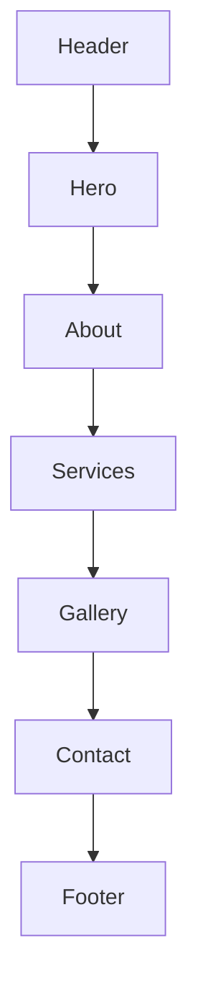

# Star Fabrication — Stylish Marketing Website

## Decisions locked in

- **Deliverable order:** One full build guide doc with complete UI component code → then scaffold and implement a **new** Next.js project (not inside MLF HRMS features).
- **Language:** English primary; Tamil brand line (`ஸ்டார் பேப்ரிக்கேஷன்`) and location (`மேவாணி`) as accent copy where the cards use them.
- **Architecture:** Single scrollable landing page (`/`) with section anchors — Header, Hero, About, Services, Gallery, Contact, Footer. No auth, no CMS, no database.
- **Stack:** Next.js 15 (App Router) + React 19 + TypeScript + Tailwind CSS v4 + Framer Motion + Lucide icons. Contact form uses `mailto:` / `tel:` CTAs plus a client-side form that opens WhatsApp with a prefilled message (best fit for a local fabrication shop; no backend required for v1).

## Brand from the visiting cards

| Element | Value |
|---------|--------|
| Name | STAR FABRICATION / Star Fabrications |
| Tagline | Our Motive Your Satisfaction |
| Contacts | Boopalan (DME) — 88079 20508; Silambarasan (DMET) — 770846 8506 |
| Location | Mevani |
| Services | Grill works, Gate works, Roofing sheet, Cement sheet, Main door, Kerala-style set works; also industrial sheds / designer gates from card photos |
| Look | Deep black background, gold/yellow accents, white/silver type, red service highlights, welder-sparks energy |

**Visual direction (intentional, not generic AI purple/cream):** charcoal/black industrial surfaces, brushed-metal type feel, gold star motif, full-bleed welding hero, strong type (e.g. **Oswald** for display + **DM Sans** for body — not Inter/Roboto).

## Project layout (new repo/folder)

Suggested path: `/Users/psmpasu/projects/star-fabrication` (sibling to MLF).

```
star-fabrication/
  app/
    layout.tsx          # fonts, metadata, dark shell
    page.tsx            # composes all sections
    globals.css         # CSS variables + atmospheric background
  components/
    site-header.tsx
    site-footer.tsx
    hero.tsx
    about.tsx
    services.tsx
    gallery.tsx
    contact.tsx
    star-logo.tsx
    section-heading.tsx
  lib/
    site.ts             # phones, services, copy constants
  public/
    gallery/            # cropped assets from visiting cards
  docs/
    STAR_FABRICATION_WEBSITE_BUILD.md   # full UI code reference
```

## Page composition



1. **Header (sticky):** Star logo wordmark (`STAR` gold / `FABRICATION` white), nav links to `#about` `#services` `#gallery` `#contact`, dual **Call** buttons for both numbers.
2. **Hero (first viewport):** Full-bleed welder/sparks image, dark gradient overlay, brand as hero-level signal, one short line (tagline), one CTA group (`Get a Quote` → `#contact`, `Call Now`). No cards, no stats strip, no overlays/badges on the image.
3. **About:** Craftsmanship + Boopalan (DME) & Silambarasan (DMET) + Mevani; one purpose, one headline, short copy.
4. **Services:** Grid of interactive service tiles (Grill, Gate, Roofing sheet, Cement sheet, Main door, Kerala-style sets, Industrial sheds, General fabrication). Icons + short line each; hover motion only.
5. **Gallery:** Responsive masonry/grid from card photos (gate, shed, canopy/roof, house, welder). Click opens simple lightbox (dialog).
6. **Contact:** Name, Phone, Service select, Message; submit builds WhatsApp URL to primary number. Show both contacts + `tel:` links.
7. **Footer:** Brand, phones, Mevani, back-to-top.

## UI / motion rules

- One composition in the first viewport (brand + tagline + CTAs + dominant image).
- Atmospheric background: subtle radial gold glow + fine noise/grid — not flat black only.
- 2–3 intentional motions: hero fade/slide-up, service tile hover lift, gallery lightbox enter.
- Cards only where they support interaction (services + form), not in the hero.

## Doc deliverable (what you asked for)

Create **[`docs/STAR_FABRICATION_WEBSITE_BUILD.md`](docs/STAR_FABRICATION_WEBSITE_BUILD.md)** (in the new project, or temporarily under MLF `docs/` if you prefer before scaffolding) containing:

- Brand tokens (CSS variables)
- Full file tree
- Complete copy-pasteable code for every component listed above
- `lib/site.ts` content constants
- Setup commands (`create-next-app`, Tailwind, fonts, run)
- Asset notes (how to crop/export gallery images from the WhatsApp card images already saved under Cursor assets)

This doc is the single source a developer can follow end-to-end.

## Implementation sequence (after plan approval)

1. Write the full build doc with complete component source.
2. Scaffold Next.js + Tailwind + fonts.
3. Add `lib/site.ts` + CSS variables matching card palette.
4. Build components in order: logo → header/footer → hero → about → services → gallery → contact.
5. Wire `app/page.tsx`, polish mobile (sticky call bar optional on small screens), SEO metadata.
6. Copy/optimize gallery images from the provided card files into `public/gallery/`.

## Out of scope for v1

- Admin CMS, blog, multi-page routing beyond `/`
- Email API / SMS backend
- Tamil full-site localization toggle (can add later)
- Hosting/deploy (can add Vercel step when you ask)
