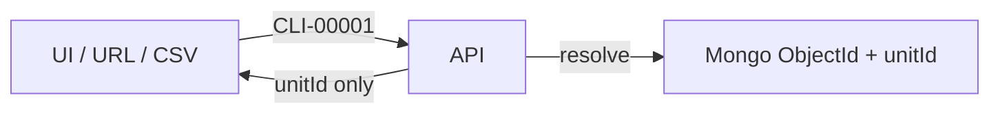
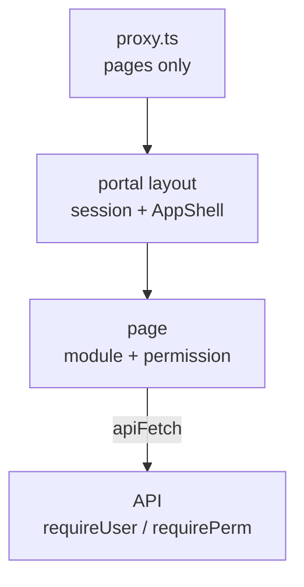
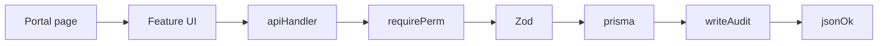

# Website Guide (ID-aware)

How the MLF portal works: **pages → APIs → models**, and **which IDs** each feature uses.

**ID lookup / full API list:** [schema-api-reference.md](./schema-api-reference.md)  
**Deeper flow notes:** [application-flows.md](./application-flows.md)

**Stack:** Next.js 16 · React 19 · Prisma 6 · MongoDB Atlas · JWT cookie · 2Factor SMS

---

## Golden ID rules (short)

| Surface | Use |
|---------|-----|
| URLs, forms, CSV, API JSON, JWT `sub`, audit | Public `unitId` (`CLI-…`, `CSE-…`, `EMP-…`) |
| DB joins / writes inside API | Mongo ObjectId (`id`, `clientId`, …) |

- Resolve `unitId` → row at the API boundary; never put ObjectIds in the UI.
- Dual FK: write/clear `xId` + `xUnitId` together.
- **No `registerId` field.** Office case/register id = `Case.unitId` (`CSE-#####`). Court: `caseNumber`, `filingNumber`, `cnr`.

---

## Architecture

### Folders

| Area | Path | Role |
|------|------|------|
| Portal pages | `app/(portal)/` | Logged-in RSC pages |
| Auth UI | `app/(auth)/login/` | Phone / PIN / OTP |
| Public | `app/(public)/legal/` | Legal pages |
| API | `app/api/**` | REST `/api/...` |
| Features | `features/<domain>/` | UI + serialize helpers |
| Libs | `lib/` | auth, rbac, db, validations, ids |
| Config | `config/company/` | modules, nav, permissions, IDs |
| Edge gate | `proxy.ts` | Login gate for **pages** (skips `/api`) |

### Auth layers

### Request lifecycle

---

## UI pages map

| Route | Page file | Feature | Primary APIs | IDs in play |
|-------|-----------|---------|--------------|-------------|
| `/login` | `app/(auth)/login/` | `features/auth` | `/api/auth/*` | `mobile`; JWT `sub` = `EMP` |
| `/` | `app/(portal)/page.tsx` | `features/home` | `/api/dashboard/summary` | Aggregate; displays CSE/CLI |
| `/clients` | `…/clients/page.tsx` | `features/clients` | `/api/clients` | `CLI` |
| `/clients/[unitId]` | `…/clients/[unitId]/` | same | `/api/clients/[unitId]` | `CLI` |
| `/cases` | `…/cases/page.tsx` | `features/cases` | `/api/cases` | `CSE`, `CLI`, court fields |
| `/cases/[unitId]` | `…/cases/[unitId]/` | same | cases + hearings + docs + accounts | `CSE`, `HRG`, `DOC`, `PAY` |
| `/employees` | `…/employees/` | `features/employees` | `/api/employees`, `/api/advocates` | `EMP` |
| `/appointments` | `…/appointments/` | `features/appointments` | `/api/appointments` | `APT`, optional `CLI`/`CSE` |
| `/availability` | `…/availability/` | `features/availability` | `/api/advocates/availability/*` | `AWH`, `ATB`, advocate `EMP`/mobile |
| `/diary` | `…/diary/` | `features/diary` | `/api/diary` | `HRG`, `APT`, `TSK` |
| `/tasks` | `…/tasks/` | `features/tasks` | `/api/tasks` | `TSK`, assignee `EMP`, soft `CSE` |
| `/accounts` | `…/accounts/` | `features/accounts` | `/api/accounts` | `PAY`, `CLI`, optional `CSE` |
| `/expenses` | `…/expenses/` | `features/expenses` | `/api/expenses` | `EXP`, optional bill `DOC` |
| `/dak` | `…/dak/` | `features/dak` | `/api/dak` | `DAK`, soft `CSE`/`CLI` |
| `/hrms` | `…/hrms/` | `features/hrms` | `/api/hrms/*` | `ATT`, `LVE`, `HOL`, `EMP` |
| `/notifications` | `…/notifications/` | `features/notifications` | `/api/notifications` | `NTF`, user `EMP` |
| `/permissions` | `…/permissions/` | `features/permissions` | `/api/permissions/*` | roles (no unitId rows) |
| `/reports` | `…/reports/` | `features/reports` | `/api/exports` | Exports by domain unitIds |
| `/activity` | `…/activity/` | `features/activity` | `/api/activity` | `actorUnitId`, `entityUnitId` |
| `/profile` | `…/profile/` | `features/profile` | `/api/profile` | Own `EMP` |
| `/legal/[slug]` | `app/(public)/legal/` | — | — | Static |

**Notes**

- Documents have **no** standalone page — embedded in case/client (and expense bill) UI → `/api/documents`.
- `features/know-your-rights/` exists but has **no route** (unused).

Module toggles: `config/company/modules.ts`. Nav: `config/company/nav.ts`.

---

## Domain flows

Each section: purpose → IDs → path → steps.

### 1. Login / OTP / session

**Purpose:** Staff login with mobile + 6-digit PIN; OTP for setup / forgot PIN.

**IDs:** `User.mobile` (login) · `User.unitId` (`EMP`) in JWT `sub` · `OtpSession.sessionId` (2Factor) · `ConsumedOtpProof.jti`

**Path:** `/login` → `/api/auth/*` → cookie `mlf_access` → `/`

| Step | Flow |
|------|------|
| Returning | `check-mobile` → PIN → `login` → cookie |
| First-time | `send-otp` → `verify-otp` → `setup-pin` |
| Forgot PIN | OTP → `forgot-pin/reset` |

Roles: `admin`, `sub_admin`, `staff`, `advocate`, `accountant` → `RolePermission` → `"module.action"` on `PublicUser.permissions`.

### 2. RBAC / modules

**IDs:** none public on permission rows; actor is always `EMP` unitId.

**Path:** `/permissions` → `/api/permissions/matrix` · guards in `lib/api/guard.ts`.

Pages mirror permissions for UX; **API enforces**. Disabled modules hide nav and fail module checks.

### 3. Clients

**Purpose:** Client registry / intake.

**IDs in:** create body (no id) · **IDs out:** `CLI-#####`  
**Links:** later cases/payments use `clientUnitId`.

**Path:** `/clients` → `POST /api/clients` → `nextUnitId("client")` → `Client` → audit.

List: `GET /api/clients?page=&q=`. Detail: `/clients/[unitId]`. Import: dry-run then confirm → `POST /api/clients/import`.

### 4. Cases and hearings

**Purpose:** Matter pipeline, court data, hearings, checklist; fees via accounts; docs via documents.

**IDs**

| Kind | Field |
|------|--------|
| Office register | `Case.unitId` (`CSE`) |
| Client link | `clientId` + `clientUnitId` (`CLI`) — dual, immutable on update |
| Court | `caseNumber`, `filingNumber`, `cnr`, `caseYear` |
| Hearing | `Hearing.unitId` (`HRG`) + dual `caseId`/`caseUnitId` |

**Path:** `/cases` → create with `clientUnitId` → detail loads case + client + hearings + documents.  
Status: `PATCH .../status` via `canTransitionStatus`.  
Hearing: `POST .../hearings` updates `nextHearingAt`; adjourn creates replacement `HRG`.  
SMS: cron `/api/cron/hearing-sms` + diary manual send (client mobile + `smsConsent`).

### 5. Appointments → case; availability

**Purpose:** Consultations; optional convert to enquiry case; advocate hours/blocks.

**IDs:** `APT` · optional dual Client (`clientId`+`clientUnitId`) · optional dual Case · `advocateMobile` · hours `AWH` / blocks `ATB`

**Path:** `/availability` (hours/blocks) → `/appointments` → `POST /api/appointments` (slot checks) → optional `POST .../convert-case` → new `CSE` (enquiry).

### 6. Diary

**Purpose:** Day board for an IST day: hearings + appointments + tasks.

**IDs shown:** `HRG`, `APT`, `TSK` (and related `CSE`/`CLI` labels)

**Path:** `/diary` → `GET /api/diary`. Access if any of cases / appointments / tasks has `*.view`.

### 7. Accounts (cash payments)

**Purpose:** Office cash ledger — not online checkout.

**IDs:** `PAY` · required dual Client · optional dual Case · actors as `{ unitId, name }` (no ObjectIds in JSON)

**Path:** `/accounts` → `POST /api/accounts` → void via `POST .../void`. Case detail fees: `GET /api/accounts?caseUnitId=CSE-…`.

### 8. Expenses

**Purpose:** Office expenses with optional bill attachment.

**IDs:** `EXP` · optional bill `DOC` via `billDocumentId` + `billDocumentUnitId` · actors `{ unitId, name }`

**Path:** `/expenses` → `POST /api/expenses` → PATCH may attach bill → `POST .../void`. Export type `expenses`.

### 9. Documents

**Purpose:** Files for case/client (and expense bills).

**IDs:** `DOC` · optional dual Case / Client / Expense · `fileKey` on disk under `uploads/`

**Path:** Embedded UI → `POST /api/documents` (multipart) → download `GET /api/documents/[unitId]/download`.  
Static PDFs: `GET /api/office-files/[slug]` (logged-in).

### 10. Tasks

**Purpose:** Office allotment / finishing.

**IDs:** `TSK` · dual assignee (`assigneeId`+`assigneeUnitId` / `EMP`) · soft `caseUnitId` (`CSE`)

**Path:** `/tasks` → create/assign may notify → diary shows due/work-date tasks.

### 11. DAK

**Purpose:** In/out postal register.

**IDs:** `DAK` · soft `caseUnitId` / `clientUnitId` (no ObjectId FKs) · optional `trackingNo`

**Path:** `/dak` → CRUD `/api/dak`. Soft links are display/filter hints — may dangle if case/client removed.

### 12. HRMS

**Purpose:** Attendance, leave, holidays, presence.

**IDs:** `ATT`, `LVE`, `HOL` · dual `userId`/`userUnitId` (`EMP`) · leave `approvedById` server-only

**Path:** `/hrms` → check-in/out · leave request/decide/cancel · holidays. Perms: `own_attendance`, `own_leave`, `approve_leave`, `manage_attendance`.

### 13. Notifications

**Purpose:** In-app inbox + optional SSE.

**IDs:** `NTF` · dual user (`EMP`) · `meta` may hold related unitIds (e.g. `appointmentUnitId`)

**Path:** Header bell + `/notifications` → `/api/notifications/*`. Stream only if `NEXT_PUBLIC_ENABLE_SSE=1`.

### 14. Search, home, reports, activity

| Flow | IDs | API |
|------|-----|-----|
| ⌘K search | Matches `unitId` + text fields | `GET /api/search?q=` |
| Home | Counts / upcoming by CSE, HRG, … | `GET /api/dashboard/summary` |
| Reports | Rows keyed by domain unitIds | `GET /api/exports?type=...` |
| Activity | `actorUnitId`, `entityUnitId` | `GET /api/activity` |

---

## CSV import (shared)

**Pattern:** UI `ImportDialog` → dry-run → confirm → `POST /api/*/import`.

Links parents **only by `*UnitId`** (`CLI`, `CSE`, …). Order: clients → cases → dependents — see [`prisma/data/README.md`](../prisma/data/README.md). Samples: `public/samples/*.sample.csv`.

---

## External integrations

| Integration | IDs / secrets |
|-------------|---------------|
| MongoDB Atlas | `DATABASE_URL` |
| 2Factor OTP + hearing SMS | `TWO_FACTOR_*`; OTP `sessionId` |
| Vercel cron hearing SMS | `CRON_SECRET` → `/api/cron/hearing-sms` |
| Local filesystem | `fileKey` / `photoKey` under `uploads/` |
| JWT (`jose`) | `JWT_SECRET`; `sub` = `EMP` unitId (7d access cookie) |

No Stripe/Razorpay/email/OAuth — payments are the cash ledger (`PAY`).

---

## Also see

- [schema-api-reference.md](./schema-api-reference.md) — full ID glossary, models, API catalog  
- [prisma-database.md](./prisma-database.md) — DB connect / deploy  
- [application-flows.md](./application-flows.md) — maintainability notes  
