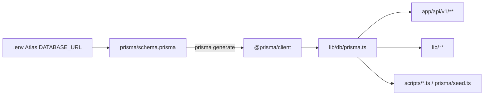
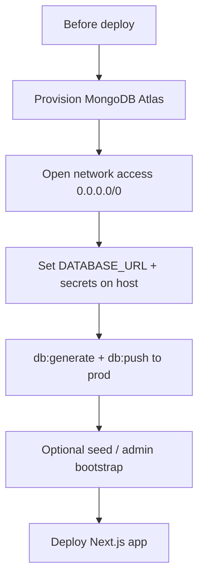

# Prisma Database Connection Docs (MLF)

## Goal

Add a single markdown doc that explains:

1. How the database **connects** via [`lib/db/prisma.ts`](lib/db/prisma.ts) (full code)
2. How the app **uses** the database (by feature)
3. What to do with the database **before deploying** and **after deploying**

## Doc location

Create **[`docs/prisma-database.md`](docs/prisma-database.md)**. Link from [`README.md`](README.md) under **Database Setup**.

## What the doc covers

### 1. Overview — how DB connects

- Stack: Next.js + Prisma 6 + **MongoDB Atlas**
- Flow: `.env` `DATABASE_URL` (`mongodb+srv`) → [`prisma/schema.prisma`](prisma/schema.prisma) → `@prisma/client` → singleton [`lib/db/prisma.ts`](lib/db/prisma.ts) → `app/api/v1/**`, `lib/**`, scripts

### 2. Full `lib/db/prisma.ts` + explanation

Include the complete file and explain:

- Next.js singleton on `globalThis` (HMR)
- `buildMongoDatabaseUrl` serverless defaults
- `clientHasRequiredModels` recreate after `prisma generate`
- Eager `$connect`
- `isDbUnreachableError` / `withDbRetry`

### 3. How the database is used (by feature)

Map MLF features to Prisma models (with 1–2 real snippets):

- **Auth / users** — `User`, `OtpSession`, `ConsumedOtpProof`, `RateLimit` via `app/api/v1/auth/**`, `lib/auth/`
- **Employees / permissions** — `User`, `RolePermission`, `AuditLog`
- **Clients / cases / hearings** — `Client`, `Case`, `Hearing`
- **Appointments / advocates** — `Appointment`, `AdvocateWeeklyHours`, `AdvocateTimeBlock`
- **Accounts** — `CashPayment`
- **Documents** — `Document`
- **Office** — `DakEntry`, `OfficeTask`, `OfficeHoliday`, `Notification`
- **HRMS** — `Attendance`, `LeaveRequest`
- **Scripts** — `prisma/seed.ts`, `scripts/db-ping.ts`, `scripts/full-audit.ts`

List models from schema; note MongoDB ObjectId + `unitId` business keys.

### 4. Dev vs production database

- **Both use Atlas** (`mongodb+srv`). Prefer separate cluster/DB name for prod.
- Never commit `.env`; set `DATABASE_URL` on the host.
- Network Access: prefer `0.0.0.0/0` so ISP IP changes and Vercel egress do not break TLS.
- Verify with `npm run db:ping`.

### 5. Before deploying (database checklist)

1. Provision production Atlas; note DB name
2. Open Network Access (`0.0.0.0/0` or VPC)
3. Create DB user; copy `mongodb+srv` URL
4. Host env: `DATABASE_URL`, `JWT_SECRET`, `ADMIN_MOBILE`, `TWO_FACTOR_*`, `CRON_SECRET`, `ALLOWED_ORIGINS`, `NODE_ENV=production`
5. `npm run db:generate` + `npm run db:push` against **prod** URL
6. Optional `npm run db:seed` (warn: do not wipe live data)
7. Confirm `postinstall` → `prisma generate` on host
8. Prefer one-off `DATABASE_URL=... npm run db:push` over pointing local `.env` at prod

### 6. After deploying (database checklist)

1. Redeploy if env vars were added after first deploy
2. Smoke-test: OTP/login, dashboard, clients, cases/diary, accounts, employees
3. On 500s: host logs, `DATABASE_URL`, Atlas allowlist, `prisma generate`
4. Later schema changes: edit schema → `db:push` prod → redeploy
5. Enable Atlas backups
6. No destructive seed against prod unless intentional

### 7. Setup commands

From [`package.json`](package.json): `db:generate`, `db:push`, `db:seed`, `db:studio`, `db:ping`, `postinstall` → `prisma generate`.

## Files to change

- [`docs/prisma-database.md`](docs/prisma-database.md) — create full doc
- [`README.md`](README.md) — Database Setup link

## Related code alignment (already applied)

These keep runtime behavior consistent with the Atlas-only docs:

- `.env.example` / remove `scripts/mongo-local.ts` + `db:local` — Atlas only
- Session: access JWT cookie (7d); remove refresh tokens / `/auth/refresh` / `SessionRefreshGate`
- Drop `RefreshToken` model from [`prisma/schema.prisma`](prisma/schema.prisma)

## Out of scope

- No Cloudinary / Razorpay / ecommerce docs (not this app)
- No inventing `SETUP.md` / `DEPLOYMENT.md` if they do not exist
