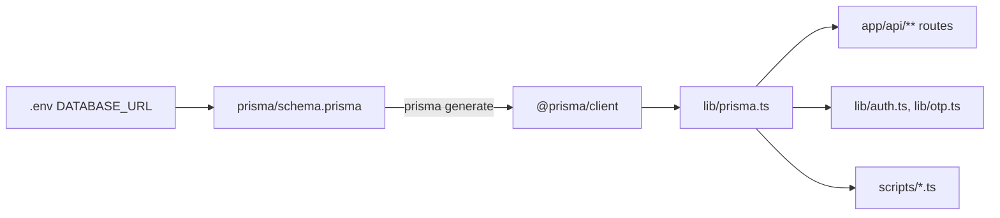
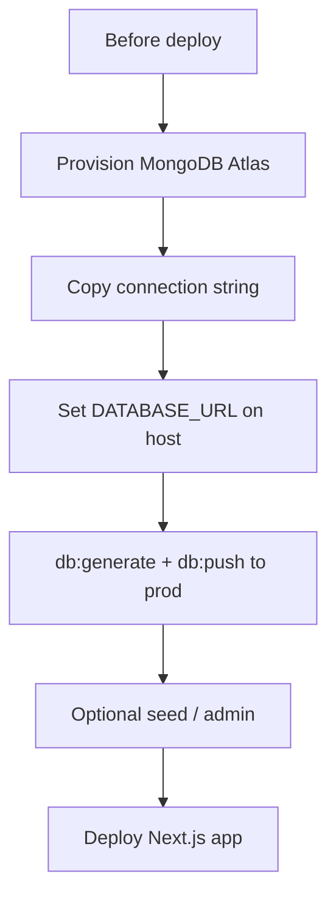

# Prisma Database Connection Docs

## Goal

Add a single markdown doc that explains:

1. How the database **connects** via [`lib/prisma.ts`](lib/prisma.ts) (full code)
2. How the app **uses** the database (by feature)
3. What to do with the database **before deploying** and **after deploying**

## Doc location (chosen default)

Create **[`docs/prisma-database.md`](docs/prisma-database.md)** (new `docs/` folder). Link to it from [`README.md`](README.md) under Database Setup. Cross-link existing [`SETUP.md`](SETUP.md) and [`DEPLOYMENT.md`](DEPLOYMENT.md) where relevant (do not duplicate Cloudinary-only content).

## What the doc will cover

### 1. Overview — how DB connects

- Stack: Next.js + Prisma 6 + MongoDB
- Flow: `.env` `DATABASE_URL` → [`prisma/schema.prisma`](prisma/schema.prisma) → `@prisma/client` → singleton [`lib/prisma.ts`](lib/prisma.ts) → API routes / libs / scripts

### 2. Full `lib/prisma.ts` code + explanation

Include the complete file and explain the Next.js singleton pattern (`globalThis` in development to avoid too many connections on hot reload).

### 3. How the database is used (by feature)

Map real app features to Prisma models and typical operations (short table / bullets, with 1–2 real code snippets):

- **Auth / users** — `User`, `Otp` via [`lib/auth.ts`](lib/auth.ts), [`lib/otp.ts`](lib/otp.ts), `app/api/auth/**`
- **Products / categories** — `Product` via `app/api/products/**`, `app/api/categories/**`
- **Cart** — `Cart`, `CartItem` via `app/api/cart/**`
- **Orders / payments** — `Order`, `OrderItem` via `app/api/orders/**`, `app/api/payments/**`, admin order routes
- **Reviews** — `Review` via `app/api/reviews/**`
- **CMS content** — `HeroSection`, `AboutSection`, `GalleryMedia`, `SiteSettings` via matching API routes
- **Scripts** — seed / create-admin (`scripts/seed-products.ts` uses its own `PrismaClient`; app uses shared `@/lib/prisma`)

Also list models from schema briefly and note MongoDB ObjectId pattern.

### 4. Local vs production database

- **Local (dev):** `DATABASE_URL="mongodb://localhost:27017/stn_products"` (or local Mongo)
- **Production (deploy):** use a hosted MongoDB (e.g. MongoDB Atlas) connection string as `DATABASE_URL` on the host (project already references Google Cloud live site in [`DEPLOYMENT.md`](DEPLOYMENT.md))
- Never commit `.env`; set `DATABASE_URL` in the deployment platform’s env config
- Same Prisma schema / client code works for both; only the URL changes

### 5. Before deploying (database checklist)

Document concrete pre-deploy steps:

1. Provision production MongoDB (Atlas or equivalent); note DB name
2. Sign in to Atlas and copy the connection string
3. Create production DB user and get connection string
4. Set production env on host: `DATABASE_URL`, plus `JWT_SECRET`, `ADMIN_EMAIL`, Cloudinary, Razorpay, SMTP, `NEXT_PUBLIC_APP_URL` (live URL)
5. From a machine that can reach prod DB: run `npm run db:generate` and `npm run db:push` against **production** `DATABASE_URL` so collections/indexes match [`prisma/schema.prisma`](prisma/schema.prisma)
6. Optionally seed: `npm run db:seed` / `npm run admin:create` against prod (only if intentional — warn not to wipe live data)
7. Confirm `postinstall` / build will run `prisma generate` on the host so `@prisma/client` exists at runtime
8. Do not point local `.env` at prod casually; use a separate prod env or one-off shell export when pushing schema

### 6. After deploying (database checklist)

Document concrete post-deploy verification:

1. Redeploy/restart if env vars were added after first deploy (same rule as [`DEPLOYMENT.md`](DEPLOYMENT.md))
2. Smoke-test DB-backed flows on live site:
   - Sign up / sign in (writes `User` / `Otp`)
   - Product list / product detail (reads `Product`)
   - Add to cart (writes `Cart` / `CartItem`)
   - Place order if payments configured (writes `Order`)
   - Admin: create/edit product
3. If API returns 500 on data routes: check host logs, verify `DATABASE_URL`, and that `prisma generate` ran during build
4. Schema changes later: update [`prisma/schema.prisma`](prisma/schema.prisma) → `db:push` to **prod** → redeploy app
5. Backups: enable Atlas backups / snapshots for production
6. Do not run destructive seed scripts against production unless replacing data on purpose

### 7. Setup commands (reference)

From [`package.json`](package.json): `db:generate`, `db:push`, `db:seed`, `postinstall` → `prisma generate`.

## Files to change

- [`docs/prisma-database.md`](docs/prisma-database.md) — **Create** full doc (connection + usage + before/after deploy)
- [`README.md`](README.md) — **Update** one link under Database Setup to the new doc

## Out of scope

- No Prisma/schema/app code changes
- No new env files
- No rewriting [`DEPLOYMENT.md`](DEPLOYMENT.md) (Cloudinary-focused); only cross-link
