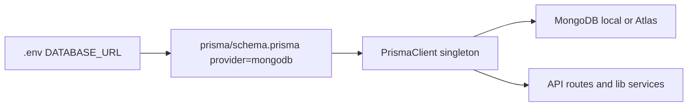

# Prisma ↔ MongoDB Connection Map

There is no project named **Rishma** in `/Users/psmpasu/projects`. Both apps use **Prisma** as the ORM to talk to **MongoDB**. Connection is always: `DATABASE_URL` → `schema.prisma` → Prisma client singleton → routes/services.



---

## Shared pattern (both apps)

1. Set `DATABASE_URL` (Mongo connection string).
2. [`schema.prisma`](mlf/prisma/schema.prisma) declares `provider = "mongodb"` and `url = env("DATABASE_URL")`.
3. `prisma generate` builds `@prisma/client`.
4. App imports a singleton `prisma` and runs queries (`findMany`, `create`, etc.).
5. Prisma engine opens the MongoDB connection; there is **no** mongoose / native `MongoClient` in either repo.

---

## MLF — richer connection

| File | Role |
|------|------|
| [mlf/.env](mlf/.env) | Live `DATABASE_URL` (Atlas `mongodb+srv://…`) |
| [mlf/.env.example](mlf/.env.example) | Example `DATABASE_URL`; `MONGODB_URI` is documented but **unused** in code |
| [mlf/lib/env.ts](mlf/lib/env.ts) | Zod requires `DATABASE_URL` on boot |
| [mlf/instrumentation.ts](mlf/instrumentation.ts) | Calls `assertEnv()` at startup |
| [mlf/prisma/schema.prisma](mlf/prisma/schema.prisma) | `datasource db { provider = "mongodb"; url = env("DATABASE_URL") }` |
| [mlf/lib/db/prisma.ts](mlf/lib/db/prisma.ts) | **Main client**: singleton, appends `serverSelectionTimeoutMS=5000`, `$connect()`, retry helpers |
| [mlf/lib/db/search.ts](mlf/lib/db/search.ts) | Query helpers on top of Prisma |
| [mlf/lib/rate-limit/index.ts](mlf/lib/rate-limit/index.ts) | Rate limits stored in Mongo via Prisma |
| [mlf/prisma/seed.ts](mlf/prisma/seed.ts) | Seed script |
| [mlf/scripts/*.ts](mlf/scripts) | Audit / smoke / migrate scripts using Prisma |
| [mlf/app/api/v1/**](mlf/app/api) | ~80+ routes import `@/lib/db/prisma` |

### 1) Schema — wires Prisma to Mongo

[`mlf/prisma/schema.prisma`](mlf/prisma/schema.prisma):

```prisma
generator client {
  provider = "prisma-client-js"
}

datasource db {
  provider = "mongodb"
  url      = env("DATABASE_URL")
}
```

### 2) Env check on boot

[`mlf/lib/env.ts`](mlf/lib/env.ts) — requires `DATABASE_URL`:

```ts
const envSchema = z.object({
  DATABASE_URL: z.string().min(1, "DATABASE_URL is required"),
  // ...
});
```

[`mlf/instrumentation.ts`](mlf/instrumentation.ts):

```ts
export async function register() {
  if (process.env.NEXT_RUNTIME === "nodejs") {
    const { assertEnv } = await import("@/lib/env");
    assertEnv();
  }
}
```

### 3) Main Prisma client (full connection code)

[`mlf/lib/db/prisma.ts`](mlf/lib/db/prisma.ts):

```ts
import { PrismaClient } from "@prisma/client";

const globalForPrisma = globalThis as unknown as {
  prisma: PrismaClient | undefined;
};

function databaseUrl(): string | undefined {
  const base = process.env.DATABASE_URL;
  if (!base) return undefined;
  // Fail fast when Atlas is unreachable (default selection wait is ~30s).
  if (/serverSelectionTimeoutMS=/i.test(base)) return base;
  const sep = base.includes("?") ? "&" : "?";
  return `${base}${sep}serverSelectionTimeoutMS=5000`;
}

function createClient() {
  return new PrismaClient({
    datasources: { db: { url: databaseUrl() } },
    log: process.env.NODE_ENV === "development" ? ["error", "warn"] : ["error"],
  });
}

function resolveClient(): PrismaClient {
  const existing = globalForPrisma.prisma;
  if (existing && clientHasRequiredModels(existing)) return existing;
  if (existing) {
    globalForPrisma.prisma = undefined;
    void existing.$disconnect().catch(() => undefined);
  }
  const next = createClient();
  void next.$connect().catch(() => undefined);
  globalForPrisma.prisma = next;
  return next;
}

export const prisma = resolveClient();

export function isDbUnreachableError(error: unknown): boolean { /* ... */ }
export async function withDbRetry<T>(fn: () => Promise<T>, attempts = 3): Promise<T> { /* ... */ }
```

- Reads `process.env.DATABASE_URL`
- Injects into `new PrismaClient({ datasources: { db: { url } } })`
- Reuses one client on `globalThis` (Next.js HMR-safe)
- Exports `isDbUnreachableError` / `withDbRetry` for Atlas blips

**Env example:** `DATABASE_URL=mongodb://127.0.0.1:27017/mlf?maxPoolSize=20` (or Atlas `mongodb+srv://…`)

**Other MLF files:** [`mlf/lib/db/search.ts`](mlf/lib/db/search.ts), [`mlf/lib/rate-limit/index.ts`](mlf/lib/rate-limit/index.ts), [`mlf/prisma/seed.ts`](mlf/prisma/seed.ts), [`mlf/scripts/*.ts`](mlf/scripts), [`mlf/app/api/v1/**`](mlf/app/api)

---

## STN — simple connection

| File | Role |
|------|------|
| [stn/prisma/schema.prisma](stn/prisma/schema.prisma) | Same Mongo datasource via `DATABASE_URL` |
| [stn/lib/prisma.ts](stn/lib/prisma.ts) | **Main client**: simple global singleton |
| [stn/lib/auth.ts](stn/lib/auth.ts), [stn/lib/otp.ts](stn/lib/otp.ts) | Auth/OTP via `prisma` |
| [stn/app/api/**](stn/app/api) | products, cart, orders, payments, reviews, etc. |
| [stn/scripts/seed-products.ts](stn/scripts/seed-products.ts), [stn/scripts/create-admin.ts](stn/scripts/create-admin.ts) | Seed / admin setup |
| [stn/SETUP.md](stn/SETUP.md), [stn/README.md](stn/README.md) | Docs for Mongo + `DATABASE_URL` |

### Schema

[`stn/prisma/schema.prisma`](stn/prisma/schema.prisma):

```prisma
datasource db {
  provider = "mongodb"
  url      = env("DATABASE_URL")
}
```

### Full Prisma client code

[`stn/lib/prisma.ts`](stn/lib/prisma.ts):

```ts
import { PrismaClient } from '@prisma/client'

const globalForPrisma = globalThis as unknown as {
  prisma: PrismaClient | undefined
}

export const prisma = globalForPrisma.prisma ?? new PrismaClient()

if (process.env.NODE_ENV !== 'production') globalForPrisma.prisma = prisma
```

Prisma reads `DATABASE_URL` from the schema automatically (no explicit URL override).

**Expected env:** `DATABASE_URL=mongodb://localhost:27017/stn_products` (`.env` not committed)

---

## How a request hits Mongo

1. API route imports `prisma` from `lib/db/prisma` (MLF) or `lib/prisma` (STN).
2. Route calls e.g. `prisma.user.findUnique(...)`.
3. Prisma Client → query engine → MongoDB using `DATABASE_URL`.
4. Result returns as typed JS objects.

---

## Deliverable after you approve

Write one reference doc at [`/Users/psmpasu/projects/PRISMA_MONGODB.md`](/Users/psmpasu/projects/PRISMA_MONGODB.md) with this map (flow diagram, file tables, env vars, and the key client snippets) so you can reopen it anytime. No app code changes.
